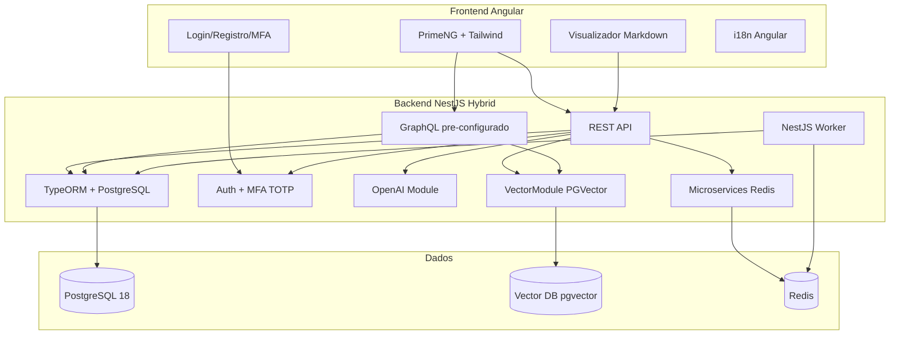
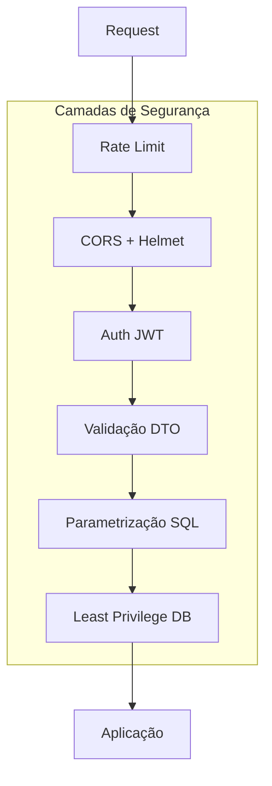

# Plano de Implementação - Ultima Forma Full Stack

> Documento vivo. Atualize a seção [Progresso e Changelog](#progresso-e-changelog) conforme cada etapa for implementada.

## Princípios Obrigatórios (prioridade máxima)

**Todos os passos de implementação DEVEM seguir estes requisitos. Segurança tem precedência sobre funcionalidade.**

- **Defesa em profundidade**: Múltiplas camadas de proteção; nenhuma falha única deve comprometer o sistema
- **Least privilege**: Permissões mínimas; usuários e serviços só acessam o estritamente necessário
- **Never trust input**: Validar e sanitizar toda entrada; nunca confiar em dados do cliente
- **Secrets nunca no código**: Chaves, senhas e tokens apenas em variáveis de ambiente ou secret managers
- **Auditabilidade**: Logs de eventos sensíveis (sem dados sensíveis nos logs); rastreabilidade de ações
- **Fail secure**: Erros devem falhar fechando acesso, não abrindo

## Arquitetura Proposta

REST e GraphQL podem ambos **ler e escrever** em PostgreSQL e em PGVector. A escolha entre um ou outro é por tipo de operação/caso de uso, não por restrição de acesso.



---

## 1. Estrutura do Monorepo (Nx)

- **Package manager**: pnpm
- **Workspace**: Nx monorepo com `@nx/workspace`
- **Apps**:
  - `apps/api` - Backend NestJS
  - `apps/web` - Frontend Angular
  - `apps/worker` - NestJS Worker (processamento assíncrono via Redis)
- **Libs**:
  - `libs/shared` — implementado: tipos, DTOs e constantes compartilhados entre frontend e backend (`@ultima-forma/shared`)
  - (conforme evolução): `libs/api-client`

Estrutura de diretórios:

```
Ultima-Forma/               # pnpm como package manager
├── apps/
│   ├── api/                    # NestJS
│   ├── web/                    # Angular
│   └── worker/                 # NestJS Worker (Redis consumer)
├── deploy/                     # Docker Compose produção (Traefik, VPS)
├── libs/
│   └── shared/                 # Tipos, DTOs (class-validator), constantes; import: @ultima-forma/shared
├── ultima-forma-business-plan/ # pt-BR/ (português) + en/ (inglês)
├── nx.json
├── package.json
├── pnpm-lock.yaml
└── tsconfig.base.json
```

---

## 2. Backend (NestJS + TypeORM + PostgreSQL)

### 2.1 Stack e Versões

| Pacote          | Versão | Nota                  |
| --------------- | ------ | --------------------- |
| NestJS          | ^11.x  | Última major          |
| @nestjs/typeorm | ^11.x  |                       |
| typeorm         | ^0.3.x |                       |
| pg              | ^8.x   | Driver PostgreSQL     |
| @nestjs/config  | ^3.x   | Variáveis de ambiente |

### 2.1.1 Segurança obrigatória (Backend)

- **Helmet**: Headers de segurança HTTP (`@nestjs/helmet`)
- **Rate limiting**: `@nestjs/throttler` ou `express-rate-limit`; configurar por rota
- **CORS estrito**: Allowlist de origens permitidas; não usar `origin: '*'` em produção
- **Validação**: `class-validator` em todos os DTOs; `ValidationPipe` global
- **SQL**: Sempre parametrizado; nunca concatenar input do usuário
- **TypeORM**: `synchronize: false` em produção; usar migrations

### 2.2 REST API como Principal

- Módulos padrão: `auth`, `users`, `health`
- Controllers REST para operações CRUD e fluxos de negócio (incluindo leitura/escrita em PostgreSQL e PGVector)
- DTOs com `class-validator` e `class-transformer`
- Documentação Swagger via `@nestjs/swagger` (opcional mas recomendado)

### 2.2.1 Segurança obrigatória (REST)

- Validação de entrada em todos os endpoints
- Sanitização de payloads (whitelist de campos permitidos)
- Tamanho máximo de payload configurado
- Proteção contra mass assignment (excluir campos não permitidos nos DTOs)

### 2.3 GraphQL Pré-implementado

- Pacotes: `@nestjs/graphql`, `@nestjs/apollo`, `apollo`, `@as-integrations/express`
- Configuração code-first no `AppModule`
- **Leitura e escrita**: Resolvers e Mutations podem acessar PostgreSQL e PGVector; usar quando consultas flexíveis ou nested forem vantajosas
- Um resolver de exemplo (ex: `HealthResolver` ou `DocumentationResolver`) para demonstrar o uso
- Endpoint em `/graphql` (Apollo Sandbox em dev)

### 2.3.1 Segurança obrigatória (GraphQL)

- Query complexity e depth limiting (ex: `graphql-query-complexity`)
- Timeouts para queries longas
- Evitar exposição excessiva do schema em produção
- Mesmas regras de validação e parametrização que REST

### 2.4 PGVector (Vector DB separado)

- **Primary DB**: PostgreSQL 18 (imagem `postgres:18`) para dados normais (users, refresh_tokens)
- **Vector DB**: `pgvector/pgvector:pg18` – apenas embeddings; instância separada
- Conexão TypeORM nomeada `vector`; `VectorSearchService` injeta `@InjectDataSource('vector')`
- Tabela embeddings criada via `db:ensure-embeddings` (script que conecta ao vector DB)
- Queries customizadas com `entityManager.query()` sobre a conexão vector para similarity search

### 2.4.1 Segurança obrigatória (PGVector)

- Prepared statements ou query builder para todas as queries
- Nunca interpolar user input em SQL; usar placeholders parametrizados

### 2.5 Integração OpenAI

- Pacote: `openai` (SDK oficial)
- Módulo `OpenAIModule` com:
  - `OpenAIService` injetável
  - Config via `OPENAI_API_KEY` em env
  - Método exemplo `chatCompletion()` para uso futuro
- Arquivo `.env.example` com `OPENAI_API_KEY=` (sem valor)

### 2.5.1 Segurança obrigatória (OpenAI)

- API key exclusivamente em variável de ambiente
- Não logar prompts ou respostas que contenham dados sensíveis
- Rate limit por usuário para evitar abuso e custo excessivo

### 2.6 Microservices pré-configurados

- **Pacotes**: `@nestjs/microservices`, `ioredis` (para Redis transport)
- **Arquitetura híbrida**: Aplicação NestJS como hybrid app — HTTP (REST/GraphQL) + microservice listener
- **Transporte**: Redis Pub/Sub (`Transport.REDIS`) para mensageria assíncrona e event-driven; opcional TCP para request-response entre serviços internos
- **Configuração**:
  - `connectMicroservice()` em `main.ts` com `Transport.REDIS` (host/port via env: `REDIS_HOST`, `REDIS_PORT`)
  - Handler de exemplo com `@MessagePattern()` (ex: `events.health` ou `tasks.process`) para demonstrar o fluxo
  - `ClientProxy` injetável para enviar mensagens/eventos quando necessário
- **Docker**: Adicionar Redis ao `docker-compose.yml` (imagem `redis:7-alpine`)
- **Uso futuro**: Pronto para workers assíncronos, processamento em background, notificações, integração entre módulos sem acoplamento síncrono

### 2.6.1 Segurança obrigatória (Microservices)

- **Redis**: Rede interna apenas; não expor Redis na internet; usar `requirepass` se ambiente compartilhado
- **Validação**: Message handlers validam payload com DTOs e `class-validator`
- **Secrets**: `REDIS_PASSWORD` em env quando autenticação habilitada

### 2.7 Migrações de Banco de Dados (fully functional)

Sistema de migrações TypeORM configurado e operacional. **synchronize** sempre `false` em todos os ambientes.

**Estrutura**:

```
apps/api/
├── src/
│   ├── db/
│   │   ├── data-source.ts      # Primary DB (CLI migrations)
│   │   ├── vector-data-source.ts # Vector DB (ensure-embeddings)
│   │   └── ensure-embeddings.ts # Cria embeddings no vector DB
│   └── migrations/
│   │   ├── 1730000000000-InitialSchema.ts
│   │   ├── 1730000000002-RefreshTokenTable.ts
│   │   └── ...
│   └── ...
```

**Arquivo `data-source.ts`** (fora do NestJS DI, para o CLI):

```typescript
import { config } from 'dotenv';
import { DataSource } from 'typeorm';

config();

export default new DataSource({
  type: 'postgres',
  host: process.env.DB_HOST || 'localhost',
  port: +(process.env.DB_PORT || 5432),
  username: process.env.DB_USERNAME,
  password: process.env.DB_PASSWORD,
  database: process.env.DB_NAME,
  entities: [__dirname + '/../**/*.entity{.ts,.js}'],
  migrations: [__dirname + '/../migrations/*{.ts,.js}'],
  synchronize: false,
  migrationsTableName: 'migrations',
});
```

**Scripts `package.json`** (no projeto ou em `apps/api`):

```json
{
  "db:migration:create": "typeorm-ts-node-commonjs migration:create",
  "db:migration:generate": "typeorm-ts-node-commonjs migration:generate -d apps/api/src/db/data-source.ts",
  "db:migration:run": "typeorm-ts-node-commonjs migration:run -d apps/api/src/db/data-source.ts",
  "db:migration:revert": "typeorm-ts-node-commonjs migration:revert -d apps/api/src/db/data-source.ts",
  "db:migration:show": "typeorm-ts-node-commonjs migration:show -d apps/api/src/db/data-source.ts"
}
```

**Fluxo de trabalho**:

| Comando | Uso |
|---------|-----|
| `pnpm run db:migration:create apps/api/src/migrations/NomeDaMigracao` | Criar migração em branco |
| `pnpm run db:migration:generate apps/api/src/migrations/NomeDaMigracao` | Gerar migração a partir das entidades |
| `pnpm run db:migration:run` | Executar migrações pendentes |
| `pnpm run db:migration:revert` | Reverter última migração |
| `pnpm run db:migration:show` | Listar status das migrações |

**PGVector (raw SQL)** — migração manual para extensão e tabela com vetores:

```typescript
// 1730000000001-PgvectorExtension.ts
import { MigrationInterface, QueryRunner } from 'typeorm';

export class PgvectorExtension1730000000001 implements MigrationInterface {
  async up(queryRunner: QueryRunner): Promise<void> {
    await queryRunner.query(`CREATE EXTENSION IF NOT EXISTS vector`);
    await queryRunner.query(`
      CREATE TABLE IF NOT EXISTS embeddings (
        id UUID PRIMARY KEY DEFAULT gen_random_uuid(),
        content TEXT,
        embedding vector(1536),
        metadata JSONB,
        created_at TIMESTAMPTZ DEFAULT now()
      )
    `);
  }
  async down(queryRunner: QueryRunner): Promise<void> {
    await queryRunner.query(`DROP TABLE IF EXISTS embeddings`);
    await queryRunner.query(`DROP EXTENSION IF EXISTS vector`);
  }
}
```

**Workflow em produção**:

A ordem deve ser sempre: **migrations primeiro** → depois subir a API. A API nunca sobe com schema desatualizado.

| Etapa | Ação |
|-------|------|
| 1 | Deploy carrega artefatos (imagem Docker ou código) na VPS |
| 2 | Carregar `.env.prod` (DB_HOST, DB_* apontando para Postgres de produção) |
| 3 | Executar `pnpm run db:migration:run` (ou equivalente) **antes** de iniciar a API |
| 4 | Se migrations falharem → **não** iniciar a API; investigar e reverter se necessário |
| 5 | Se migrations OK → iniciar/restart da API |

**Integração com Docker Compose (deploy/)**:

**Recomendado — Opção C (Script de deploy / pipeline)**: Melhor opção de segurança. Migrations rodam fora dos containers de produção; API não carrega ferramentas de migration (least privilege). Auditável via CI/deploy logs.

- Script `deploy/deploy.sh` ou pipeline CI: (1) executa `db:migration:run` contra o DB de produção; (2) em seguida `docker compose up -d`. A API sobe apenas após migrations concluídas.

Alternativas (evitar para produção sensível):
- **Opção A — Init container**: Serviço `migrate` em `depends_on`; container efêmero. Menor privilégio que B, porém migration tooling ainda dentro de container.
- **Opção B — Entrypoint da API**: Não recomendado; combina migration e runtime no mesmo container (maior superfície de ataque).

**Variáveis em produção**:
- `data-source.ts` lê de `process.env`; em produção usar `DB_HOST=postgres` (nome do serviço), `DB_NAME`, `DB_USERNAME`, `DB_PASSWORD` de `.env.prod` ou secrets.
- O comando de migration deve rodar no contexto onde essas variáveis estão disponíveis (container com mesmo `.env`, ou `env_file: .env.prod`).

**Em caso de falha**:
- Se `migration:run` falhar, a tabela `migrations` indica até qual migração foi aplicada; não commitar transação parcial.
- Para rollback: `migration:revert` (reverte a última); repetir se necessário. Atenção: `down()` deve ser destrutivo de forma reversível quando possível.
- Após correção, gerar nova migração e repetir o deploy.

**Regras**:

- Revisar migrações geradas antes de commitar; ajustar SQL se necessário
- Nunca editar migração já aplicada em produção; criar nova migração para correções
- Testar `up` e `down` em ambiente de dev/staging

### 2.7.1 Segurança obrigatória (Migrations)

- Credenciais do banco via variáveis de ambiente; nunca em `data-source.ts`
- Migrações versionadas no repositório; não gerar em runtime

### 2.8 NestJS Worker (apps/worker)

Aplicação NestJS standalone que consome jobs do Redis via **[BullMQ](https://bullmq.io/)**; utilizada quando necessário para processamento assíncrono pesado ou em background.

- **BullMQ**: Message queue e background jobs para Node.js sobre Redis; retry com backoff, delayed jobs, rate limiting, job flows, cron/recurring jobs.
- **Arquitetura**: App NestJS com `@nestjs/bullmq`; `Queue` na API para enfileirar; `Worker` no apps/worker para processar. Redis como broker.
- **Uso típico**: Jobs pesados (embeddings, processamento OpenAI, notificações em lote), tarefas agendadas, filas com retry automático.
- **Shared code**: Reutilizar libs ou módulos (TypeORM, OpenAI, Vector) via `libs/` quando o worker precisar acessar DB ou serviços externos. O worker pode importar tipos e DTOs de `@ultima-forma/shared`.
- **Docker**: Serviço `worker` no docker-compose; `depends_on: redis`; escala independente da API.
- **Pré-implementado**: Estrutura base; fila stub (ex: `tasks`) com processor; API injeta `Queue` para adicionar jobs.

**Integração API ↔ Worker**: A API registra `BullModule.forRoot()` e `BullModule.registerQueue()`; injeta `@InjectQueue('tasks')` para enfileirar. O worker usa `@Processor('tasks')` para processar. Mesmo Redis, filas BullMQ.

**Pacotes**: `@nestjs/bullmq`, `bullmq`.

### 2.8.1 Segurança obrigatória (Worker)

- Mesmas regras de Redis e validação que microservices; credenciais via env.

---

## 3. Autenticação e MFA

### 3.1 Fluxo

1. **Registro**: email + senha (hash com bcrypt)
2. **Login**: email + senha
3. **MFA obrigatório**: Se usuário não tem MFA configurado → redireciona para setup; se tem → solicita código TOTP
4. **Setup MFA**: Backend gera secret (speakeasy ou otplib), retorna otpauth URL; frontend exibe QR para Google/Microsoft Authenticator; usuário valida com código de 6 dígitos

### 3.2 Backend

- Pacotes: `@nestjs/jwt`, `@nestjs/passport`, `passport`, `passport-jwt`, `bcrypt`, `speakeasy` (ou `otplib`)
- Entidades: `User` (id, email, passwordHash, mfaSecret, mfaEnabled, etc.)
- Endpoints:
  - `POST /auth/register`
  - `POST /auth/login` (retorna token temporário se MFA pendente)
  - `POST /auth/mfa/setup` (gera secret, retorna otpauth URL)
  - `POST /auth/mfa/verify` (verifica código e ativa MFA)
  - `POST /auth/mfa/validate` (valida código no login, retorna JWT final)
- Guard JWT para rotas protegidas

### 3.2.1 Segurança obrigatória (Auth/MFA)

- **bcrypt** com cost 12 ou superior (salt automático)
- **JWT**: expiração curta (ex: 15 min); preferir `httpOnly` cookie quando possível
- **Refresh tokens**: rotação e revogação; armazenamento seguro
- **Lockout**: após N tentativas falhas de login/MFA (ex: 5), bloquear temporariamente
- **Secrets TOTP**: criptografados em repouso no banco (não em plaintext)

### 3.3 Frontend

- Tela de login (email/senha)
- Tela de registro
- Tela de setup MFA (QR code com `angularx-qrcode` ou similar)
- Tela de verificação MFA no login
- Interceptor HTTP para enviar JWT e tratar 401

### 3.3.1 Segurança obrigatória (Auth Frontend)

- Tokens em `httpOnly` cookies quando possível; caso contrário, nunca em localStorage sem mitigação adicional
- Não expor tokens em URLs ou query params

---

## 4. Frontend (Angular)

### 4.1 Stack e Versões

| Pacote              | Versão                                     |
| ------------------- | ------------------------------------------ |
| Angular             | ^21.x                                      |
| PrimeNG             | ^21.x                                      |
| Tailwind CSS        | ^4.x (via `ng add tailwindcss`)             |
| tailwindcss-primeui | conforme compatibilidade PrimeNG           |

### 4.1.1 Angular Zoneless (Change Detection)

- **Modo zoneless**: Angular 21 usa zoneless por padrão. O app usa `provideZonelessChangeDetection()` explicitamente.
- **OnPush obrigatório**: Todos os componentes devem usar `ChangeDetectionStrategy.OnPush` (regra Cursor em `.cursor/rules/angular-onpush.mdc`).
- **Signals para estado assíncrono**: Componentes que atualizam estado via HTTP ou observables devem usar Signals ou AsyncPipe, nunca atribuição direta em callbacks (zoneless não notifica Angular automaticamente).

### 4.2 PrimeNG + Tailwind + Dark Mode

- Instalar PrimeNG e `tailwindcss-primeui`
- Tema PrimeNG com preset (ex: Aura) e `darkModeSelector: '.dark'` ou `.app-dark`
- Tailwind com `darkMode: 'class'` no CSS
- Variável/classe `dark` aplicada por padrão no `<html>` ou `<body>` (ex: `class="dark"`)
- Serviço `ThemeService` para alternar e persistir preferência (localStorage)

### 4.3 Renderização Markdown

- Pacote: `ngx-markdown` (^21.x, compatível com Angular 17+)
- Páginas que listam e exibem documentos de `ultima-forma-business-plan/`
- **Leitura somente**: os arquivos .md são copiados para `assets/docs` em build e renderizados no frontend
- **Documentação localizada**: estrutura `en/` e `pt-BR/` em `ultima-forma-business-plan/`; o visualizador carrega o conteúdo conforme o idioma do usuário (`TranslateService.currentLang`); fallback para `en` se a tradução não existir
- **Build**: `project.json` copia `ultima-forma-business-plan/**/*.md` para `assets/docs/`, preservando `en/` e `pt-BR/`
- Rota `/docs` com sidebar listando os 18 documentos; rota `/docs/:id` exibindo o markdown renderizado; conteúdo recarrega ao trocar o idioma (`uf-language-select`)

### 4.4 i18n (Angular)

- Seguir [angular.dev/guide/i18n](https://angular.dev/guide/i18n)
- Adicionar `@angular/localize`
- Marcar textos com `i18n` em templates e `$localize` em TS
- Configurar `angular.json` com `i18n` e locales (ex: `pt-BR`, `en`)
- Comando `ng extract-i18n` para gerar arquivos de tradução (ex: `messages.xlf`)
- Build localizado: `ng build --localize`

### 4.5 Rotas e Layout

- Rota pública: `/login`, `/register`
- Rotas com MFA: `/mfa/setup`, `/mfa/verify`
- Rotas protegidas: `/docs`, `/docs/:id`, home (`/`)
- Guard de rota para autenticação
- Layout com sidebar/menu para docs e logout

### 4.5.1 Segurança obrigatória (Frontend)

- **XSS**: Confiar na sanitização do Angular; `ngx-markdown` em modo seguro (sanitize habilitado)
- **CSRF**: Tokens CSRF para operações mutantes quando usando cookies
- **CSP**: Content Security Policy configurada no servidor/proxy
- Conteúdo dinâmico (markdown) sempre sanitizado

### 4.6 Produção: Docker + Nginx (production-grade)

**Dockerfile** multi-stage para `apps/web`:
- **Stage 1 (build)**: Node image; `pnpm install`; `pnpm run build` (Angular production, `--configuration=production`)
- **Stage 2 (serve)**: `nginx:alpine`; copia artefatos de `dist/` para `/usr/share/nginx/html`; copia `nginx.conf`

**Arquivo `apps/web/nginx.conf`** (production-scalable):

- **worker_processes** `auto`; `worker_connections` adequado (ex: 1024)
- **gzip** on; tipos: text/css, application/javascript, application/json
- **Caching**: `expires` para assets com hash (1y); `index.html` sem cache ou curto
- **SPA routing**: `location / { try_files $uri $uri/ /index.html; }`
- **Security headers**: `add_header X-Frame-Options "SAMEORIGIN"`; `X-Content-Type-Options "nosniff"`
- **Client body size**: `client_max_body_size` se uploads forem necessários
- **Listen**: porta 80 no container; Traefik faz proxy

**Estrutura**:

```
apps/web/
├── Dockerfile
├── nginx.conf
├── project.json           # budgets, allowedCommonJsDependencies
└── ...
```

**Configuração de build** (apps/web/project.json):
- **Budgets**: `maximumWarning: 700kb`, `maximumError: 1mb` para bundle initial
- **CommonJS**: `allowedCommonJsDependencies: ["qrcode"]` para `angularx-qrcode` (MFA setup QR)

### 4.6.1 Segurança obrigatória (Docker/nginx Web)

- Imagem nginx:alpine (superfície mínima)
- Headers de segurança; sem expor versões

---

## 5. Comunicação Frontend-Backend

- **REST**: `HttpClient` do Angular; base URL configurável (environment); opera leitura e escrita em DB e PGVector
- **GraphQL**: `@apollo/client` ou `apollo-angular` para consultas e mutations quando a flexibilidade do schema for útil; também acessa DB e PGVector
- Interceptor para JWT e tratamento de erros

### 5.1 Segurança obrigatória (Comunicação)

- **HTTPS** obrigatório em produção
- Certificados válidos; renovação automática (ex: Let's Encrypt)
- Stack traces e detalhes de erro não expostos em produção

---

## 6. Docker e Ambiente

- `docker-compose.yml` com:
  - PostgreSQL 18 (primary) + vector-db (pgvector, embeddings only)
  - Redis 7 (para microservices e worker)
  - (Opcional) API, Web e Worker em containers para dev
- `.env` para desenvolvimento local (localhost); `.env.example` como template de produção (copiar para `.env.prod` no VPS)

### 6.1 Segurança obrigatória (Docker)

- Imagens executando como usuário não-root quando possível
- Não expor portas além do estritamente necessário
- `.env` nunca versionado; usar `.env.example` como template
- `.gitignore` deve incluir `.env` e arquivos de secrets

### 6.2 Docker Compose Produção (VPS)

Compose production-grade para deploy em VPS remoto com **Traefik** como reverse proxy e gerenciamento de certificados HTTPS automáticos (Let's Encrypt).

**Script `deploy.sh`** (Opção C — recomendada):
1. Carrega `.env.prod`
2. Executa `db:migration:run` (via `docker run` temporário ou `pnpm run` no host com DB acessível)
3. Se migrations OK → `docker compose -f docker-compose.yml up -d`
4. Se migrations falharem → exit 1; não sobe a API

**Build e push de imagens (Docker Hub)**:
- Imagens api, web, worker são construídas localmente e enviadas ao Docker Hub (`yurimatoslima/ultimaforma-*`)
- Script: `deploy/build-and-push.sh [versão]` — determina tag por: CLI → git tag → package.json
- Versionamento: definir `IMAGE_TAG=1.0.0` em `.env.prod` para deploys reproduzíveis
- Alternativa build local (sem push): `docker compose -f docker-compose.yml -f docker-compose.prod.build.yml up -d`

**Estrutura sugerida**:

```
deploy/
├── deploy.sh                  # Script de deploy (migrations + compose up)
├── build-and-push.sh         # Build e push das imagens para Docker Hub
├── docker-compose.yml         # Stack principal (usa imagens do registry)
├── docker-compose.prod.build.yml  # Override para build local (opcional)
├── traefik/
│   ├── traefik.yml            # Config estática (providers, entrypoints, certificatesResolvers)
│   └── acme.json              # Certificados Let's Encrypt (volume, perms 600)
└── .env.prod.example          # Template de variáveis
```

**Traefik**:
- Entrypoints: HTTP (80) redireciona para HTTPS; HTTPS (443)
- Certificados: `certificatesResolvers.letsencrypt` com ACME HTTP challenge ou DNS challenge (para wildcards)
- Providers: `providers.docker` para descoberta automática via labels
- Dashboard: Opcional; protegido com Basic Auth ou desabilitado em produção

**Serviços e rotas**:
- **api**: `api.ultimaforma.id` → container API
- **web**: `app.ultimaforma.id` ou `ultimaforma.id` → container Web (Nginx servindo build Angular; ver `apps/web/Dockerfile` e `nginx.conf`)
- Labels Traefik por serviço: `traefik.http.routers.*.rule`, `traefik.http.routers.*.entrypoints`, `traefik.http.routers.*.tls.certresolver`

**Variáveis de ambiente** (`.env.prod`):
- `DOMAIN=ultimaforma.id`, `API_SUBDOMAIN=api`, `APP_SUBDOMAIN=app`, `EMAIL_LETSENCRYPT` (para notificações ACME)
- `IMAGE_TAG` (opcional): versão das imagens Docker, ex. `1.0.0`; omitir para `latest`
- Secrets: `DB_*`, `JWT_*`, `OPENAI_API_KEY`, `REDIS_*`, etc.

**Migrations em produção**:
- Usar **Opção C** (script de deploy): `deploy.sh` executa `db:migration:run` e depois `docker compose up -d`. Ver seção 2.7 workflow em produção.

**Requisitos VPS**:
- Docker e Docker Compose instalados
- Portas 80 e 443 liberadas no firewall
- Domínio apontando para o IP do VPS (A/AAAA records)

### 6.2.1 Segurança obrigatória (Docker Produção)

- Traefik dashboard desabilitado ou protegido (Basic Auth, IP allowlist)
- `acme.json` com permissão 600; não versionar
- Secrets em arquivos ou Docker secrets; nunca em compose em texto plano
- Health checks em todos os serviços

---

## 7. Ordem de Implementação Sugerida

1. Criar workspace Nx e apps (api, web, worker)
2. Configurar backend: TypeORM, PostgreSQL, módulos base, migrações (2.7)
3. Configurar PGVector (migration + módulo stub)
4. Implementar auth + MFA (backend e frontend)
5. Integrar OpenAI no backend
6. Pré-configurar GraphQL no backend
7. Pré-configurar microservices (hybrid app + Redis)
8. Pré-configurar NestJS Worker (apps/worker)
9. Configurar frontend: PrimeNG, Tailwind, dark mode padrão
10. Implementar i18n no frontend
11. Implementar visualizador de documentação Markdown (base em ultima-forma-business-plan)
12. Integrar frontend com API (login, docs)
13. Angular production: Dockerfile + nginx.conf (4.6)
14. Docker Compose produção (Traefik + HTTPS automático para VPS)

---

## 8. Alinhamento OWASP

A implementação deve seguir o [OWASP Top 10](https://owasp.org/www-project-top-ten/) e o [OWASP API Security Top 10](https://owasp.org/API-Security/):

| OWASP | Consideração no projeto |
|-------|-------------------------|
| A01 Broken Access Control | Guards, autorização por recurso, validação de ownership |
| A02 Cryptographic Failures | HTTPS, bcrypt para senhas, TOTP secrets criptografados |
| A03 Injection | Queries parametrizadas, class-validator, sanitização |
| A04 Insecure Design | Princípios deste plano; defesa em profundidade |
| A05 Security Misconfiguration | Helmet, CORS estrito, CSP, sem sync em prod |
| A06 Vulnerable Components | Dependências atualizadas; auditoria (`pnpm audit`) |
| A07 Auth Failures | MFA obrigatório, JWT curto, lockout, refresh tokens |
| A08 Integrity Failures | Verificação de assinaturas, integridade de dados |
| A09 Logging Failures | Logs sem PII/tokens; auditoria de eventos sensíveis |
| A10 SSRF | Validar URLs em chamadas externas (OpenAI, etc.) |

Referências: [OWASP Cheat Sheet Series](https://cheatsheetseries.owasp.org/)

---

## 9. Camadas de Segurança (Referência)



---

## 10. Restrições e Observações

- **Documentos ultima-forma-business-plan**: Estrutura atual: `pt-BR/` (português original) e `en/` (traduções em inglês). Arquivos servidos via `assets/docs` em build; não modificar a estrutura de pastas nem os IDs dos documentos sem atualizar `DOC_LIST` e `DocViewComponent`. Script `publish-to-youtrack-kb.sh` publica em artigos separados: UF-A-4 (Plano de Negocios / pt-BR) e UF-A-5 (Business Plan / en).
- **Versões**: Manter dependências nas versões mais recentes estáveis no momento da implementação.
- **MFA**: Obrigatório para todos os usuários; não permitir acesso sem MFA ativo após primeiro login.

---

## Progresso e Changelog

> Atualize esta seção conforme implementar cada etapa. Registre data, item concluído e alterações relevantes.

| # | Etapa | Status | Data | Verificação de Segurança | Observações |
|---|-------|--------|------|--------------------------|-------------|
| 1 | Workspace Nx + apps | Concluído | 2025-02-19 | - | api, web, worker |
| 2 | Backend TypeORM, PostgreSQL + Migrações | Concluído | 2025-02-19 | Checklists 2.1.1, 2.7.1 | data-source.ts, scripts |
| 3 | PGVector | Concluído | 2025-02-19 | Checklist 2.4.1 | migration + VectorModule stub |
| 4 | Auth + MFA | Concluído | 2025-02-19 | Checklists 3.2.1, 3.3.1 | JWT, bcrypt, speakeasy, refresh tokens, lockout, encrypted MFA |
| 5 | OpenAI | Concluído | 2025-02-19 | Checklist 2.5.1 | OpenAIModule |
| 6 | GraphQL | Concluído | 2025-02-19 | Checklist 2.3.1 | HealthResolver |
| 7 | Microservices (hybrid + Redis) | Concluído | 2025-02-19 | Checklist 2.6.1 | Transport.REDIS, EventsController |
| 8 | NestJS Worker (apps/worker) | Concluído | 2025-02-19 | Checklist 2.8.1 | BullMQ, TasksProcessor |
| 9 | Frontend PrimeNG, Tailwind, dark | Concluído | 2025-02-19 | Checklist 4.5.1 | Aura preset, app-dark |
| 10 | i18n | Concluído | 2025-02-19 | - | @angular/localize, i18n markers |
| 11 | Visualizador Markdown | Concluído | 2025-02-19 | Sanitização ngx-markdown | ngx-markdown, /docs |
| 12 | Integração frontend-API | Concluído | 2025-02-19 | Checklists 5.1, 6.1 | ApiService, proxy |
| 13 | Angular production (Dockerfile + nginx) | Concluído | 2025-02-19 | Checklist 4.6.1 | apps/web/Dockerfile, nginx.conf |
| 14 | Docker Compose produção (Traefik + VPS) | Concluído | 2025-02-19 | Checklist 6.2.1 | deploy/, traefik, deploy.sh |
| 15 | Angular Zoneless + OnPush | Concluído | 2025-02-19 | - | provideZonelessChangeDetection, signals em DocViewComponent, OnPush em todos os componentes, regra angular-onpush.mdc |
| 16 | Build: budgets e CommonJS | Concluído | 2025-02-19 | - | maximumWarning 700kb, allowedCommonJsDependencies qrcode |
| 17 | Documentação localizada (en/pt-BR) | Concluído | 2025-02-23 | - | Estrutura `ultima-forma-business-plan/{en,pt-BR}/`; DocViewComponent carrega por `currentLang`; 18 arquivos traduzidos; `publish-to-youtrack-kb.sh` com LOCALE (UF-A-4 pt-BR, UF-A-5 en) |
| 18 | Lib shared (frontend/backend) | Concluído | 2025-02-23 | - | `libs/shared` com `@ultima-forma/shared`; AuthUser, AuthResponse, DTOs (LoginDto, RegisterDto, MfaVerifyDto, RefreshDto), API_BASE; api e web consomem a lib |

**Nota**: Marque uma etapa como concluída somente após validar o checklist de segurança correspondente.

### Histórico de alterações do plano

- **2025-02-16**: Plano inicial criado e salvo em `docs/IMPLEMENTATION_PLAN.md`. Diagrama atualizado para refletir que REST e GraphQL ambos leem/escrevem em DB e PGVector.
- **2025-02-16**: Adicionados princípios obrigatórios de produção e segurança; checklists de segurança por seção; alinhamento OWASP; diagrama de camadas; coluna de verificação de segurança na tabela de progresso. Regra Cursor `.cursor/rules/production-security.mdc` criada.
- **2025-02-16**: Adicionada seção 2.6 Microservices pré-configurados (hybrid app NestJS + Redis Pub/Sub); Redis no docker-compose; nova etapa 7 na ordem de implementação.
- **2025-02-16**: Adicionada seção 6.2 Docker Compose produção para VPS com Traefik; certificados HTTPS automáticos (Let's Encrypt); nova etapa 12.
- **2025-02-16**: Adicionada seção 2.7 Migrações de banco de dados (fully functional): data-source.ts, scripts CLI, fluxo generate/run/revert, exemplo PGVector raw SQL, integração deploy.
- **2025-02-16**: Migrations em produção: Opção C (deploy.sh) recomendada; least privilege, auditável; deploy.sh adicionado à estrutura e ao fluxo.
- **2025-02-16**: Package manager alterado para pnpm em todo o plano.
- **2025-02-16**: Adicionado NestJS Worker (apps/worker); Angular production Dockerfile + nginx.conf escalável; etapas 8 e 13.
- **2025-02-16**: NestJS Worker atualizado para usar [BullMQ](https://bullmq.io/) (@nestjs/bullmq, bullmq); retry, delayed jobs, filas.
- **2025-02-19**: Angular atualizado para ^21.x; PrimeNG ^21.x. Seção 4.1.1 Angular Zoneless: provideZonelessChangeDetection, OnPush obrigatório, regra Cursor angular-onpush.mdc. Etapas 15–16: zoneless implementado, build config (budgets 700kb, allowedCommonJsDependencies qrcode).
- **2025-02-23**: Documentação localizada (Option A): Seção 4.3 atualizada — estrutura `en/` e `pt-BR/` em `ultima-forma-business-plan/`; DocViewComponent carrega markdown por idioma; fallback para `en`. Seção 10 atualizada — restrições refletem nova estrutura e script YouTrack. Etapa 17: 18 arquivos traduzidos; `publish-to-youtrack-kb.sh` com LOCALE (pt-BR → UF-A-4 Plano de Negocios; en → UF-A-5 Business Plan).
- **2025-02-23**: Lib shared implementada (`libs/shared`): tipos (AuthUser, AuthResponse), DTOs com class-validator (LoginDto, RegisterDto, MfaVerifyDto, RefreshDto), constante API_BASE. Import path `@ultima-forma/shared`. api e web atualizados para consumir a lib. Etapa 18 concluída.
