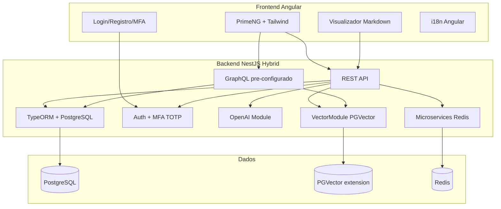

# Plano de Implementação - Ultima Forma Full Stack

> Documento vivo. Atualize a seção [Progresso e Changelog](#progresso-e-changelog) conforme cada etapa for implementada.

## Princípios Obrigatórios (prioridade máxima)

**Todos os passos de implementação DEVEM seguir estes requisitos. Segurança tem precedência sobre funcionalidade.**

- **Defesa em profundidade**: Múltiplas camadas de proteção; nenhuma falha única deve comprometer o sistema
- **Least privilege**: Permissões mínimas; usuários e serviços só acessam o estritamente necessário
- **Never trust input**: Validar e sanitizar toda entrada; nunca confiar em dados do cliente
- **Secrets nunca no código**: Chaves, senhas e tokens apenas em variáveis de ambiente ou secret managers
- **Auditabilidade**: Logs de eventos sensíveis (sem dados sensíveis nos logs); rastreabilidade de ações
- **Fail secure**: Erros devem falhar fechando acesso, não abrindo

## Arquitetura Proposta

REST e GraphQL podem ambos **ler e escrever** em PostgreSQL e em PGVector. A escolha entre um ou outro é por tipo de operação/caso de uso, não por restrição de acesso.



---

## 1. Estrutura do Monorepo (Nx)

- **Workspace**: Nx monorepo com `@nx/workspace`
- **Apps**:
  - `apps/api` - Backend NestJS
  - `apps/web` - Frontend Angular
- **Libs** (conforme evolução): `libs/shared-types`, `libs/api-client`

Estrutura de diretórios:

```
Ultima-Forma/
├── apps/
│   ├── api/                    # NestJS
│   └── web/                    # Angular
├── deploy/                     # Docker Compose produção (Traefik, VPS)
├── libs/
├── ultima-forma-business-plan/ # Existente - não modificar
├── nx.json
├── package.json
└── tsconfig.base.json
```

---

## 2. Backend (NestJS + TypeORM + PostgreSQL)

### 2.1 Stack e Versões

| Pacote          | Versão | Nota                  |
| --------------- | ------ | --------------------- |
| NestJS          | ^11.x  | Última major          |
| @nestjs/typeorm | ^11.x  |                       |
| typeorm         | ^0.3.x |                       |
| pg              | ^8.x   | Driver PostgreSQL     |
| @nestjs/config  | ^3.x   | Variáveis de ambiente |

### 2.1.1 Segurança obrigatória (Backend)

- **Helmet**: Headers de segurança HTTP (`@nestjs/helmet`)
- **Rate limiting**: `@nestjs/throttler` ou `express-rate-limit`; configurar por rota
- **CORS estrito**: Allowlist de origens permitidas; não usar `origin: '*'` em produção
- **Validação**: `class-validator` em todos os DTOs; `ValidationPipe` global
- **SQL**: Sempre parametrizado; nunca concatenar input do usuário
- **TypeORM**: `synchronize: false` em produção; usar migrations

### 2.2 REST API como Principal

- Módulos padrão: `auth`, `users`, `health`
- Controllers REST para operações CRUD e fluxos de negócio (incluindo leitura/escrita em PostgreSQL e PGVector)
- DTOs com `class-validator` e `class-transformer`
- Documentação Swagger via `@nestjs/swagger` (opcional mas recomendado)

### 2.2.1 Segurança obrigatória (REST)

- Validação de entrada em todos os endpoints
- Sanitização de payloads (whitelist de campos permitidos)
- Tamanho máximo de payload configurado
- Proteção contra mass assignment (excluir campos não permitidos nos DTOs)

### 2.3 GraphQL Pré-implementado

- Pacotes: `@nestjs/graphql`, `@nestjs/apollo`, `apollo`, `@as-integrations/express`
- Configuração code-first no `AppModule`
- **Leitura e escrita**: Resolvers e Mutations podem acessar PostgreSQL e PGVector; usar quando consultas flexíveis ou nested forem vantajosas
- Um resolver de exemplo (ex: `HealthResolver` ou `DocumentationResolver`) para demonstrar o uso
- Endpoint em `/graphql` (Apollo Sandbox em dev)

### 2.3.1 Segurança obrigatória (GraphQL)

- Query complexity e depth limiting (ex: `graphql-query-complexity`)
- Timeouts para queries longas
- Evitar exposição excessiva do schema em produção
- Mesmas regras de validação e parametrização que REST

### 2.4 PGVector

- Imagem Docker: `pgvector/pgvector:pg16` ou PostgreSQL 16+ com extensão pgvector
- TypeORM ainda não tem suporte nativo completo; usar:
  - Migration SQL para `CREATE EXTENSION IF NOT EXISTS vector`
  - Tabela com coluna `vector` via migration raw SQL
  - Queries customizadas com `entityManager.query()` para similarity search
- Criar módulo `VectorModule` com serviço `VectorSearchService` (métodos stub) pronto para embeddings e buscas; consumido por **Controllers REST** e **Resolvers GraphQL** conforme necessidade

### 2.4.1 Segurança obrigatória (PGVector)

- Prepared statements ou query builder para todas as queries
- Nunca interpolar user input em SQL; usar placeholders parametrizados

### 2.5 Integração OpenAI

- Pacote: `openai` (SDK oficial)
- Módulo `OpenAIModule` com:
  - `OpenAIService` injetável
  - Config via `OPENAI_API_KEY` em env
  - Método exemplo `chatCompletion()` para uso futuro
- Arquivo `.env.example` com `OPENAI_API_KEY=` (sem valor)

### 2.5.1 Segurança obrigatória (OpenAI)

- API key exclusivamente em variável de ambiente
- Não logar prompts ou respostas que contenham dados sensíveis
- Rate limit por usuário para evitar abuso e custo excessivo

### 2.6 Microservices pré-configurados

- **Pacotes**: `@nestjs/microservices`, `ioredis` (para Redis transport)
- **Arquitetura híbrida**: Aplicação NestJS como hybrid app — HTTP (REST/GraphQL) + microservice listener
- **Transporte**: Redis Pub/Sub (`Transport.REDIS`) para mensageria assíncrona e event-driven; opcional TCP para request-response entre serviços internos
- **Configuração**:
  - `connectMicroservice()` em `main.ts` com `Transport.REDIS` (host/port via env: `REDIS_HOST`, `REDIS_PORT`)
  - Handler de exemplo com `@MessagePattern()` (ex: `events.health` ou `tasks.process`) para demonstrar o fluxo
  - `ClientProxy` injetável para enviar mensagens/eventos quando necessário
- **Docker**: Adicionar Redis ao `docker-compose.yml` (imagem `redis:7-alpine`)
- **Uso futuro**: Pronto para workers assíncronos, processamento em background, notificações, integração entre módulos sem acoplamento síncrono

### 2.6.1 Segurança obrigatória (Microservices)

- **Redis**: Rede interna apenas; não expor Redis na internet; usar `requirepass` se ambiente compartilhado
- **Validação**: Message handlers validam payload com DTOs e `class-validator`
- **Secrets**: `REDIS_PASSWORD` em env quando autenticação habilitada

---

## 3. Autenticação e MFA

### 3.1 Fluxo

1. **Registro**: email + senha (hash com bcrypt)
2. **Login**: email + senha
3. **MFA obrigatório**: Se usuário não tem MFA configurado → redireciona para setup; se tem → solicita código TOTP
4. **Setup MFA**: Backend gera secret (speakeasy ou otplib), retorna otpauth URL; frontend exibe QR para Google/Microsoft Authenticator; usuário valida com código de 6 dígitos

### 3.2 Backend

- Pacotes: `@nestjs/jwt`, `@nestjs/passport`, `passport`, `passport-jwt`, `bcrypt`, `speakeasy` (ou `otplib`)
- Entidades: `User` (id, email, passwordHash, mfaSecret, mfaEnabled, etc.)
- Endpoints:
  - `POST /auth/register`
  - `POST /auth/login` (retorna token temporário se MFA pendente)
  - `POST /auth/mfa/setup` (gera secret, retorna otpauth URL)
  - `POST /auth/mfa/verify` (verifica código e ativa MFA)
  - `POST /auth/mfa/validate` (valida código no login, retorna JWT final)
- Guard JWT para rotas protegidas

### 3.2.1 Segurança obrigatória (Auth/MFA)

- **bcrypt** com cost 12 ou superior (salt automático)
- **JWT**: expiração curta (ex: 15 min); preferir `httpOnly` cookie quando possível
- **Refresh tokens**: rotação e revogação; armazenamento seguro
- **Lockout**: após N tentativas falhas de login/MFA (ex: 5), bloquear temporariamente
- **Secrets TOTP**: criptografados em repouso no banco (não em plaintext)

### 3.3 Frontend

- Tela de login (email/senha)
- Tela de registro
- Tela de setup MFA (QR code com `angularx-qrcode` ou similar)
- Tela de verificação MFA no login
- Interceptor HTTP para enviar JWT e tratar 401

### 3.3.1 Segurança obrigatória (Auth Frontend)

- Tokens em `httpOnly` cookies quando possível; caso contrário, nunca em localStorage sem mitigação adicional
- Não expor tokens em URLs ou query params

---

## 4. Frontend (Angular)

### 4.1 Stack e Versões

| Pacote              | Versão                                     |
| ------------------- | ------------------------------------------ |
| Angular             | ^19.x                                      |
| PrimeNG             | ^19.x ou ^20.x (compatível com Angular 19) |
| Tailwind CSS        | ^4.x (via `ng add tailwindcss`)             |
| tailwindcss-primeui | conforme compatibilidade PrimeNG           |

### 4.2 PrimeNG + Tailwind + Dark Mode

- Instalar PrimeNG e `tailwindcss-primeui`
- Tema PrimeNG com preset (ex: Aura) e `darkModeSelector: '.dark'` ou `.app-dark`
- Tailwind com `darkMode: 'class'` no CSS
- Variável/classe `dark` aplicada por padrão no `<html>` ou `<body>` (ex: `class="dark"`)
- Serviço `ThemeService` para alternar e persistir preferência (localStorage)

### 4.3 Renderização Markdown

- Pacote: `ngx-markdown` (^21.x, compatível com Angular 17+)
- Páginas que listam e exibem documentos de `ultima-forma-business-plan/`
- **Leitura somente**: os arquivos .md serão servidos via API (ou copiados para `assets` em build) e renderizados no frontend; **nenhuma alteração** nos arquivos originais
- Estrutura sugerida: rota `/docs` com sidebar listando os 17 documentos; rota `/docs/:id` exibindo o markdown renderizado

### 4.4 i18n (Angular)

- Seguir [angular.dev/guide/i18n](https://angular.dev/guide/i18n)
- Adicionar `@angular/localize`
- Marcar textos com `i18n` em templates e `$localize` em TS
- Configurar `angular.json` com `i18n` e locales (ex: `pt-BR`, `en`)
- Comando `ng extract-i18n` para gerar arquivos de tradução (ex: `messages.xlf`)
- Build localizado: `ng build --localize`

### 4.5 Rotas e Layout

- Rota pública: `/login`, `/register`
- Rotas com MFA: `/mfa/setup`, `/mfa/verify`
- Rotas protegidas: `/docs`, `/docs/:id`, home (`/`)
- Guard de rota para autenticação
- Layout com sidebar/menu para docs e logout

### 4.5.1 Segurança obrigatória (Frontend)

- **XSS**: Confiar na sanitização do Angular; `ngx-markdown` em modo seguro (sanitize habilitado)
- **CSRF**: Tokens CSRF para operações mutantes quando usando cookies
- **CSP**: Content Security Policy configurada no servidor/proxy
- Conteúdo dinâmico (markdown) sempre sanitizado

---

## 5. Comunicação Frontend-Backend

- **REST**: `HttpClient` do Angular; base URL configurável (environment); opera leitura e escrita em DB e PGVector
- **GraphQL**: `@apollo/client` ou `apollo-angular` para consultas e mutations quando a flexibilidade do schema for útil; também acessa DB e PGVector
- Interceptor para JWT e tratamento de erros

### 5.1 Segurança obrigatória (Comunicação)

- **HTTPS** obrigatório em produção
- Certificados válidos; renovação automática (ex: Let's Encrypt)
- Stack traces e detalhes de erro não expostos em produção

---

## 6. Docker e Ambiente

- `docker-compose.yml` com:
  - PostgreSQL 16 + pgvector
  - Redis 7 (para microservices transport)
  - (Opcional) API e Web em containers para dev
- `.env` para desenvolvimento local (localhost); `.env.example` como template de produção (copiar para `.env.prod` no VPS)

### 6.1 Segurança obrigatória (Docker)

- Imagens executando como usuário não-root quando possível
- Não expor portas além do estritamente necessário
- `.env` nunca versionado; usar `.env.example` como template
- `.gitignore` deve incluir `.env` e arquivos de secrets

### 6.2 Docker Compose Produção (VPS)

Compose production-grade para deploy em VPS remoto com **Traefik** como reverse proxy e gerenciamento de certificados HTTPS automáticos (Let's Encrypt).

**Estrutura sugerida**:

```
deploy/
├── docker-compose.prod.yml    # Stack principal
├── traefik/
│   ├── traefik.yml            # Config estática (providers, entrypoints, certificatesResolvers)
│   └── acme.json              # Certificados Let's Encrypt (volume, perms 600)
└── .env.prod.example          # Template de variáveis
```

**Traefik**:
- Entrypoints: HTTP (80) redireciona para HTTPS; HTTPS (443)
- Certificados: `certificatesResolvers.letsencrypt` com ACME HTTP challenge ou DNS challenge (para wildcards)
- Providers: `providers.docker` para descoberta automática via labels
- Dashboard: Opcional; protegido com Basic Auth ou desabilitado em produção

**Serviços e rotas**:
- **api**: `api.ultimaforma.id` → container API
- **web**: `app.ultimaforma.id` ou `ultimaforma.id` → container Web (Nginx/Caddy servindo build estático Angular)
- Labels Traefik por serviço: `traefik.http.routers.*.rule`, `traefik.http.routers.*.entrypoints`, `traefik.http.routers.*.tls.certresolver`

**Variáveis de ambiente** (`.env.prod`):
- `DOMAIN=ultimaforma.id`, `API_SUBDOMAIN=api`, `APP_SUBDOMAIN=app`, `EMAIL_LETSENCRYPT` (para notificações ACME)
- Secrets: `DB_*`, `JWT_*`, `OPENAI_API_KEY`, `REDIS_*`, etc.

**Requisitos VPS**:
- Docker e Docker Compose instalados
- Portas 80 e 443 liberadas no firewall
- Domínio apontando para o IP do VPS (A/AAAA records)

### 6.2.1 Segurança obrigatória (Docker Produção)

- Traefik dashboard desabilitado ou protegido (Basic Auth, IP allowlist)
- `acme.json` com permissão 600; não versionar
- Secrets em arquivos ou Docker secrets; nunca em compose em texto plano
- Health checks em todos os serviços

---

## 7. Ordem de Implementação Sugerida

1. Criar workspace Nx e apps (api, web)
2. Configurar backend: TypeORM, PostgreSQL, módulos base
3. Configurar PGVector (migration + módulo stub)
4. Implementar auth + MFA (backend e frontend)
5. Integrar OpenAI no backend
6. Pré-configurar GraphQL no backend
7. Pré-configurar microservices (hybrid app + Redis)
8. Configurar frontend: PrimeNG, Tailwind, dark mode padrão
9. Implementar i18n no frontend
10. Implementar visualizador de documentação Markdown (base em ultima-forma-business-plan)
11. Integrar frontend com API (login, docs)
12. Docker Compose produção (Traefik + HTTPS automático para VPS)

---

## 8. Alinhamento OWASP

A implementação deve seguir o [OWASP Top 10](https://owasp.org/www-project-top-ten/) e o [OWASP API Security Top 10](https://owasp.org/API-Security/):

| OWASP | Consideração no projeto |
|-------|-------------------------|
| A01 Broken Access Control | Guards, autorização por recurso, validação de ownership |
| A02 Cryptographic Failures | HTTPS, bcrypt para senhas, TOTP secrets criptografados |
| A03 Injection | Queries parametrizadas, class-validator, sanitização |
| A04 Insecure Design | Princípios deste plano; defesa em profundidade |
| A05 Security Misconfiguration | Helmet, CORS estrito, CSP, sem sync em prod |
| A06 Vulnerable Components | Dependências atualizadas; auditoria (npm audit) |
| A07 Auth Failures | MFA obrigatório, JWT curto, lockout, refresh tokens |
| A08 Integrity Failures | Verificação de assinaturas, integridade de dados |
| A09 Logging Failures | Logs sem PII/tokens; auditoria de eventos sensíveis |
| A10 SSRF | Validar URLs em chamadas externas (OpenAI, etc.) |

Referências: [OWASP Cheat Sheet Series](https://cheatsheetseries.owasp.org/)

---

## 9. Camadas de Segurança (Referência)


---

## 10. Restrições e Observações

- **Documentos ultima-forma-business-plan**: Não alterar. Usar apenas como fonte de conteúdo para leitura e exibição. Se for necessário copiar ou transformar para servir via API/assets, solicitar autorização antes de qualquer mudança nos arquivos originais.
- **Versões**: Manter dependências nas versões mais recentes estáveis no momento da implementação.
- **MFA**: Obrigatório para todos os usuários; não permitir acesso sem MFA ativo após primeiro login.

---

## Progresso e Changelog

> Atualize esta seção conforme implementar cada etapa. Registre data, item concluído e alterações relevantes.

| # | Etapa | Status | Data | Verificação de Segurança | Observações |
|---|-------|--------|------|--------------------------|-------------|
| 1 | Workspace Nx + apps | Pendente | - | - | |
| 2 | Backend TypeORM, PostgreSQL | Pendente | - | Checklist 2.1.1 | |
| 3 | PGVector | Pendente | - | Checklist 2.4.1 | |
| 4 | Auth + MFA | Pendente | - | Checklists 3.2.1, 3.3.1 | |
| 5 | OpenAI | Pendente | - | Checklist 2.5.1 | |
| 6 | GraphQL | Pendente | - | Checklist 2.3.1 | |
| 7 | Microservices (hybrid + Redis) | Pendente | - | Checklist 2.6.1 | |
| 8 | Frontend PrimeNG, Tailwind, dark | Pendente | - | Checklist 4.5.1 | |
| 9 | i18n | Pendente | - | - | |
| 10 | Visualizador Markdown | Pendente | - | Sanitização ngx-markdown | |
| 11 | Integração frontend-API | Pendente | - | Checklists 5.1, 6.1 | |
| 12 | Docker Compose produção (Traefik + VPS) | Pendente | - | Checklist 6.2.1 | |

**Nota**: Marque uma etapa como concluída somente após validar o checklist de segurança correspondente.

### Histórico de alterações do plano

- **2025-02-16**: Plano inicial criado e salvo em `docs/IMPLEMENTATION_PLAN.md`. Diagrama atualizado para refletir que REST e GraphQL ambos leem/escrevem em DB e PGVector.
- **2025-02-16**: Adicionados princípios obrigatórios de produção e segurança; checklists de segurança por seção; alinhamento OWASP; diagrama de camadas; coluna de verificação de segurança na tabela de progresso. Regra Cursor `.cursor/rules/production-security.mdc` criada.
- **2025-02-16**: Adicionada seção 2.6 Microservices pré-configurados (hybrid app NestJS + Redis Pub/Sub); Redis no docker-compose; nova etapa 7 na ordem de implementação.
- **2025-02-16**: Adicionada seção 6.2 Docker Compose produção para VPS com Traefik; certificados HTTPS automáticos (Let's Encrypt); nova etapa 12.
