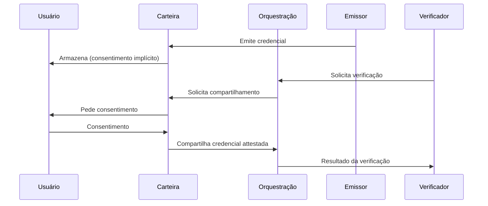

# Arquitetura da Solução

## Componentes Principais

### 1. Carteira (Wallet) de Identidade

Aplicação controlada pelo usuário que armazena credenciais de forma soberana. O titular decide quais credenciais compartilhar, com quem e em qual momento. A Ultima Forma não retém cópias das credenciais; a carteira será hospedada localmente em seu dispositivo inteligente. A utilização de tecnologia blockchain também é factível em outro momento, tanto para rastreamento de atividades quanto para wallet em si.

**Características principais:**
- Armazenamento descentralizado (dispositivo do usuário)
- Consentimento granular por verificação
- Suporte a padrões W3C* Verifiable Credentials

### 2. Plataforma de Orquestração

Backend que conecta emissores, verificadores e carteiras sem centralizar dados de identidade. Gerencia fluxos de emissão e verificação, resolução de DID*, validação de assinaturas e registro de auditoria (logs de consentimento, não conteúdo das credenciais).

### 3. Emissores de Credenciais

Entidades que emitem credenciais verificáveis (governos, bancos, universidades, empregadores). A plataforma orquestra a conexão entre emissores e carteiras; cada emissor mantém seu processo de emissão e assinatura.

### 4. API Enterprise

API* para integração de verificadores (empresas que precisam validar atributos). Permite solicitar verificação de credenciais específicas, receber resultados attestados e integrar fluxos de KYC*/AML* existentes.

---

## Fluxo de Dados

**Princípio:** Dados sensíveis transitam entre carteira e verificador via orquestração, mas a plataforma não persiste o conteúdo das credenciais.

---

## Modelo de Consentimento

- Cada verificação exige consentimento explícito do titular.
- O consentimento é específico: quais atributos, para qual verificador, em qual transação.
- O titular pode revogar consentimentos anteriores.
- Logs de consentimento são mantidos para auditoria e conformidade (o quê foi consentido e quando, não o conteúdo dos dados).

---

## Níveis de Confiança

| Nível | Descrição |
|-------|-----------|
| **Emissor qualificado** | Credenciais emitidas por entidades reguladas (governo, instituições financeiras) com assinatura criptográfica verificável |
| **Emissor registrado** | Emissores cadastrados na plataforma com processos auditados |
| **Self-attested** | Declarações do próprio titular; confiança limitada, uso em cenários de baixo risco |

A plataforma permite que verificadores definam quais níveis aceitam para cada tipo de verificação.

---

## Primitivas de Segurança

- **Assinaturas criptográficas**: Credenciais assinadas por emissores; integridade verificável.
- **Zero-knowledge / selective disclosure**: Possibilidade de revelar apenas atributos necessários, não a credencial inteira.
- **Sem armazenamento centralizado**: A plataforma não mantém repositório de credenciais do usuário.
- **Auditoria**: Registros imutáveis de consentimentos e eventos de verificação para conformidade e disputas.

---

## Glossário (siglas e termos)

- **AML**: Anti-Money Laundering; regras e controles de combate à lavagem de dinheiro.
- **API**: Application Programming Interface; interface para integração entre sistemas.
- **DID**: Decentralized Identifier; identificador descentralizado.
- **KYC**: Know Your Customer; processo de verificação de identidade de clientes.
- **W3C**: World Wide Web Consortium; organismo de padronização (ex.: Verifiable Credentials).
