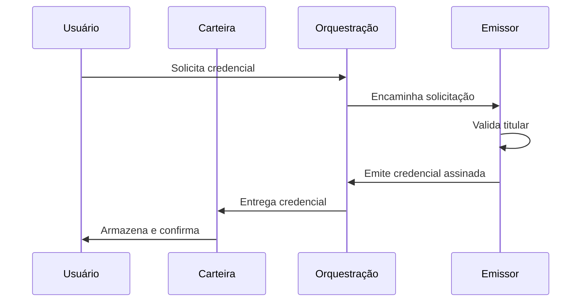
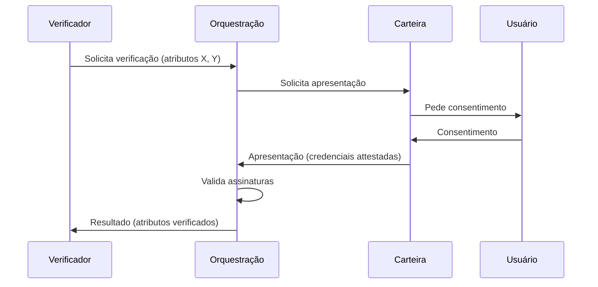

# Apêndice

## Diagramas Técnicos

### Fluxo de Emissão de Credencial

### Fluxo de Verificação

---

## Fluxos de Exemplo

### Caso 1: Verificação de Documento para Onboarding Bancário

1. Usuário possui credencial de documento emitida por Gov.br na carteira
2. Fintech solicita verificação de CPF e nome via API
3. Orquestração encaminha solicitação à carteira
4. Usuário consente compartilhamento
5. Carteira envia apresentação com atributos solicitados
6. Orquestração valida assinatura do emissor
7. Verificador recebe resultado e prossegue com onboarding

### Caso 2: Verificação de Qualificação Profissional

1. Usuário possui credencial de diploma emitida por universidade integrada
2. Empresa contratante solicita verificação de titulação
3. Fluxo análogo ao anterior; apenas atributos relevantes são compartilhados

---

## Glossário

| Termo | Definição |
|-------|-----------|
| **Credencial verificável** | Atestado digital assinado criptograficamente por um emissor, contendo atributos sobre o titular |
| **DID** | Decentralized Identifier; identificador que permite resolução para endpoint sem autoridade central |
| **Emissor** | Entidade que emite credenciais (governo, banco, instituição de ensino, etc.) |
| **Verificador** | Entidade que solicita e recebe atestados sobre atributos do titular |
| **Carteira** | Aplicação onde o titular armazena credenciais e controla compartilhamento |
| **Orquestração** | Coordenação do fluxo entre emissores, carteiras e verificadores |
| **Apresentação** | Conjunto de credenciais ou atributos compartilhados pelo titular em resposta a uma solicitação |
| **KYC** | Know Your Customer; processo de verificação de identidade de clientes |
| **AML** | Anti-Money Laundering; normas de combate à lavagem de dinheiro |

---

## Registro de Premissas

| Premissa | Valor/Descrição | Fonte/Nota |
|---------|----------------|------------|
| Custo KYC tradicional | [PLACEHOLDER] | Referência de mercado |
| TAM verificação de identidade | [PLACEHOLDER] | Consultorias de mercado |
| Percentual SAM/SOM | [PLACEHOLDER] | Modelo interno |
| Taxa de retenção cliente | [PLACEHOLDER] | Benchmark |
| Ciclo de venda enterprise | [PLACEHOLDER] | Estimativa |

*Atualizar com dados reais conforme disponíveis.*

---

## Referências de Mercado

- W3C Verifiable Credentials Data Model
- eIDAS 2.0 Regulation (EU)
- LGPD (Lei Geral de Proteção de Dados - Brasil)
- McKinsey, Grand View Research (estimativas de mercado de identidade)
- Gov.br - Estratégia de Identidade Digital

---

*Documento vivo; revisar periodicamente com evolução do produto e do mercado.*

---

# Lacunas Críticas a Serem Resolvidas

Este documento consolida as decisões estratégicas que precisam ser formalmente definidas antes do início da execução operacional do MVP e da estratégia comercial.

## 1. Vertical Inicial no Brasil

Definir qual será o primeiro segmento-alvo:

- Banco tradicional
- Fintech
- Marketplace
- HR / Onboarding corporativo
- Outro (especificar)

**Impacto direto:**
- Escopo do MVP
- Complexidade regulatória
- Ciclo de venda
- Ticket médio esperado

Status: [EM ABERTO]

---

## 2. Tipo de MVP

Definir qual será a estratégia inicial:

- Wallet-first
- API-first
- Emissor-first
- Híbrido (especificar)

**Impacto direto:**
- Prioridade técnica
- Estrutura de equipe
- Time-to-market
- Dependência de parceiros

Status: [EM ABERTO]

---

## 3. Estratégia de Validação Comercial

Definir abordagem inicial:

- Entrevistas exploratórias (5–10 empresas)
- Busca por Design Partner
- Carta de Intenção (LOI)
- Piloto fechado

**Impacto direto:**
- Redução de risco
- Ajuste de pricing
- Refinamento do problema real

Status: [EM ABERTO]

---

## 4. Modelo de Captação Inicial

Definir estrutura financeira:

- Bootstrapped
- Investidor anjo
- Pré-seed institucional
- Estrutura híbrida

**Impacto direto:**
- Ritmo de desenvolvimento
- Estrutura societária
- Capacidade de contratação

Status: [EM ABERTO]

---

## 5. Estrutura Jurídica da Empresa

Definir:

- País de constituição
- Estrutura societária
- Estrutura de vesting
- Conselho consultivo (advisors)

**Impacto direto:**
- Captação futura
- Governança
- Segurança jurídica

Status: [EM ABERTO]

---

## Observação Estratégica

Nenhuma etapa de desenvolvimento avançado deve iniciar sem definição formal das lacunas acima.

Este documento deve ser atualizado conforme cada decisão for tomada.

Status Geral: ⚠ Decisões pendentes antes da Fase de Execução.
