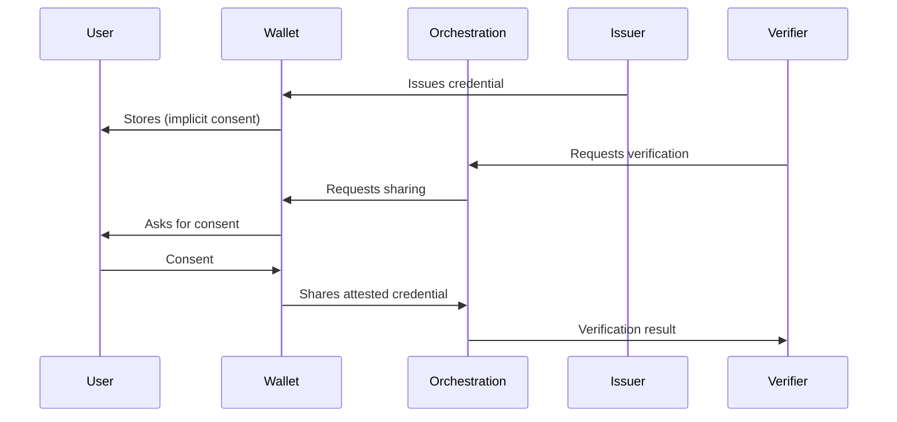

# Solution Architecture

## Main Components

### 1. Identity Wallet

User-controlled application that stores credentials in a sovereign manner. The holder decides which credentials to share, with whom, and when. Ultima Forma does not retain copies of credentials; the wallet will be hosted locally on the user's smart device. The use of blockchain technology is also feasible at a later stage, both for activity tracking and for the wallet itself.

**Key features:**
- Decentralized storage (user's device)
- Granular consent per verification
- Support for W3C* Verifiable Credentials standards

### 2. Orchestration Platform

Backend that connects issuers, verifiers, and wallets without centralizing identity data. Manages issuance and verification flows, DID* resolution, signature validation, and audit logs (consent logs, not credential content).

### 3. Credential Issuers

Entities that issue verifiable credentials (governments, banks, universities, employers). The platform orchestrates the connection between issuers and wallets; each issuer maintains its issuance and signing process.

### 4. Enterprise API

API* for verifier integration (companies that need to validate attributes). Allows requesting verification of specific credentials, receiving attested results, and integrating with existing KYC*/AML* flows.

---

## Data Flow

**Principle:** Sensitive data transits between wallet and verifier via orchestration, but the platform does not persist credential content.

---

## Consent Model

- Each verification requires explicit consent from the holder.
- Consent is specific: which attributes, for which verifier, in which transaction.
- The holder may revoke previous consents.
- Consent logs are maintained for audit and compliance (what was consented and when, not data content).

---

## Trust Levels

| Level | Description |
|-------|-------------|
| **Qualified issuer** | Credentials issued by regulated entities (government, financial institutions) with verifiable cryptographic signature |
| **Registered issuer** | Issuers registered on the platform with audited processes |
| **Self-attested** | Declarations from the holder; limited trust, for low-risk scenarios |

The platform allows verifiers to define which levels they accept for each verification type.

---

## Security Primitives

- **Cryptographic signatures**: Credentials signed by issuers; verifiable integrity.
- **Zero-knowledge / selective disclosure**: Possibility to reveal only necessary attributes, not the entire credential.
- **No centralized storage**: The platform does not maintain a user credential repository.
- **Audit**: Immutable records of consents and verification events for compliance and disputes.

---

## Glossary (acronyms and terms)

- **AML**: Anti-Money Laundering; rules and controls to combat money laundering.
- **API**: Application Programming Interface; interface for integration between systems.
- **DID**: Decentralized Identifier; decentralized identifier.
- **KYC**: Know Your Customer; process of verifying client identity.
- **W3C**: World Wide Web Consortium; standardization body (e.g., Verifiable Credentials).
