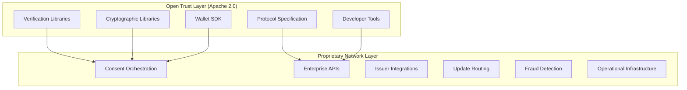
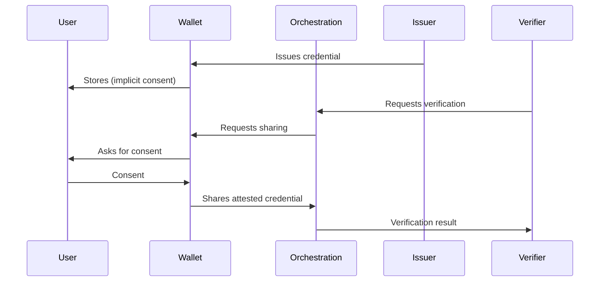

# Solution Architecture

## Main Components

### 1. Credential Consent Layer (Multi-Channel)

The consent layer is the user-facing component that enables credential sharing. It operates through three channels, designed so the platform works without requiring users to install any app:

- **Web-based consent flows (Day 1).** When a verifier requests credential verification, the user receives a link (email, SMS, or embedded in a web flow) to review and approve the request in a browser. No app install required.
- **Issuer-embedded SDK.** Banks, telecoms, and other issuers embed credential management into their existing apps via SDK. A bank's mobile app becomes a credential wallet for credentials that bank has issued. This leverages installed bases of millions of users.
- **Standalone Identity Wallet (convenience layer).** A dedicated mobile application for users who hold credentials from multiple issuers and want unified management. Stores credentials locally on the user's device with granular consent per verification, support for W3C* Verifiable Credentials standards, and credential management (view, share, revoke consent).

The platform is designed so that any channel can serve any verification request. The standalone wallet makes the experience better, not possible.

### 2. Orchestration Platform

Backend that connects issuers, verifiers, and credential holders (via any channel) without centralizing identity data. Manages issuance and verification flows, DID* resolution, signature validation, and audit logs (consent logs, not credential content).

### 3. Credential Issuers

Entities that issue verifiable credentials (governments, banks, universities, employers). The platform orchestrates the connection between issuers and credential holders. Each issuer maintains its issuance and signing process.

### 4. Enterprise API

API* for verifier integration (companies that need to validate attributes). Allows requesting verification of specific credentials, receiving attested results, and integrating with existing KYC*/AML* flows. The platform complements existing compliance tools (PEP/sanctions screening, ongoing monitoring, risk scoring) rather than replacing them.

---

## Open vs. Proprietary Components

The architecture draws a clear boundary between the open trust layer and the proprietary network layer:

### Open (Trust Layer)

- **Credential verification libraries** -- open-source libraries for validating W3C Verifiable Credentials and cryptographic signatures
- **Cryptographic libraries** -- public, auditable implementations of signature validation, DID resolution, and selective disclosure
- **Wallet SDK** -- open-source SDK enabling any developer or institution to build wallets compatible with the protocol
- **Credential schemas / protocol specification** -- published, versioned protocol spec defining credential formats, presentation flows, and trust framework
- **Developer verification tools** -- CLI and testing tools for developers to validate integrations and credential formats

### Proprietary (Network Layer)

- **Consent orchestration platform** -- the core engine managing multi-party consent flows, credential routing, and session management
- **Enterprise APIs** -- production APIs with SLA, rate limiting, authentication, and compliance logging
- **Issuer integrations** -- maintained connections to banks, telecoms, governments, and other credential sources
- **Identity update routing** -- infrastructure for propagating credential updates to verifiers with active consent
- **Fraud detection / analytics** -- behavioral analytics, anomaly detection, and anti-abuse systems
- **Operational infrastructure** -- monitoring, SRE, incident response, and high-availability systems

### Open/Proprietary Boundary

```mermaid
graph TB
    subgraph "Open Trust Layer (Apache 2.0)"
        VL[Verification Libraries]
        CL[Cryptographic Libraries]
        WS[Wallet SDK]
        PS[Protocol Specification]
        DT[Developer Tools]
    end

    subgraph "Proprietary Network Layer"
        CO[Consent Orchestration]
        EA[Enterprise APIs]
        II[Issuer Integrations]
        UR[Update Routing]
        FD[Fraud Detection]
        OI[Operational Infrastructure]
    end

    VL --> CO
    CL --> CO
    WS --> CO
    PS --> EA
    DT --> EA
```

This boundary follows the same core logic as Stripe (open-source Elements UI / proprietary payments network), Cloudflare (open-source Workers runtime / proprietary edge network), and Kubernetes (open-source orchestrator / proprietary cloud infrastructure). The open layer builds trust and adoption. The proprietary layer captures value.

---

## Data Flow

```mermaid
sequenceDiagram
    participant U as User
    participant C as Wallet
    participant O as Orchestration
    participant E as Issuer
    participant V as Verifier

    E->>C: Issues credential
    C->>U: Stores (implicit consent)
    V->>O: Requests verification
    O->>C: Requests sharing
    C->>U: Asks for consent
    U->>C: Consent
    C->>O: Shares attested credential
    O->>V: Verification result
```

**Principle:** Sensitive data transits between wallet and verifier via orchestration, but the platform does not persist credential content.

---

## Consent Model

- Each verification requires explicit consent from the holder.
- Consent is specific: which attributes, for which verifier, in which transaction.
- The holder may revoke previous consents.
- Consent logs are maintained for audit and compliance (what was consented and when, not data content).

---

## Trust Levels

| Level | Description |
|-------|-------------|
| **Qualified issuer** | Credentials issued by regulated entities (government, financial institutions) with verifiable cryptographic signature |
| **Registered issuer** | Issuers registered on the platform with audited processes |
| **Self-attested** | Declarations from the holder; limited trust, for low-risk scenarios |

The platform allows verifiers to define which levels they accept for each verification type.

---

## Security Primitives

- **Cryptographic signatures**: Credentials signed by issuers, with verifiable integrity. All cryptographic operations use open-source, auditable implementations.
- **Zero-knowledge / selective disclosure**: Possibility to reveal only necessary attributes, not the entire credential.
- **No centralized storage**: The platform does not maintain a user credential repository.
- **Audit**: Immutable records of consents and verification events for compliance and disputes.
- **Public verifiability**: Any party can independently verify credential authenticity using the open verification libraries without relying on Ultima Forma's infrastructure.

---

## How the Architecture Reduces Identity Fraud

The current identity verification model creates attack surfaces at every point where data is collected. Every company that runs KYC is a target. The proposed architecture eliminates most of these collection points and shifts verification to cryptographic proofs.

Below is the impact of the architecture on the main identity fraud vectors.

### Synthetic identity fraud

In the current model, a fraudster combines a real CPF with fabricated data (name, address, photo) and attempts to open accounts. The attack works because each company collects and validates data in isolation, with no common source of truth.

In the proposed architecture, the verifiable credential is issued by a qualified issuer (bank, government) that has already validated the person's complete identity. There is no such thing as a "partially true" credential. The issuer attests to the full set of attributes with a cryptographic signature. A verifier that requires a qualified issuer credential receives mathematical proof that the identity was validated as a whole, not a set of fields that could have been assembled.

### Stolen identity reuse

Data breaches expose CPF, name, address, and other personal data of millions of people. In the current model, this data is enough to open accounts or perform transactions on behalf of the victim.

With verifiable credentials, leaked data loses its utility. The credential is stored in the holder's wallet, bound to the device and protected by local authentication. Having someone's personal data does not allow presenting a valid credential. The attacker would need to compromise the victim's physical device and its biometric or PIN authentication. The attack vector shifts from "having information" to "having device control", which is a barrier of a different order.

### Registration manipulation

Account takeover through address, phone, or email changes is possible because companies maintain editable records that rely on internal validation processes (often fragile, such as SMS confirmation or support calls).

In the proposed architecture, attributes like address and phone number are credentials issued and signed by an issuer. Changing an address means obtaining a new credential from the issuer, which will run its own validation process. An attacker cannot change an address by calling a verifier's support line because the verifier is not the source of the data. The source is the issuer, and the credential only changes when the issuer re-issues it.

The identity update routing propagates legitimate changes automatically, with the holder's consent, to all verifiers with active consent. This keeps data current without opening manipulation gaps.

### Forged documents and selfie spoofing

The current model requires every company to capture documents and selfies for proof of life. Each capture is an attack point. Smaller companies or those with less sophisticated processes are preferred targets.

The architecture removes the need for repeated document and selfie capture. Proof of life happens once, at the qualified issuer, which has dedicated liveness detection infrastructure (3D cameras, video injection detection, depth analysis, and microexpression analysis). The result of that verification is encoded in the credential.

When the credential is used, verification is cryptographic, not visual. The verifier validates the issuer's digital signature. There is no selfie to fake, no document to tamper with. The selfie spoofing attack must be executed against the qualified issuer, which is the entity with the greatest capability and incentive to detect it. If the issuer is compromised, the credential can be revoked, invalidating all future uses.

### Combined effect

| Fraud vector | Current model | With the proposed architecture |
|---|---|---|
| Synthetic identity | Partial data accepted by isolated validation | Credential attests to full identity, verified by qualified issuer |
| Stolen identity | Leaked data is enough to operate | Data without the credential (and without device control) is useless |
| Registration manipulation | Editable records at every company | Attributes come from issuer-signed credentials, not internal records |
| Forged documents | Every verification is an attack point | Cryptographic verification, no document capture |
| Selfie spoofing | Attack repeatable at every company | Proof of life concentrated at the qualified issuer, once |

Fraud reduction does not come from a better anti-fraud tool. It comes from the structural elimination of attack vectors. When verification is a cryptographic proof rather than a visual inspection of documents, most traditional attacks lose their entry point.

### When the Trusted Source Is Compromised

There is a structural risk in any ecosystem based on trusted issuers. If a fraudster alters a user's data within an issuer, and the platform propagates that change to other integrated companies, the risk arises of disseminating authenticated but materially false data. The cryptographic signature proves provenance, integrity, consent, and audit trail. It does not, by itself, guarantee the material truthfulness of the data when the issuer has been defrauded, hacked, or suffered unauthorized alteration in its database.

The potential impact includes improper registration updates across multiple companies, account takeover, and alteration of email, phone, address, bank account, PIX key, or other sensitive attributes. The effect is systemic: network propagation requires rollback, blocking, and revocation, with reputational risk for the network and contractual and regulatory exposure depending on Ultima Forma's role in the flow.

The architectural response is not to promise absolute truth of every emitted data point. Ultima Forma operates as a trust orchestration layer, risk policy, containment infrastructure, and auditable trail of consent, origin, status, and propagation. We drastically reduce document fraud, forgery, in-transit tampering, and sharing without consent. We add risk controls to limit damage when the trusted source itself is compromised.

**Mitigators already in the architecture.** Digitally signed credentials, cryptographic validation of provenance and integrity, explicit and auditable consent, data minimization on the platform, traceability and audit trail, status and revocation validation, segmentation by trust level and issuer type, device binding and strong user authentication where applicable.

**Additional propagation controls.** The architecture provides propagation based on attribute criticality. Low or medium risk attributes (address, secondary phone, registration preferences) receive standard treatment. High risk attributes (primary login email, recovery phone, bank account, PIX key, primary document, beneficiary, device change, legal identity change) require additional controls before propagation.

For high-impact changes, the architecture provides step-up auth and double confirmation: reinforced user authentication, additional confirmation in the wallet, confirmation via phishing-resistant factor, and, in critical cases, confirmation by a second trusted source. For certain sensitive attributes, a **cooling-off window or intelligent delay** applies before automatic propagation, adaptive to risk, context, and detected anomalies.

Anomaly detection and quarantine hold suspicious events before propagation. Simultaneous changes to multiple sensitive attributes, atypical volume from an issuer, changes outside the user's pattern, changes after device swap, and suspicious sequences enter quarantine for review, confirmation, or blocking.

Before propagating an attribute, the architecture queries the credential status and respects issuer revocation, suspension, or blocking. Operational kill switch capability exists to pause an issuer or credential type in case of incident. Each relevant attribute carries provenance and context metadata: source issuer, issuance timestamp, last validation, trust level, status, and version. This enables risk-based decisions by attribute consumers.

The architecture provides the ability to identify which parties received a given update, stop further propagation, revert changes when applicable, and trigger remediation workflows. The trust framework defines minimum security requirements, onboarding criteria, revocation policy, incident communication SLA, right of audit, and minimum operational standards for issuers. The network's operational model provides clear role definition, responsibility for data origin, incident cooperation, evidentiary trail, and recourse and governance mechanisms.

The platform was designed with privacy-by-design, security-by-design, and fraud-governance-by-design. It is not merely portability infrastructure. It is a trust orchestration layer that operates in imperfect environments.

---

## Glossary (acronyms and terms)

- **AML**: Anti-Money Laundering; rules and controls to combat money laundering.
- **API**: Application Programming Interface; interface for integration between systems.
- **DID**: Decentralized Identifier; decentralized identifier.
- **KYC**: Know Your Customer; process of verifying client identity.
- **W3C**: World Wide Web Consortium; standardization body (e.g., Verifiable Credentials).
