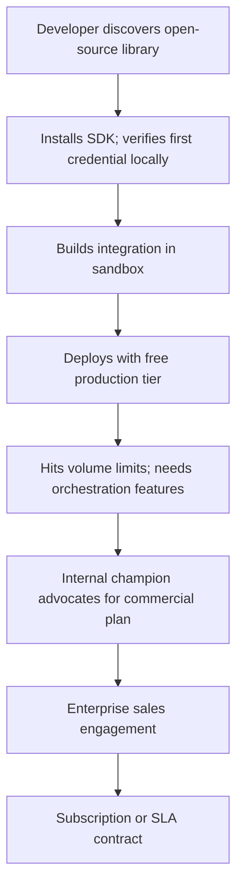

# Developer Adoption Strategy

## Why Developer Adoption Matters

Stripe did not win payments by hiring the largest enterprise sales team. It won by making payments easy for developers. Twilio did not win communications by signing carrier agreements faster. It won by giving developers a programmable API. Plaid did not win financial data by having the best bank relationships. It won by making financial data accessible through a developer-friendly interface.

The pattern is clear: infrastructure companies that win create developer-first adoption channels that complement enterprise sales. Developers try the product, build integrations, and then drive bottom-up demand within their organizations.

Ultima Forma's open-source verification libraries and SDK are the foundation of this channel. They serve as a distribution strategy, not merely a marketing tactic.

---

## Open SDKs and Verification Libraries

### How They Accelerate Adoption

A developer building a fintech application in Brazil today has no standard way to verify identity credentials. They integrate with 2--3 proprietary KYC vendors, each with different APIs, data formats, and integration requirements. Every new vendor requires weeks of integration work.

Ultima Forma's open verification libraries change this equation:

- **Install in minutes.** `npm install @ultima-forma/verify` (or equivalent for Python, Java, Go). A developer can validate a verifiable credential in their local environment within 30 minutes.
- **Standard interface.** One API for all credential types, all issuers, all trust levels. The library handles DID resolution, signature validation, schema checking, and revocation status.
- **No vendor lock-in at the verification layer.** The open library works independently of Ultima Forma's proprietary platform. A developer can verify credentials without being a platform customer. When they need orchestration, consent management, and production infrastructure, the proprietary platform is the natural next step.

### SDK Distribution

| Platform | Package | Target Developers |
|----------|---------|-------------------|
| **JavaScript/TypeScript** | npm: `@ultima-forma/verify`, `@ultima-forma/wallet-sdk` | Web developers, Node.js backend developers |
| **Python** | PyPI: `ultima-forma` | Data engineers, backend developers, ML/AI teams |
| **Java/Kotlin** | Maven Central: `com.ultimaforma:verify` | Enterprise backend, Android developers |
| **Go** | Go module: `github.com/ultima-forma/verify-go` | Infrastructure engineers, microservices developers |
| **Swift** | Swift Package Manager | iOS developers |

Priority: JavaScript/TypeScript (Phase 0), Python and Java (Phase 1), Go and Swift (Phase 2).

---

## Developer Experience (DX) as Competitive Advantage

Developer experience is a first-class engineering concern, not an afterthought. The following DX investments create a built-in adoption advantage:

### Documentation Portal

- Getting started guide (credential verification in < 10 minutes)
- API reference with interactive examples
- Integration guides by use case (KYC onboarding, age verification, income verification)
- Architecture guides for building on the open protocol
- Changelog and migration guides for every version

### Developer Sandbox

A fully functional sandbox environment where developers can:

- Issue test credentials from simulated issuers
- Build and test verification flows end-to-end
- Validate wallet integrations
- Test consent flows without real user data
- Generate sample audit logs and compliance reports

The sandbox is free and requires only email registration. No sales conversation required.

### Developer Tools

- **CLI** for local development: generate test credentials, validate schemas, simulate verification flows
- **Postman/OpenAPI collections** for rapid API exploration
- **GitHub Actions / CI integrations** for automated credential validation in deployment pipelines
- **Error messages** that explain the problem and suggest the fix (not cryptographic error codes)

---

## Free Tier Strategy

The free tier is the top of the developer funnel. It is designed to let developers build real integrations without commercial friction:

| Tier | Verification Volume | Features | Purpose |
|------|-------------------|----------|---------|
| **Open Source** | Unlimited (local) | Verification libraries, wallet SDK, protocol spec | Adoption; community building |
| **Sandbox** | Unlimited (test data) | Full API access with test credentials | Integration development |
| **Free Production** | 100 verifications/month | Production API with rate limits | Proof of concept; small projects |
| **Paid** | Per pricing plans | Full production features, SLA, support | Commercial use |

The free production tier ensures that a developer who builds a working integration never hits a paywall during initial validation. The transition to paid happens when the application reaches production scale -- the same point where the developer's organization is ready to sign a commercial agreement.

---

## Community Building

### Channels

- **GitHub**: all open-source repositories, issue tracking, discussions, pull requests
- **Discord**: developer community for real-time support, integration help, and feature discussions
- **Developer blog**: technical content on verifiable credentials, identity standards, integration patterns
- **Developer events**: hackathons, meetups, conference talks focused on identity infrastructure

### Community Programs

- **Early access program**: developers who contribute to the open-source libraries get early access to new platform features
- **Integration showcase**: featured case studies of developer-built integrations
- **Bug bounty**: security-focused bounty program for the open-source verification libraries
- **Ambassador program**: active community members who help other developers and provide product feedback

---

## Developer-to-Enterprise Conversion Funnel

This funnel operates in parallel with direct enterprise sales. The developer channel reduces CAC by creating internal champions before the sales team engages. Enterprise deals that originate from developer adoption close faster and retain better because the technical integration is already proven.

---

## Metrics

| Metric | Phase 0--1 Target | Phase 2--3 Target | Why It Matters |
|--------|------------------|------------------|----------------|
| **GitHub stars** (verification libraries) | 500+ | 2,000+ | Awareness and credibility signal |
| **SDK downloads** (monthly) | 1,000+ | 10,000+ | Adoption breadth |
| **Active developers** (monthly sandbox users) | 100+ | 500+ | Engaged developer base |
| **Sandbox-to-production conversion** | 10--15% | 15--25% | Funnel efficiency |
| **Developer-originated enterprise deals** | 1--2 | 5--10 | Revenue from developer channel |
| **External contributors** | 5+ | 20+ | Ecosystem health |
| **Community Discord members** | 200+ | 1,000+ | Community engagement |

---

## Glossary (acronyms and terms)

- **API**: Application Programming Interface; interface for integration between systems.
- **CAC**: Customer Acquisition Cost.
- **CLI**: Command-Line Interface; developer tool for terminal-based interaction.
- **DID**: Decentralized Identifier; decentralized identifier.
- **DX**: Developer Experience; quality of the developer's interaction with tools, documentation, and APIs.
- **SDK**: Software Development Kit; set of tools for building on a platform.
- **SLA**: Service Level Agreement; service level agreement.
