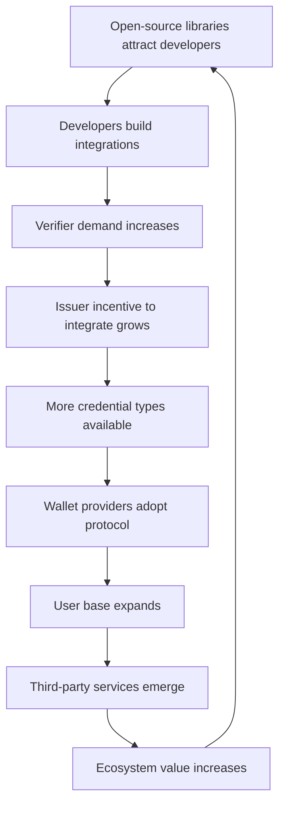

# Ecosystem Strategy

## From Platform to Ecosystem

Ultima Forma begins as an orchestration platform connecting issuers and verifiers. The long-term vision is an ecosystem where third parties build services, tools, and applications on top of the open protocol and proprietary network -- creating value that Ultima Forma could not build alone.

The ecosystem strategy transforms the competitive landscape: instead of defending against competitors, the platform recruits them as ecosystem participants. Every third-party wallet, every integration partner, every developer tool built on the protocol increases the value of the network.

---

## Ecosystem Participants

### Issuers

Entities that create verifiable credentials -- the supply side of the network.

| Issuer Type | Credential Examples | Strategic Value |
|-------------|-------------------|-----------------|
| **Banks** | Income verification, account ownership, credit score | Highest trust level; strongest economic incentive (KYC cost reduction) |
| **Telecoms** | Address verification, phone number ownership | Large installed base; high-frequency verification demand |
| **Governments** | Civil identity, tax ID, professional licenses | Highest trust level; regulatory alignment; GOV.BR integration |
| **Universities** | Academic credentials, professional certifications | High value for HR/employment verification use cases |
| **Employers** | Employment verification, income attestation | High demand from financial services for lending decisions |
| **Healthcare** | Insurance status, vaccination records, professional credentials | Regulated sector with strong compliance requirements |

### Verifiers

Companies that consume verified credentials -- the demand side of the network.

| Verifier Type | Use Cases | Volume Profile |
|---------------|-----------|---------------|
| **Fintechs** | Customer onboarding, KYC compliance, credit decisions | High volume; cost-sensitive; digital-first |
| **Insurance** | Policyholder verification, claims validation | Medium volume; high-value transactions |
| **Healthcare** | Patient identity, insurance verification, provider credentials | Growing digital adoption; strong regulatory requirements |
| **Real estate** | Tenant verification, income proof, identity for contracts | Medium volume; high per-transaction value |
| **HR / Employment** | Background checks, credential verification, work authorization | Steady volume; growing compliance requirements |

### Developers

Building on top of the open protocol -- the adoption engine.

- **Integration developers**: building credential verification into existing applications
- **Wallet developers**: creating specialized wallets for specific industries or use cases
- **Tool developers**: building analytics, compliance, and monitoring tools on top of the protocol
- **Platform developers**: building vertical applications that use credential verification as a core feature

### Wallet Providers

Third-party wallets using the open SDK create choice for users and expand the network.

- Banks embedding credential management via the issuer SDK
- Independent wallet developers building specialized experiences
- Government wallets (GOV.BR) integrating via the open protocol
- Industry-specific wallets (healthcare, education, professional)

### Third-Party Services

Services built on top of the platform that create additional value for participants:

- **Compliance analytics**: monitoring and reporting tools for regulated industries
- **Fraud detection**: specialized anti-fraud services using credential verification data
- **Integration middleware**: connectors for ERP, CRM, and industry-specific systems
- **Audit services**: independent audit and certification services for credential issuers

---

## Ecosystem Revenue Model

The ecosystem creates multiple revenue streams beyond direct verification fees:

| Revenue Source | Model | Timeline |
|---------------|-------|----------|
| **Verification fees** | Per-verification and subscription (core business) | Phase 0+ |
| **Enterprise platform fees** | Annual contracts for high-volume, high-SLA access | Phase 1+ |
| **Developer platform fees** | Production API access beyond free tier | Phase 1+ |
| **Ecosystem partner fees** | Revenue share with third-party services built on the platform | Phase 2+ |
| **Certification fees** | Issuer certification and audit programs | Phase 2+ |
| **Marketplace commissions** | Commissions on third-party services transacted through the platform | Phase 3+ |

As the ecosystem matures, the revenue mix shifts from direct verification fees toward platform and ecosystem fees -- a higher-margin, more defensible revenue model.

---

## Ecosystem Flywheel

Each cycle of the flywheel increases the value for all participants and raises the cost of switching to an alternative ecosystem.

---

## Marketplace Potential (Long Term)

As the ecosystem matures (Phase 3+), a marketplace for credential-related services becomes viable:

- **Issuer marketplace**: verifiers discover and connect with issuers across credential types and trust levels
- **Service marketplace**: third-party compliance, analytics, and integration services available to all platform participants
- **Developer marketplace**: pre-built integrations, templates, and tools that accelerate implementation

The marketplace model transforms Ultima Forma from an infrastructure provider into a platform business -- with the corresponding improvement in unit economics and defensibility.

---

## Ecosystem Growth Metrics

| Metric | Phase 1 Target | Phase 2 Target | Phase 3 Target |
|--------|---------------|---------------|---------------|
| **Issuer integrations** | 3--5 | 10--15 | 25+ |
| **Active verifier clients** | 5--10 | 20--30 | 50+ |
| **Credential types available** | 5--8 | 15--20 | 30+ |
| **Third-party wallet implementations** | 1--2 | 5--8 | 15+ |
| **Third-party services on platform** | 0 | 3--5 | 10+ |
| **Developer community size** | 200+ | 1,000+ | 5,000+ |

---

## Glossary (acronyms and terms)

- **API**: Application Programming Interface; interface for integration between systems.
- **CRM**: Customer Relationship Management; customer relationship management system.
- **ERP**: Enterprise Resource Planning; integrated management system.
- **KYC**: Know Your Customer; process of verifying client identity.
- **SDK**: Software Development Kit; set of tools for building on a platform.
- **SLA**: Service Level Agreement; service level agreement.
