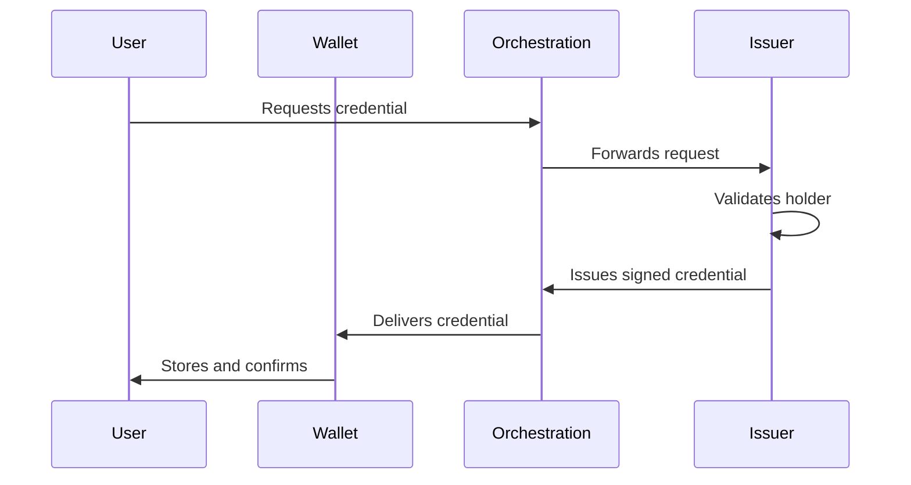
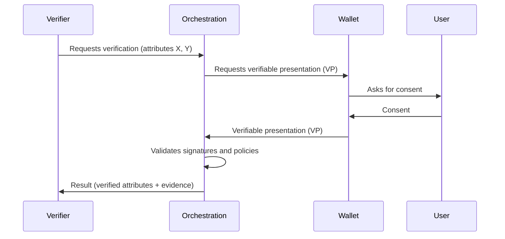

# Appendix

This appendix consolidates, in reference format, the technical flows and main numerical assumptions used throughout the plan.

---

## A. Technical Diagrams (reference)

### A.1 Credential issuance flow

### A.2 Verification flow (verifiable presentation with consent)

---

## B. Example flows (use cases)

### B.1 FinTech onboarding (initial vertical)

1. The user has an identity credential issued by a qualified/registered issuer (e.g., Gov.br, financial institution, or telecom), stored in the wallet.
2. The FinTech requests verification of minimum attributes (e.g., CPF and name) via API.
3. The orchestration platform forwards the request to the wallet, with policy and scope.
4. The user consents to sharing the minimum set of attributes.
5. The wallet sends a **verifiable presentation (VP)** with the requested attributes and cryptographic evidence (issuer signatures and, when applicable, status/revocation).
6. The orchestration validates signature, status when applicable, and records event metadata (audit).
7. The FinTech receives the verifiable result and continues the onboarding and KYC flow under its responsibility.

### B.2 Professional qualification verification

1. The user has a diploma/certification credential issued by an integrated university/issuing entity.
2. The hiring company requests verification of the necessary attribute (e.g., "degree", "course", "year").
3. The flow follows the same onboarding pattern: consent, **verifiable presentation (VP)** with selective disclosure (when applicable), and cryptographic validation.

---

## C. Consolidated assumptions (plan values)

| Assumption | Value/Description | Where defined in plan |
|---------|------------------|-----------------------------|
| **Initial vertical** | **FinTech** | "Go-To-Market" section |
| **Initial geography** | **Brazil** (expansion to selected LATAM) | "Go-To-Market" section |
| **MVP type (scope)** | **Hybrid**: orchestration + enterprise API + minimal wallet (Android/iOS) | "Solution Architecture" and "Roadmap 36 Months" sections |
| **Traditional KYC cost (pain reference)** | **Individual**: BRL **40–100** per verification; **Corporate**: ~BRL **10–12.5k** per review | "Problem Statement" section |
| **TAM (global verification/KYC market)** | **US$ 15–25B by 2030**, CAGR ~**12–15%** | "Market Thesis" section |
| **SAM / SOM (reference)** | **SAM**: **15–25%** of TAM (vertical+geography); **SOM (36m)**: **0.5–2%** of SAM | "Market Thesis" section |
| **Sales cycle (reference)** | **Growth**: **3–6 months**; **Enterprise**: **6–9 months** | "Go-To-Market" and "Unit Economics" sections |
| **Retention (proxy via average useful life)** | **Starter**: 24–36m; **Growth**: 30–42m; **Enterprise**: 36–60m | "Unit Economics" section |

---

## D. Pricing and unit economics (summary)

### D.1 Verification pricing (table)

| Item | Table price | Definition |
|------|----------------:|----------|
| **Basic verification** | **BRL 3.90** | Cryptographic validation, issuer/DID resolution, format/schema checks, audit (metadata) |
| **Qualified verification** | **BRL 12.90** | Basic + policies (e.g., require qualified/registered issuer), status/revocation when available, auditable evidence package |

Reference for volume discounts, subscription, and enterprise SLA: "Business Model" section.

### D.2 COGS per verification (reference ranges)

| Type | Up to 10k/month | 10k–100k/month | >100k/month |
|------|------------:|-------------:|----------:|
| **Basic COGS** | **BRL 0.40** | **BRL 0.24** | **BRL 0.15** |
| **Qualified COGS** | **BRL 0.90** | **BRL 0.60** | **BRL 0.40** |

Reference: "Unit Economics" section.

### D.3 Subscriptions and enterprise package (reference)

| Offer | Price | Includes | Excess (reference) |
|--------|------:|--------|-------------------------|
| **Starter (subscription)** | **BRL 7,500/month** | 2,000 basic + 200 qualified / month | BRL 2.50 (basic) / BRL 8.50 (qualified) |
| **Growth (subscription)** | **BRL 29,000/month** | 10,000 basic + 1,000 qualified / month | BRL 1.90 (basic) / BRL 6.90 (qualified) |
| **Enterprise (SLA)** | **from BRL 450,000/year** | 200,000 basic + 20,000 qualified / year; 99.9% uptime | BRL 1.20 (basic) / BRL 4.50 (qualified) |

Reference: "Business Model" section.

### D.4 Fixed cost base (0–12 months, reference)

| Category | Range (BRL/month) | Note |
|----------|----------------:|------------|
| **Cloud + observability + security** | **BRL 18,000–35,000** | Environments, managed database, queues/events, log/audit storage, monitoring/alerts, WAF/rate limiting, backups |
| **Operation (partial SRE) and technical support** | **BRL 25,000–55,000** | Partial team allocation, varying per active clients and integration complexity |

Reference: "Unit Economics" section.

---

## E. Roadmap (36 months, summary)

| Phase | Period | Key milestones |
|------|---------|-------------|
| **0 — Foundation** | 0–6m | Orchestration MVP, enterprise API, 1 minimum integrated issuer, minimal wallet (Android/iOS) |
| **1 — Pilot** | 6–12m | 1 issuer in production, validated end-to-end flow, 1 anchor partner and ~10k verifications in period |
| **2 — Initial scale** | 12–24m | 2–3 issuers, 5–10 enterprise clients, 200–500k verifications/year |
| **3 — Expansion** | 24–36m | Multi-region and/or 2nd vertical, 1–2 million verifications/year, Series A preparation |

Reference: "Roadmap 36 Months" section.

---

## F. Fundraising (reference)

| Round | Target | Objective | Target runway |
|--------|-----:|----------|------------|
| **Pre-seed** | **BRL 3.5M** | MVP in production, paid pilots, recurring commercial base | **16–18 months** |
| **Seed** | **BRL 12M** | Acquisition/retention scale, annual contracts, Series A preparation | **18–24 months** |

Reference: "Fundraising Strategy" section.

---

## G. Risks (summary matrix)

| Risk | Prob. | Impact | Main mitigation |
|-------|-------|---------|---------------------|
| Regulatory | Medium | High | Legal opinion, conservative design (do not store credentials; do not decide on credit) |
| Adoption | Medium | High | Pilot with anchor partner, clear ROI, flexibility for hybrid flows |
| Big Tech | Medium | Medium–High | Focus on regulated, neutrality/interoperability, network building |
| Technological | Low–Medium | Medium–High | Open standards, security audits, architecture with smaller surface |
| Execution | Medium | High | Incremental roadmap, adequate runway, metrics, delivery governance |

Reference: "Risk Analysis" section.

---

## H. References (standards and sources)

- **W3C**: Verifiable Credentials Data Model; DID Core.
- **Regulation**: LGPD (Brazil), GDPR (Europe), eIDAS 2.0 (EU).
- **Market**: estimates from consultancies cited in the plan (e.g., McKinsey, Grand View Research).
- **Brazil context**: Gov.br (digital identity references and initiatives).

---

## Glossary (terms and acronyms used in the plan)

| Term | Definition |
|-------|-----------|
| **AML** | Anti-Money Laundering; rules and controls to combat money laundering |
| **API** | Application Programming Interface; interface for integration between systems |
| **B2B / B2B2C** | Business models aimed at companies (and company→company→consumer) |
| **CAC** | Customer Acquisition Cost |
| **CAGR** | Compound Annual Growth Rate; compound annual growth rate |
| **COGS** | Cost of Goods Sold; direct cost to deliver the service |
| **Verifiable credential (VC)** | Digital attestation cryptographically signed by an issuer, containing attributes about the holder |
| **DID** | Decentralized Identifier; decentralized identifier |
| **eIDAS** | European regulation on electronic identification and trust services |
| **Issuer** | Entity that issues credentials (government, bank, telecom, university, etc.) |
| **KYC** | Know Your Customer; process of verifying client identity |
| **LGPD** | General Data Protection Law (Brazil) |
| **LTV** | Lifetime Value; value of the customer over the relationship (typically in gross margin) |
| **NRR** | Net Revenue Retention; net revenue retention in client base (includes expansion and losses) |
| **SLA** | Service Level Agreement; service level agreement |
| **SAM / SOM / TAM** | Market segments: serviceable, obtainable, addressable |
| **Verifier** | Entity that requests and receives attestations about holder attributes |
| **Wallet** | Application where the holder stores credentials and controls sharing |
| **Orchestration** | Coordination of flow between issuers, wallets, and verifiers |
| **Verifiable presentation (VP)** | Set of credentials and/or attributes presented by the holder in response to a request, with verifiable cryptographic evidence (e.g., signatures; and, when applicable, status/revocation) |
