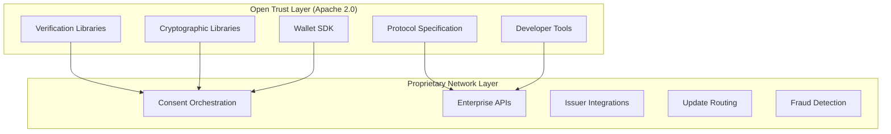
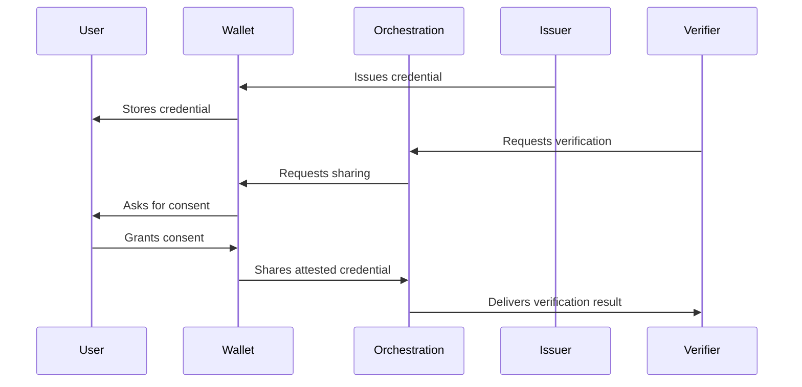
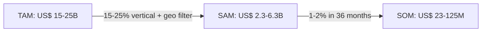
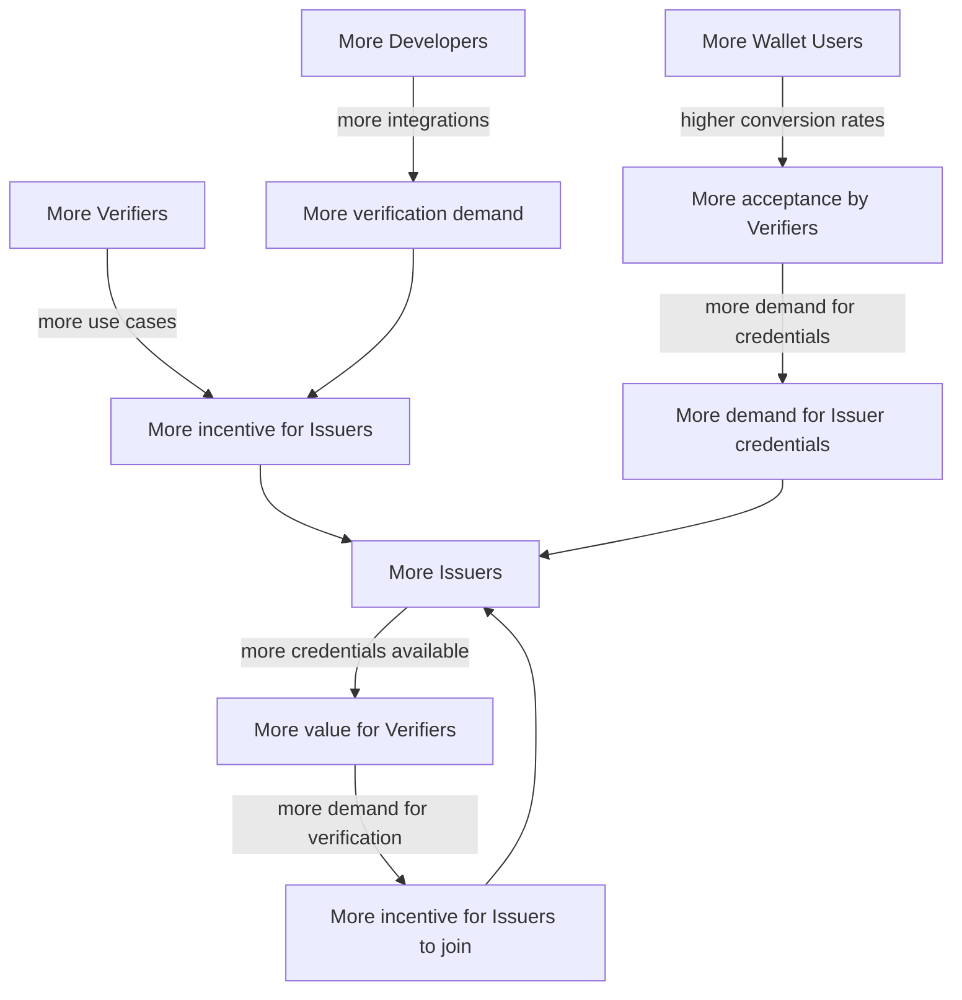
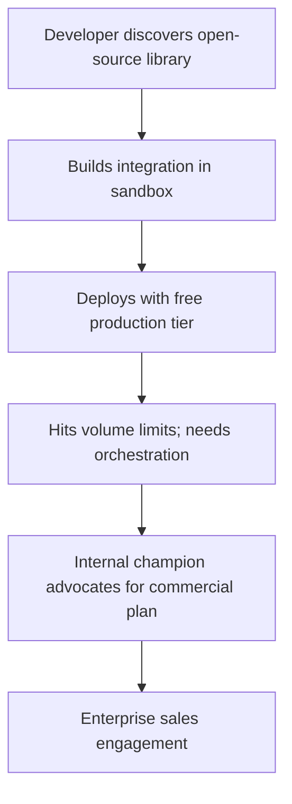
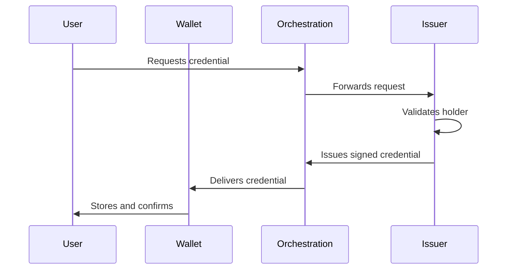
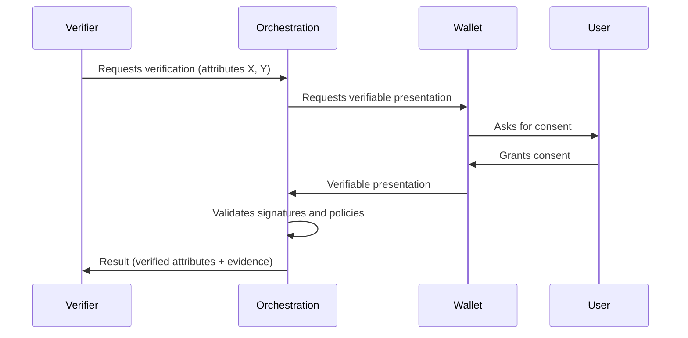

# Ultima Forma

## Open Protocol. Trusted Network.

### The Open Trust Protocol for Portable Identity

---

# 1. Executive Summary

Every year, companies spend billions rebuilding the same process: collecting documents, validating identities, checking fraud, and complying with KYC and AML regulation. Users repeat these steps dozens of times across banks, fintechs, insurers, and government services. The data collected is siloed, inconsistent, and static. It decays. It gets breached. It never reaches the next institution that needs it.

Digital identity today has no interoperability layer. The challenge is infrastructure, not software.

Ultima Forma is building that layer. The company operates an open trust protocol for portable identity, powered by a proprietary infrastructure network. The verification protocol is open-source and auditable. The orchestration network is proprietary. This follows the same model as Stripe (open Elements / proprietary payments network), Cloudflare (open Workers / proprietary edge network), and Kubernetes (open orchestrator / proprietary cloud infrastructure).

The platform connects three actors: **issuers** (banks, telecoms, governments) who create verifiable credentials, **users** who store them in sovereign wallets, and **companies** who need verified data to onboard customers, prevent fraud, and comply with regulation.

The platform does not centralize data. It does not issue identities. It does not make credit decisions. It orchestrates the flow of cryptographically signed credentials between parties, with explicit user consent at every step. The verification layer is open-source -- anyone can inspect, audit, and build on it.

*Our protocol is open and auditable. Our network is proprietary.*

The business model generates revenue from verification transactions, subscriptions, and enterprise contracts, with an ecosystem incentive layer that shares revenue with issuers and returns cashback to users during early network growth. Steady-state gross margins exceed 85%. The three-sided network produces compounding value as each new participant increases utility for the others.

Ultima Forma is raising **BRL 3.5 million in a pre-seed round** to deliver the production MVP, publish the open-source verification libraries and wallet SDK, close paid pilots with fintech partners, and establish the commercial base for recurring revenue over a 16--18 month execution cycle.

**In one sentence:** Ultima Forma is the open trust protocol for portable identity -- powered by a proprietary infrastructure network that reduces data collection and identity verification costs by 70--90% for basic checks and 30--50% of total KYC workflow cost when combined with existing compliance tools, while users maintain sovereignty over their data.

---

# 2. The Infrastructure Thesis

Identity is following the same path as payments, financial data, and communications -- from fragmented point solutions to unified infrastructure APIs.

| Domain | Before | Infrastructure Layer | Outcome |
|--------|--------|---------------------|---------|
| **Payments** | Bespoke bank integrations | Stripe | US$ 65B+ valuation |
| **Financial data** | Screen scraping, bilateral agreements | Plaid | US$ 13B+ valuation |
| **Communications** | Carrier-by-carrier agreements | Twilio | US$ 15B+ at peak |
| **Web infrastructure** | Self-managed servers and CDNs | Cloudflare | US$ 30B+ market cap |
| **Identity** | Fragmented KYC, siloed data | **Ultima Forma** | Building |

In each case, the winning company built the neutral layer that connected a fragmented ecosystem. In each case, the company that controlled the open developer interface and the proprietary infrastructure network captured the infrastructure position.

Open protocols create the largest addressable markets. TCP/IP, HTTP, and SMTP demonstrate that when the protocol layer is open, the ecosystem grows faster and the infrastructure operator captures value at the network layer. Ultima Forma applies this logic to identity: the verification protocol is open, and the orchestration network is proprietary.

### Why Identity Infrastructure Is Inevitable

Identity verification is a regulatory requirement in financial services, insurance, healthcare, and government, not an optional step. Every company that onboards a customer, extends credit, or processes a payment must answer the same question: *is this person who they claim to be?*

Today, each company answers that question independently, from scratch, every time. The result is a fragmented system where the same individual is verified dozens of times over a lifetime, each verification costing BRL 40--100 for individuals and up to BRL 12,500 for corporate reviews. The global identity verification and KYC market exceeds US$ 15 billion and is growing at 12--15% CAGR.

Three forces are converging to make neutral identity infrastructure inevitable:

**Regulation is forcing it.** Europe's eIDAS 2.0 mandates digital identity wallets for EU citizens. Brazil's LGPD and Europe's GDPR enforce consent, data minimization, and portability. AML/KYC requirements sustain the demand for verification while making centralized data hoarding increasingly costly and risky. Mandatory age verification laws across multiple jurisdictions (Online Safety Act in the UK, Marco Legal Digital in Brazil, Social Media Minimum Age Act in Australia, DSA in the EU, and US state laws) expand the addressable market into sectors previously outside identity verification scope: gaming, social media, and content platforms.

**Economics are demanding it.** Traditional KYC is expensive, redundant, and does not scale. Companies maintain entire teams for manual document analysis, data reconciliation, and compliance handling. Each additional onboarding step reduces conversion. The cost of fraud in financial services ranges from 0.3% to 10% of revenue.

**Technology is enabling it.** W3C Verifiable Credentials and Decentralized Identifiers (DIDs) provide open standards for issuing, holding, and verifying credentials without centralized registries. Zero-knowledge proofs enable verification without exposing unnecessary data. Cloud infrastructure and standardized APIs reduce integration cost to weeks instead of months.

The market thesis is simple: identity will become portable, reusable infrastructure. The company that builds the neutral orchestration layer -- with an open trust protocol and a proprietary network -- captures the position that Plaid built for financial data. In Brazil, PIX demonstrated that shared infrastructure in a regulated ecosystem can achieve near-universal adoption once the value proposition is undeniable. Credential orchestration follows the same core logic.

---

# 3. The Problem

### The cost of the status quo

Digital identity does not work as infrastructure. It works as disconnected silos. Every company rebuilds the same pipeline: data collection, identity validation, anti-fraud checks, regulatory compliance, and continuous registration updates.

The consequences are measurable:

| Dimension | Cost | Context |
|-----------|------|---------|
| Individual KYC verification | BRL 40--100 | Tools + operation per verification |
| Corporate KYC review | BRL 10,000--12,500 | Corporate structure and beneficial owner analysis |
| Average onboarding time | 15--45 minutes | Per verification event |
| Fraud losses (financial sector) | 0.3--10% of revenue | Varies by segment and geography |
| Rework from data inconsistency | 15--30% of operations | Based on market studies |

### For users: friction and loss of control

Users accumulate identities across dozens of systems. A credential issued by one institution cannot be reused at another. The same person submits documents, selfies, and proofs of life repeatedly -- a survey by Unico and Instituto Locomotiva found that 77% of Brazilians cite time waste and bureaucracy as their primary frustration with identity processes.

After submitting data, users lose visibility and control. They do not know who accesses their information, for how long, or how to revoke it. Centralized databases attract attacks, and breaches affect millions. The incentive structure rewards data accumulation, not minimization.

### For companies: cost, fraud, and stale data

**Redundant verification.** Even if a bank has performed full KYC on a customer, the next institution repeats the entire process: document capture, proof of life, anti-fraud checks, regulatory verification. Identity is recreated, not reused.

**Fraud exposure.** Fragmented systems make cross-verification difficult. Synthetic identity fraud (valid CPF combined with fabricated data), stolen identity reuse, document forgery, and registration manipulation thrive in environments where no single source of truth exists.

**Data decay.** After onboarding, customer data -- address, phone, email, income, marital status -- is never automatically synchronized between institutions.

**Conversion loss.** Each additional onboarding step reduces conversion. Companies invest heavily in customer acquisition and lose users at the identity validation step.

### The trust deficit

Beyond cost and friction, the current system has a fundamental trust problem. Users are asked to submit their most sensitive data to systems they cannot inspect. Companies rely on KYC vendors they cannot audit. Regulators must trust vendor self-certification. The identity infrastructure market is built on opaque trust -- contracts and certifications rather than inherent transparency.

Open protocol infrastructure addresses this deficit directly: the verification layer is auditable, the cryptography is public, and any party can independently verify what the system does.

### The fundamental root cause

Current digital identity is:

- Not portable (credentials do not transfer between institutions)
- Not reusable (each verification starts from zero)
- Not synchronized (data decays after collection)
- Not interoperable (systems operate in silos)
- Not transparent (verification systems are black boxes)

---

# 4. The Technological Shift

A set of standards and cryptographic primitives now exists that makes verifiable, portable, user-controlled identity technically feasible at scale. The building blocks are already in production, not just theoretical.

### Verifiable Credentials (W3C Standard)

A verifiable credential is a digital attestation cryptographically signed by an issuer, containing attributes about a holder. The signature is mathematically verifiable by any party without contacting the issuer. The holder controls which credentials to share, with whom, and when.

### Decentralized Identifiers (DIDs)

DIDs are globally unique identifiers that resolve to endpoints without depending on a central registry. They allow issuers, holders, and verifiers to discover each other and establish trust without a single authority controlling the namespace.

### Zero-Knowledge Proofs and Selective Disclosure

These cryptographic techniques allow a holder to prove specific attributes without revealing the underlying data. A user can prove they are over 18 without revealing their birthdate.

### Privacy Regulation as Catalyst

GDPR and LGPD enforce consent, data minimization, and the right to be forgotten. eIDAS 2.0 mandates digital identity wallets for EU citizens and establishes a framework for qualified credentials and trust services.

### Convergence

These four forces -- open credential standards, decentralized identifiers, privacy-preserving cryptography, and regulatory mandates -- are converging simultaneously. They make it possible to build identity infrastructure where credentials are issued once and reused many times, the holder controls sharing, verification is instant and cryptographic, and no central party stores or controls the data. The open protocol makes this infrastructure trustworthy by default.

---

# 5. Why Now

### The regulatory window

eIDAS 2.0 will require EU member states to offer digital identity wallets. This creates immediate demand for credential orchestration infrastructure. In Brazil, LGPD enforcement is maturing. The GOV.BR platform registered more than 95 million digital signatures in the first half of 2025 alone. CPQD and Brazil's Digital Government Secretariat signed a two-year cooperation agreement to pilot decentralized identity using verifiable credentials for GOV.BR access. FEBRABAN, Zetta, and ABRID signed a complementary agreement to advance public digital identity infrastructure. Brazil assumed the coordinating role in the Global Digital Collaboration in December 2025, leading international efforts on digital identity wallets and interoperability standards.

### The age verification wave

A second regulatory force operates in parallel to financial KYC. The Online Safety Act (UK), Brazil's Marco Legal para Proteção de Crianças e Adolescentes em Ambientes Digitais (2025), the Social Media Minimum Age Act (Australia), and the Digital Services Act (EU) require digital platforms to verify user age. In the US, several states have passed similar laws. The central dilemma of these regulations is how to protect minors without creating new surveillance databases. Attribute verification via verifiable credentials and ZKP solves this dilemma: the user proves they are over 16 or 18 without revealing date of birth, name, or any other personal data. Unlike financial KYC (a one-time event per relationship), age verification can recur per session or per platform, multiplying the transaction volume on the orchestration network.

### The standards are production-ready

W3C Verifiable Credentials and DID Core specifications have moved from draft to stable. Multiple open-source implementations exist. The gap is no longer technical feasibility - it is market infrastructure.

### The first-mover window

Neutral identity infrastructure is a network-effects business. The first platform to assemble a critical mass of issuers and verifiers in a given market becomes the default. The window to establish an open-protocol orchestration layer -- before proprietary platforms lock in the ecosystem -- is open now. In Brazil and LATAM, there is no incumbent in this position.

---

# 6. The Solution

Ultima Forma provides an open trust protocol for portable identity, implemented through three components:

### 1. Credential Consent Layer (Multi-Channel)

The consent layer operates through three channels:

- **Web-based consent flows (Day 1).** Users approve credential sharing via browser links -- no app required.
- **Issuer-embedded SDK.** Banks and telecoms embed credential management into their existing apps via SDK.
- **Standalone Identity Wallet (convenience layer).** A dedicated mobile application for power users who want unified credential management.

### 2. Orchestration Platform

The backend that connects issuers, verifiers, and credential holders without centralizing identity data. Records consent events and verification metadata -- never credential content.

### 3. Enterprise API

The integration interface for companies that need to validate identity attributes. Complements existing compliance tools.

### Open vs. Proprietary Architecture

| Layer | Components | Status |
|-------|-----------|--------|
| **Open Trust Layer** | Credential verification libraries, cryptographic libraries, wallet SDK, protocol specification, developer tools | Open-source (Apache 2.0) |
| **Proprietary Network Layer** | Consent orchestration, enterprise APIs, issuer integrations, update routing, fraud detection, operational infrastructure | Proprietary |

The open layer builds trust and adoption. The proprietary layer captures value. A competitor can fork the code, but they cannot fork the network.

### How It Works

### Trust Levels

| Level | Description |
|-------|-------------|
| **Qualified issuer** | Credentials from regulated entities with verifiable cryptographic signatures |
| **Registered issuer** | Issuers registered on the platform with audited processes |
| **Self-attested** | Holder declarations; limited trust, appropriate for low-risk scenarios |

### What Ultima Forma Is Not

| Boundary | Rationale |
|----------|-----------|
| **Not a bank** | No deposits, no financial products. Avoids banking regulation |
| **Not a credit provider** | No credit decisions, no scoring. Focus on verification |
| **Not a data repository** | No centralized credential storage. Minimizes breach liability |
| **Not an identity authority** | No identity issuance. Positioned as facilitator |
| **Not a closed system** | Open verification protocol; trust through auditability |

---

# 7. The Team

### Identity Resolution at Scale

The founding team brings rare expertise in **digital identification and identity resolution using Big Data**, applied in governmental and high-criticality environments. This includes direct experience with the Federal Police, ABIN (Brazilian Intelligence Agency), Central Bank of Brazil, and the Attorney General's Office.

**[Pedro Drummond](https://www.linkedin.com/in/drummondpedro/)** -- Enterprise Data Architect with over 20 years of experience in data architecture, systems integration, and identity resolution at scale. Currently Principal Enterprise Architect at AdvancedMD, where he leads the architecture of a platform that processes PII and PHI data for thousands of patients in the US under HIPAA regulation. Based in northern Spain.

### AI-First Engineering

**[Yuri Lima](https://www.linkedin.com/in/yuri-matos-de-lima/)** -- AI Platform Lead at CTD KG, a German ERP company, where he leads the artificial intelligence platform. Market-reference expert in building AI-first systems with focus on reliability, cost, and security. Based in northern Spain.

AI is embedded in the platform from conception. In the product, it automates and assists verification journeys. In engineering, it combines evals, observability, prompt/model governance, and quality automation to accelerate delivery cycles. In operations, it covers intelligent monitoring, incident classification, and risk analysis.

### Deep Regulatory Knowledge

The team combines deep knowledge of corporate governance, global regulations related to identity, data, and privacy, and the governmental environment.

---

# 8. Market Size

### TAM -- Total Addressable Market

The global identity verification and KYC market is projected at **US$ 15--25 billion by 2030**, growing at a CAGR of 12--15%. Mandatory age verification laws across multiple jurisdictions expand the addressable market into sectors previously outside traditional KYC scope: gaming, social media, content platforms, and age-restricted e-commerce. Verification volume in these verticals is substantially higher than financial KYC, given the recurring nature of the checks (per session or per platform, rather than a one-time event per relationship).

### SAM -- Serviceable Addressable Market

Mid and large companies in fintech, healthcare, and public sector, in regions with favorable regulatory frameworks (Brazil, selected LATAM, EU). Approximately **15--25% of TAM**, or **US$ 2.3--6.3 billion**.

### SOM -- Serviceable Obtainable Market

Conservative estimate: **1--2% of SAM over a 36-month horizon**, representing **US$ 23--125 million** in annual market opportunity.

---

# 9. Business Model

Ultima Forma monetizes verified data exchange through four revenue tiers, layered with ecosystem incentives that accelerate network growth.

### Revenue Streams

#### 1. Pay-per-Verification

| Verification Type | Standard Price | Early Adopter | 10k--100k/mo | >100k/mo |
|-------------------|---------------|---------------|--------------|----------|
| **Basic** | BRL 3.90 | BRL 2.50 | BRL 1.90 | ~BRL 1.20 |
| **Qualified** | BRL 12.90 | BRL 8.50 | BRL 6.90 | ~BRL 4.50 |
| **Corporate / High-Risk** | BRL 25--50 | By proposal | By proposal | By proposal |

#### 2. Subscriptions

| Plan | Price | Included Volume | Excess Rate |
|------|-------|----------------|-------------|
| **Starter** | BRL 7,500/mo | 2,000 basic + 200 qualified | BRL 2.50 / BRL 8.50 |
| **Growth** | BRL 29,000/mo | 10,000 basic + 1,000 qualified | BRL 1.90 / BRL 6.90 |
| **Scale** | By proposal | Negotiated | Declining rate |

#### 3. Enterprise SLA

- From **BRL 450,000/year**
- 99.9% uptime SLA
- Priority support, integration governance, audit and compliance reports

#### Revenue Mix Target (24--36 month horizon)

| Type | Target Share | Rationale |
|------|------------|-----------|
| **Recurring** (subscriptions + SLA) | 65% | Predictable base; retention and LTV |
| **Event-based** (per verification) | 35% | Gateway to subscription |

### Ecosystem Incentive Layer

| Phase | Period | Issuer Share | User Cashback | Platform Net (basic) |
|-------|--------|-------------|---------------|---------------------|
| **Phase 1** | 0--18 months | BRL 1.00 | BRL 1.00 (first 10 uses) | BRL 1.90 |
| **Phase 2** | 18--36 months | BRL 0.50 | -- | BRL 3.40 |
| **Phase 3** | 36+ months | -- | -- | BRL 3.90 |

### Unit Economics

| Metric | Starter | Growth | Enterprise |
|--------|---------|--------|------------|
| Monthly revenue | BRL 7,500 | BRL 29,000 | BRL 37,500 |
| Infrastructure gross margin (steady-state) | 80% | 82% | 85% |
| CAC | BRL 20k--35k | BRL 60k--110k | BRL 180k--320k |
| Payback | 3--6 months | 3--5 months | 6--10 months |
| LTV (gross margin) | BRL 144k--216k | BRL 713k--998k | BRL 1.15M--1.91M |

Target: LTV:CAC >= 3:1, payback <= 12 months.

### Scalability

- Infrastructure cost dominated by fixed base that amortizes across growing volume
- No linear cost proportionality
- Network effects compound with each new participant

---

# 10. Network Effects

### The Three-Sided Flywheel

The open protocol adds a fourth side to the flywheel: **developers**. Open-source SDKs and verification libraries attract developers who build integrations. Integrations create demand for the proprietary platform. The developer ecosystem grows independently of enterprise sales.

### Cold-Start Sequencing

Every infrastructure company that redefined a category faced the same objection: "but who goes first?" Twilio convinced telecom carriers. Stripe convinced banks. Plaid scraped bank data before formal agreements existed. PIX faced resistance from the very institutions it was designed to serve. Within two years it processed more transactions than credit and debit cards combined.

**The sequencing strategy.** Ultima Forma begins with the most valuable and reputable institutions -- large banks and telecoms -- because their credentials carry the highest trust, their participation signals legitimacy, and they bear the strongest economic incentive. The first 1--2 issuer integrations unlock the first verifier pilots. The first verifier pilots generate data that accelerates the next issuer conversation. In parallel, the open-source libraries attract developers who create bottom-up demand.

**Resilience to slower adoption.** If issuer integration takes twice as long as projected, the 20% capital reserve extends runway by approximately 3 months. The first 1--2 verifier clients can operate as design partners under reduced-cost terms. The business model depends on one issuer and one verifier proving the unit economics in production, not on rapid multi-issuer scale.

---

# 11. Open Trust Architecture

### Why Transparency Is Non-Negotiable

Identity is the highest-trust data category. When a user routes their identity through a system, they must be able to verify what that system does. Traditional identity providers operate as black boxes. Ultima Forma rejects this model.

The verification protocol is open-source and publicly auditable. Any party can inspect what the system does with their data, how verification works, and whether the cryptographic guarantees hold.

### Open-Source Strategy

| Phase | Components Released |
|-------|-------------------|
| **Phase 0** (0--6m) | Verification library, Wallet SDK, protocol spec draft v0.1 |
| **Phase 1** (6--12m) | Protocol spec v1.0, CLI tools, contributor guidelines |
| **Phase 2** (12--24m) | Extended crypto libraries, reference wallet, developer sandbox |
| **Phase 3** (24--36m) | Governance formalization, certification program |

### Governance Model

Protocol changes follow a proposal-review-approval process. Contributions are managed via CLA and code review standards. As the ecosystem matures, governance may transition to a foundation model (similar to Linux Foundation, CNCF, or OpenID Foundation).

### Comparable Open-Protocol Companies

| Company | Open Layer | Proprietary Layer | Outcome |
|---------|-----------|-------------------|---------|
| **Red Hat** | Linux kernel | Enterprise support | US$ 34B acquisition |
| **Confluent** | Apache Kafka | Cloud platform | US$ 9B+ market cap |
| **HashiCorp** | Terraform, Vault | HCP Cloud | US$ 5B+ acquisition |
| **Stripe** | Elements, Stripe.js | Payments network | US$ 65B+ valuation |

---

# 12. Developer Adoption Strategy

### Developer-Led Growth

Stripe did not win payments by hiring the largest sales team. It won by making payments easy for developers. Ultima Forma follows the same model.

**Open SDKs and verification libraries:**
- Install in minutes: `npm install @ultima-forma/verify`
- Standard interface for all credential types and issuers
- No vendor lock-in at the verification layer

**Developer sandbox:** fully functional environment with test credentials, end-to-end verification flows, and free access.

**Developer-to-enterprise funnel:**

**Metrics targets:**

| Metric | Phase 0--1 | Phase 2--3 |
|--------|-----------|-----------|
| GitHub stars | 500+ | 2,000+ |
| Monthly SDK downloads | 1,000+ | 10,000+ |
| Active sandbox developers | 100+ | 500+ |
| Developer-originated deals | 1--2 | 5--10 |

---

# 13. Ecosystem Strategy

The platform grows into a broad ecosystem of participants building on the open protocol:

- **Issuers**: banks, telecoms, governments, universities, employers
- **Verifiers**: fintechs, insurers, healthcare, real estate, HR
- **Developers**: building integrations on the open protocol
- **Wallet providers**: third-party wallets using the open SDK
- **Third-party services**: analytics, compliance, fraud detection

Each participant increases value for all others. The ecosystem is the moat.

---

# 14. Competitive Landscape

### Named Competitors by Category

| Category | Players | Model |
|----------|---------|-------|
| **Credential orchestration** | Trinsic, Walt.id, Mattr | VC infrastructure; US/Europe focus |
| **Traditional KYC (Brazil)** | idwall, Unico | Centralized data collection; pivot barrier |
| **Bureau-based KYC** | Serasa, Boa Vista, TransUnion | More likely to become issuers than competitors |
| **Government wallets** | Gov.br, eID | Complementary; issuance vs. orchestration |
| **Big Tech** | Apple, Google, Meta | Authentication, not attribute verification |

No direct credential orchestration competitor currently operates in Brazil or LATAM.

### How the Open Protocol Changes Competitive Dynamics

- **Closed competitors cannot match trust guarantees** of auditable cryptography and open-source verification
- **Open-source consortia** are partially addressed by being the company that already open-sourced the protocol and built the community
- **International players** adopting the open protocol expand the ecosystem, not threaten it
- **Developer adoption** creates bottom-up demand that enterprise-only competitors cannot replicate

---

# 15. Infrastructure Moat

### What Defends This Business

**Protocol moat (strength: growing).** When the open protocol becomes a standard, switching away from the standard is harder than switching vendors. A competitor can replicate the code in months. Replicating the protocol adoption takes years. They can fork the protocol, but they cannot fork the network.

**Network effects (strength: medium--high).** Each new issuer, verifier, developer, and wallet user increases value for the others. This effect compounds with scale and creates a built-in advantage.

**Trust infrastructure (strength: high).** Relationships with qualified issuers require time, credibility, security audits, and regulatory alignment. Trust is a cumulative asset.

**Integration depth (strength: medium, increasing).** Enterprise API integrations create implementation costs and switching costs.

**Developer ecosystem (strength: growing).** Open SDKs attract developers who create demand. The community cannot be replicated by launching a competing product.

**Regulatory positioning (strength: medium--high).** Open protocol enables regulatory inspection and reduces compliance friction.

### Supply Risk Mitigation

- Issuer diversification (no single issuer > 30% of volume)
- Integration commitments with advance notice
- Standard portability (W3C VC/DID credentials are format-portable)

---

# 16. Trust Framework

Ultima Forma publishes a public trust framework:

- **Open Protocol**: published specification, versioned, with public governance
- **Public Cryptography**: all cryptographic operations auditable, no proprietary black box
- **Auditable Components**: open-source verification libraries with continuous security audits
- **Issuer Certification**: public criteria for trust levels, transparent scoring

The trust framework enables regulatory acceptance across jurisdictions and allows third parties to build trust products on top of the framework.

---

# 17. Go-To-Market Strategy

### Beachhead: Brazil Fintech

Financial institutions and fintechs have the most intense KYC requirements, highest verification volumes, and strongest cost sensitivity.

### Distribution Channels

- **Direct sales**: Commercial team for enterprise accounts, 3--6 month cycles
- **Partners**: Integrators and consultancies
- **Demand generation**: Technical content, events, webinars
- **Developer-led growth**: Open-source SDKs drive bottom-up adoption. Developers discover, build, and advocate internally

### Ideal Customer Profiles

| ICP | Primary Pain | Trigger |
|-----|-------------|---------|
| **Mid-size fintech** | High KYC cost; long conversion | Cost reduction |
| **Digital bank / neobank** | Multiple KYC providers; inconsistency | Stack simplification |
| **Payment company / PSP** | Fraud, rework, cost per transaction | Automation |

### 36-Month Roadmap

| Phase | Period | Key Milestones |
|-------|--------|---------------|
| **0 -- Foundation** | 0--6m | MVP, 1 issuer integration, open-source library release, wallet SDK |
| **1 -- Pilot** | 6--12m | 1 anchor partner, protocol spec v1.0, developer sandbox |
| **2 -- Scale** | 12--24m | 5--10 clients, developer community, third-party wallets |
| **3 -- Expansion** | 24--36m | Multi-region, Series A, protocol governance, ecosystem certification |

### Fundraising Milestones

| Round | Target | Key Deliverables |
|-------|--------|-----------------|
| **Pre-seed** | BRL 3.5M | MVP, 3--6 paying clients, MRR BRL 40--80k, open-source libraries published |
| **Seed** | BRL 12M | 20--30 clients, ARR BRL 2--6M, 2,000+ GitHub stars, LTV:CAC >= 3:1 |

### Pre-Seed Revenue Projection

**Conservative scenario:**

| Month | Cumulative Clients | MRR |
|-------|--------------------|-----|
| M6 | 1 | BRL 7,500 |
| M12 | 4 | BRL 51,500 |
| M18 | 6 | BRL 66,500 |

**Moderate scenario:**

| Month | Cumulative Clients | MRR |
|-------|--------------------|-----|
| M6 | 1 | BRL 7,500 |
| M12 | 5 | BRL 80,500 |
| M18 | 8 | BRL 120,000 |

**Downside scenario:**

| Month | Cumulative Clients | MRR |
|-------|--------------------|-----|
| M12 | 2 | BRL 7,500 |
| M18 | 3 | BRL 44,000 |

### Pre-seed Capital Allocation

| Category | Share | Amount |
|----------|-------|--------|
| Product / Engineering | 45% | BRL 1.58M |
| Commercial | 25% | BRL 875k |
| Operations / Legal | 10% | BRL 350k |
| Reserve | 20% | BRL 700k |

### Target Investors

- **Infrastructure-focused funds**: investing in protocol-level companies, API infrastructure, and developer platforms
- **Deep tech funds**: focused on open-source companies with network effects
- Early-stage funds focused on fintech, identity, or infrastructure
- Angels with experience in regulated sectors or digital identity
- Family offices with appetite for long-term B2B infrastructure thesis
- Corporate venture in KYC/compliance-intensive sectors

---

# 18. Long-Term Vision

In ten years, digital identity will be portable infrastructure. Credentials issued once will be reusable across contexts, countries, and sectors. The open trust protocol will be the standard that the market builds around -- just as HTTP became the standard for the web and TCP/IP became the standard for networking.

### The trajectory

**Years 1--3: Establish the beachhead.** Become the reference credential orchestration platform in Brazilian fintech. Publish the open protocol. Build the developer community. Prove the model with measurable KYC cost reduction.

**Years 3--5: Expand the network.** Enter healthcare, insurance, and public sector. Expand to LATAM and EU. The network effect and developer ecosystem become the primary growth drivers. The open protocol gains regulatory references.

**Years 5--10: Become infrastructure.** Credential verification through Ultima Forma's protocol becomes the default for regulated onboarding. The protocol is governed by a multi-stakeholder foundation. New credential types emerge: professional qualifications, health records, corporate certifications. The platform evolves from a verification tool into the identity interoperability layer.

Ultima Forma is building the open trust protocol for portable identity. The protocol is open. The network is proprietary. The infrastructure is inevitable.

---

# Appendix

## A. Risk Analysis

| Risk | Probability | Impact | Primary Mitigation |
|------|------------|--------|-------------------|
| **Regulatory** | Medium | High | Legal opinion; architecture minimizes surface; open protocol enables regulatory inspection |
| **Adoption** | Medium | High | Clear ROI; pilot partner; developer-led growth channel |
| **Big Tech** | Medium | Medium--High | Regulated verticals; neutrality; open trust guarantees |
| **Technological** | Low--Medium | Medium--High | Mature standards; audits; open-source community |
| **Execution** | Medium | High | Incremental roadmap; adequate runway; metrics |
| **Open-Source** | Medium | Medium | Proprietary network moat; governance model; community investment |
| **Currency/Macro** | Medium | Medium | BRL-denominated model; capital reserve |
| **Gov. platform expansion** | Medium | High | Private-sector focus; complementary positioning |

## B. Technical Flow Diagrams

### Credential Issuance

### Verification with Consent

## C. Regulatory Positioning

### Data Responsibility Model

| Actor | Responsibility |
|-------|---------------|
| **Issuers** | Quality and validity of issued credentials |
| **Verifiers** | Decisions based on credentials |
| **Ultima Forma** | Orchestration availability, processing compliance, consent logs. Open protocol enables independent verification |

### Storage Model

| Data Type | Location | Retention |
|-----------|----------|-----------|
| **Credentials** | User's wallet (device) | Under holder control |
| **Consent logs** | Platform | Per legal requirement (e.g., 5 years) |
| **Verification metadata** | Platform | Operational + compliance policy |

## D. Future Considerations

### White-Label Orchestration for Tier 1 Banks

For the largest issuers, offer co-branded wallet capabilities or white-label credential verification using Ultima Forma's open protocol and proprietary orchestration infrastructure.

### Data Quality Premium

As the network matures, issuer payouts tied to credential quality and freshness create a quality flywheel.

### Ecosystem Marketplace

As the ecosystem matures, a marketplace for credential-related services -- compliance tools, analytics, audit services -- becomes viable, transforming Ultima Forma from infrastructure provider to platform business.

## E. Glossary

| Term | Definition |
|------|-----------|
| **AML** | Anti-Money Laundering; rules and controls to prevent money laundering |
| **API** | Application Programming Interface; integration interface between systems |
| **ARR** | Annual Recurring Revenue |
| **BACEN** | Central Bank of Brazil |
| **B2B / B2B2C** | Business models: company-to-company and company-to-company-to-consumer |
| **CAC** | Customer Acquisition Cost |
| **CAGR** | Compound Annual Growth Rate |
| **CLA** | Contributor License Agreement |
| **CLI** | Command-Line Interface |
| **COGS** | Cost of Goods Sold; direct cost to deliver the service |
| **DID** | Decentralized Identifier; globally unique identifier resolved without a central registry |
| **DX** | Developer Experience |
| **eIDAS** | European regulation on electronic identification and trust services |
| **GDPR** | General Data Protection Regulation (Europe) |
| **KYC** | Know Your Customer; identity verification process |
| **LGPD** | General Data Protection Law (Brazil) |
| **LTV** | Lifetime Value; value of a customer over the relationship |
| **MDM** | Master Data Management |
| **MRR** | Monthly Recurring Revenue |
| **NRR** | Net Revenue Retention |
| **PSP** | Payment Service Provider |
| **SDK** | Software Development Kit |
| **SLA** | Service Level Agreement |
| **SSO** | Single Sign-On |
| **TAM / SAM / SOM** | Total Addressable / Serviceable Addressable / Serviceable Obtainable Market |
| **Verifiable Credential (VC)** | Digital attestation cryptographically signed by an issuer |
| **Verifiable Presentation (VP)** | Set of credentials presented by a holder with cryptographic evidence |
| **W3C** | World Wide Web Consortium; standards body for Verifiable Credentials and DIDs |

---

*Ultima Forma -- Open Protocol. Trusted Network. Building the identity infrastructure layer.*
