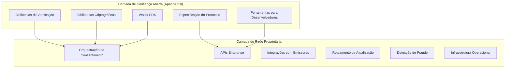
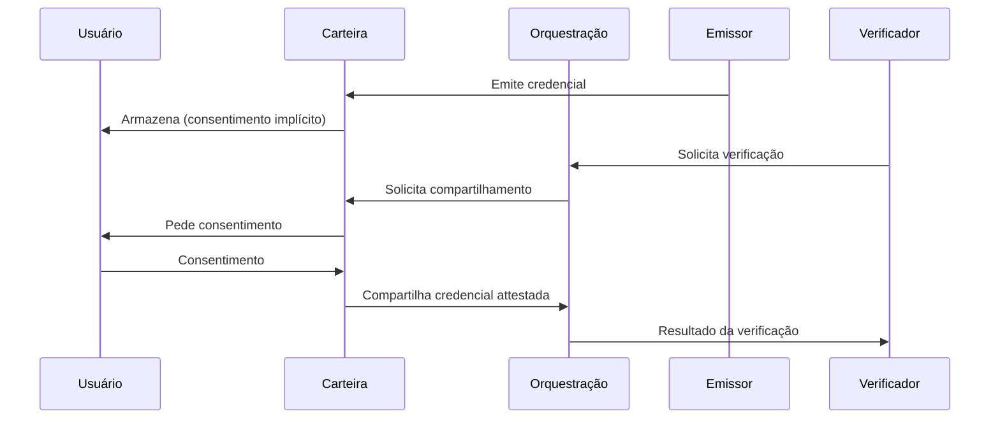

# Arquitetura da Solução

## Componentes Principais

### 1. Camada de Consentimento de Credenciais (Multi-Canal)

A camada de consentimento é o componente voltado ao usuário que permite o compartilhamento de credenciais. Opera por três canais, projetados para que a plataforma funcione sem exigir que o usuário instale qualquer app:

- **Fluxos de consentimento web (Day 1).** Quando um verificador solicita verificação de credencial, o usuário recebe um link (e-mail, SMS ou embutido em fluxo web) para revisar e aprovar a solicitação no navegador. Sem necessidade de instalar app.
- **SDK embarcado em emissores.** Bancos, telecoms e outros emissores embarcam o gerenciamento de credenciais em seus apps existentes via SDK. O app mobile de um banco passa a ser uma carteira de credenciais para credenciais que esse banco emitiu. Isso aproveita bases instaladas de milhões de usuários.
- **Carteira de Identidade standalone (camada de conveniência).** Aplicativo mobile dedicado para usuários que possuem credenciais de múltiplos emissores e desejam gerenciamento unificado. Armazena credenciais localmente no dispositivo do usuário com consentimento granular por verificação, suporte a padrões W3C* Verifiable Credentials e gerenciamento de credenciais (visualizar, compartilhar, revogar consentimento).

A plataforma é projetada para que qualquer canal possa atender qualquer solicitação de verificação. A carteira standalone melhora a experiência, não a torna possível.

### 2. Plataforma de Orquestração

Backend que conecta emissores, verificadores e titulares de credenciais (via qualquer canal) sem centralizar dados de identidade. Gerencia fluxos de emissão e verificação, resolução de DID*, validação de assinaturas e registro de auditoria (logs de consentimento, não conteúdo das credenciais).

### 3. Emissores de Credenciais

Entidades que emitem credenciais verificáveis (governos, bancos, universidades, empregadores). A plataforma orquestra a conexão entre emissores e titulares de credenciais. Cada emissor mantém seu processo de emissão e assinatura.

### 4. API Enterprise

API* para integração de verificadores (empresas que precisam validar atributos). Permite solicitar verificação de credenciais específicas, receber resultados atestados e integrar fluxos de KYC*/AML* existentes. A plataforma complementa ferramentas de conformidade existentes (PEP/sanctions screening, monitoramento contínuo, risk scoring) em vez de substituí-las.

---

## Componentes Abertos vs. Proprietários

A arquitetura estabelece uma fronteira clara entre a camada de confiança aberta e a camada de rede proprietária:

### Aberto (Camada de Confiança)

- **Bibliotecas de verificação de credenciais** — bibliotecas open-source para validação de W3C Verifiable Credentials e assinaturas criptográficas
- **Bibliotecas criptográficas** — implementações públicas e auditáveis de validação de assinaturas, resolução de DID e selective disclosure
- **Wallet SDK** — SDK open-source que permite a qualquer desenvolvedor ou instituição construir carteiras compatíveis com o protocolo
- **Esquemas de credenciais / especificação do protocolo** — especificação de protocolo publicada e versionada que define formatos de credenciais, fluxos de apresentação e framework de confiança
- **Ferramentas de verificação para desenvolvedores** — CLI e ferramentas de teste para desenvolvedores validarem integrações e formatos de credenciais

### Proprietário (Camada de Rede)

- **Plataforma de orquestração de consentimento** — o motor central que gerencia fluxos de consentimento multipartes, roteamento de credenciais e gerenciamento de sessão
- **APIs Enterprise** — APIs de produção com SLA, rate limiting, autenticação e logging de conformidade
- **Integrações com emissores** — conexões mantidas com bancos, telecoms, governos e outras fontes de credenciais
- **Roteamento de atualização de identidade** — infraestrutura para propagar atualizações de credenciais a verificadores com consentimento ativo
- **Detecção de fraude / analytics** — analytics comportamental, detecção de anomalias e sistemas anti-abuso
- **Infraestrutura operacional** — monitoramento, SRE, resposta a incidentes e sistemas de alta disponibilidade

### Fronteira Aberto/Proprietário

Essa fronteira segue a mesma lógica de Stripe (Elements UI open-source / rede de pagamentos proprietária), Cloudflare (runtime Workers open-source / rede de borda proprietária) e Kubernetes (orquestrador open-source / infraestrutura de nuvem proprietária). A camada aberta constrói confiança e adoção. A camada proprietária captura valor.

---

## Fluxo de Dados

**Princípio:** Dados sensíveis transitam entre carteira e verificador via orquestração, mas a plataforma não persiste o conteúdo das credenciais.

---

## Modelo de Consentimento

- Cada verificação exige consentimento explícito do titular.
- O consentimento é específico: quais atributos, para qual verificador, em qual transação.
- O titular pode revogar consentimentos anteriores.
- Logs de consentimento são mantidos para auditoria e conformidade (o quê foi consentido e quando, não o conteúdo dos dados).

---

## Níveis de Confiança

| Nível | Descrição |
|-------|-----------|
| **Emissor qualificado** | Credenciais emitidas por entidades reguladas (governo, instituições financeiras) com assinatura criptográfica verificável |
| **Emissor registrado** | Emissores cadastrados na plataforma com processos auditados |
| **Self-attested** | Declarações do próprio titular; confiança limitada, uso em cenários de baixo risco |

A plataforma permite que verificadores definam quais níveis aceitam para cada tipo de verificação.

---

## Primitivas de Segurança

- **Assinaturas criptográficas**: Credenciais assinadas por emissores. Integridade verificável.
- **Zero-knowledge / selective disclosure**: Possibilidade de revelar apenas atributos necessários, não a credencial inteira.
- **Sem armazenamento centralizado**: A plataforma não mantém repositório de credenciais do usuário.
- **Auditoria**: Registros imutáveis de consentimentos e eventos de verificação para conformidade e disputas.
- **Verificabilidade pública**: Qualquer parte pode verificar independentemente a autenticidade da credencial usando as bibliotecas de verificação abertas, sem depender da infraestrutura da Ultima Forma.

---

## Como a Arquitetura Reduz Fraude de Identidade

O modelo atual de verificação de identidade cria superfícies de ataque em cada ponto onde dados são coletados. Cada empresa que faz KYC é um alvo. A arquitetura proposta elimina a maioria desses pontos de coleta e desloca a verificação para provas criptográficas.

A seguir, o impacto da arquitetura nos principais vetores de fraude de identidade.

### Fraude de identidade sintética

No modelo atual, um fraudador combina um CPF real com dados inventados (nome, endereço, foto) e tenta abrir contas. O ataque funciona porque cada empresa coleta e valida dados de forma isolada, sem uma fonte comum de verdade.

Na arquitetura proposta, a credencial verificável é emitida por um emissor qualificado (banco, governo) que já validou a identidade completa da pessoa. Não existe credencial "parcialmente verdadeira". O emissor atesta o conjunto completo de atributos com uma assinatura criptográfica. Um verificador que exige credencial de emissor qualificado recebe uma prova matemática de que aquela identidade foi validada por inteiro, não um conjunto de campos que podem ter sido montados.

### Reuso de identidade roubada

Vazamentos de dados expõem CPF, nome, endereço e outros dados pessoais de milhões de pessoas. No modelo atual, esses dados são suficientes para abrir contas ou realizar transações em nome da vítima.

Com credenciais verificáveis, dados vazados perdem utilidade. A credencial é armazenada na carteira do titular, vinculada ao dispositivo e protegida por autenticação local. Ter os dados pessoais de alguém não permite apresentar uma credencial válida. O atacante precisaria comprometer o dispositivo físico da vítima e sua autenticação biométrica ou PIN. O vetor de ataque passa de "ter informação" para "ter controle do dispositivo", o que é uma barreira de ordem diferente.

### Manipulação cadastral

Account takeover por troca de endereço, telefone ou email é possível porque empresas mantêm cadastros editáveis que dependem de processos internos de validação (frequentemente frágeis, como confirmação por SMS ou chamada ao suporte).

Na arquitetura proposta, atributos como endereço e telefone são credenciais emitidas e assinadas por um emissor. Alterar um endereço significa obter uma nova credencial do emissor, que executará seu próprio processo de validação. Um atacante não consegue alterar o endereço ligando para o suporte de um verificador porque o verificador não é a fonte do dado. A fonte é o emissor, e a credencial só muda quando o emissor a re-emite.

O roteamento de atualização de identidade propaga mudanças legítimas automaticamente, com consentimento do titular, para todos os verificadores que possuem consentimento ativo. Isso mantém dados atualizados sem abrir brechas para manipulação.

### Documentos falsificados e selfie spoofing

O modelo atual exige que cada empresa capture documentos e selfies para prova de vida. Cada captura é um ponto de ataque. Empresas menores ou com processos menos sofisticados são alvos preferenciais.

A arquitetura elimina a necessidade de captura repetida de documentos e selfies. A prova de vida acontece uma vez, no emissor qualificado, que dispõe de infraestrutura dedicada a liveness detection (câmeras 3D, detecção de injeção de vídeo, análise de profundidade e microexpressões). O resultado dessa verificação é codificado na credencial.

Na hora de usar a credencial, a verificação é criptográfica, não visual. O verificador valida a assinatura digital do emissor. Não há selfie para falsificar, não há documento para adulterar. O ataque de selfie spoofing precisa ser executado contra o emissor qualificado, que é a entidade com maior capacidade e incentivo para detectá-lo. Se o emissor é comprometido, a credencial pode ser revogada, invalidando todos os usos futuros.

### Efeito combinado

| Vetor de fraude | Modelo atual | Com a arquitetura proposta |
|---|---|---|
| Identidade sintética | Dados parciais aceitos por validação isolada | Credencial atesta identidade completa, verificada por emissor qualificado |
| Identidade roubada | Dados vazados são suficientes para operar | Dados sem a credencial (e sem controle do dispositivo) são inúteis |
| Manipulação cadastral | Cadastros editáveis em cada empresa | Atributos vêm de credenciais assinadas pelo emissor, não de cadastros internos |
| Documentos falsificados | Cada verificação é um ponto de ataque | Verificação criptográfica, sem captura de documento |
| Selfie spoofing | Ataque repetível em cada empresa | Prova de vida concentrada no emissor qualificado, uma única vez |

A redução de fraude não vem de uma ferramenta antifraude melhor. Vem da eliminação estrutural dos vetores de ataque. Quando a verificação é uma prova criptográfica e não uma inspeção visual de documentos, a maioria dos ataques tradicionais perde o ponto de entrada.

### Quando a Origem Confiável é Comprometida

Existe um risco estrutural em qualquer ecossistema baseado em emissores confiáveis. Se um fraudador conseguir alterar os dados de um usuário dentro de um emissor, e a plataforma propagar essa alteração para outras empresas integradas, surge o risco de disseminação de dados autenticados, porém materialmente falsos. A assinatura criptográfica comprova procedência, integridade, consentimento e trilha de auditoria. Ela não garante, por si só, a veracidade material do dado quando o emissor foi fraudado, hackeado ou sofreu alteração indevida em sua base.

O impacto potencial inclui atualização cadastral indevida em múltiplas empresas, account takeover, alteração de e-mail, telefone, endereço, conta bancária, chave PIX ou outros atributos sensíveis. O efeito é sistêmico: propagação em rede exige rollback, bloqueio e revogação, com risco reputacional para a rede e exposição contratual e regulatória conforme o papel da Ultima Forma no fluxo.

A resposta arquitetural não é prometer verdade absoluta de todo dado emitido. A Ultima Forma opera como camada de orquestração de confiança, política de risco, infraestrutura de contenção e trilha auditável de consentimento, origem, status e propagação. Reduzimos drasticamente fraude documental, falsificação, adulteração em trânsito e compartilhamento sem consentimento. Adicionamos controles de risco para limitar o dano quando a própria origem confiável é comprometida.

**Mitigadores já previstos na arquitetura.** Credenciais assinadas digitalmente, validação criptográfica de procedência e integridade, consentimento explícito e auditável, minimização de dados na plataforma, rastreabilidade e trilha de auditoria, validação de status e revogação, segmentação por nível de confiança e tipo de emissor, device binding e autenticação forte do usuário onde aplicável.

**Controles adicionais de propagação.** A arquitetura prevê propagação baseada em criticidade do atributo. Atributos de baixo ou médio risco (endereço, telefone secundário, preferências cadastrais) recebem tratamento padrão. Atributos de alto risco (e-mail principal de login, telefone de recuperação, conta bancária, chave PIX, documento principal, beneficiário, troca de device, mudança de identidade legal) exigem controles adicionais antes da propagação.

Para mudanças de alto impacto, a arquitetura prevê step-up auth e dupla confirmação: autenticação reforçada do usuário, confirmação adicional na wallet, confirmação por fator resistente a phishing e, em casos críticos, confirmação por segunda origem confiável. Para certos atributos sensíveis, existe **janela de resfriamento ou delay inteligente** antes da propagação automática, adaptativa conforme risco, contexto e anomalias detectadas.

A detecção de anomalias e quarentena retém eventos suspeitos antes da propagação. Alterações simultâneas de múltiplos atributos sensíveis, volume atípico vindo de um emissor, mudanças fora do padrão do usuário, alterações após troca de dispositivo e sequências suspeitas entram em quarentena para revisão, confirmação ou bloqueio.

Antes de propagar um atributo, a arquitetura consulta o status da credencial e respeita revogação, suspensão ou bloqueio do emissor. Existe capacidade de kill switch operacional para pausar um emissor ou tipo de credencial em caso de incidente. Cada atributo relevante carrega metadados de proveniência e contexto: emissor de origem, timestamp de emissão, última validação, nível de confiança, status e versão. Isso permite decisões baseadas em risco pelos consumidores de atributos.

A arquitetura prevê capacidade de identificar quais partes receberam determinada atualização, interromper propagação adicional, reverter alterações quando aplicável e acionar workflows de remediação. O trust framework define requisitos mínimos de segurança, critérios de onboarding, política de revogação, SLA de comunicação de incidentes, direito de auditoria e padrões mínimos operacionais para emissores. O modelo operacional da rede prevê definição clara de papéis, responsabilidade por origem do dado, cooperação em incidente, trilha probatória e mecanismos de regresso e governança.

A plataforma foi desenhada com privacy-by-design, security-by-design e fraud-governance-by-design. Não é apenas infraestrutura de portabilidade. É camada de orquestração de confiança que opera em ambientes imperfeitos.

---

## Glossário (siglas e termos)

- **AML**: Anti-Money Laundering; regras e controles de combate à lavagem de dinheiro.
- **API**: Application Programming Interface; interface para integração entre sistemas.
- **DID**: Decentralized Identifier; identificador descentralizado.
- **KYC**: Know Your Customer; processo de verificação de identidade de clientes.
- **W3C**: World Wide Web Consortium; organismo de padronização (ex.: Verifiable Credentials).
