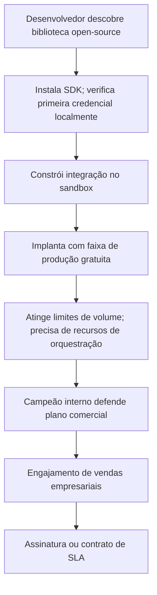

# Estratégia de Adoção por Desenvolvedores

## Por Que a Adoção por Desenvolvedores Importa

O Stripe não venceu em pagamentos contratando a maior equipe de vendas empresariais. Venceu tornando os pagamentos fáceis para desenvolvedores. O Twilio não venceu em comunicações assinando acordos com operadoras mais rápido. Venceu dando aos desenvolvedores uma *API* programável. O Plaid não venceu em dados financeiros tendo os melhores relacionamentos bancários. Venceu tornando os dados financeiros acessíveis por meio de uma interface amigável para desenvolvedores.

O padrão é claro: empresas de infraestrutura que vencem criam canais de adoção developer-first que complementam as vendas empresariais. Desenvolvedores experimentam o produto, constroem integrações e então impulsionam demanda bottom-up dentro de suas organizações.

As bibliotecas de verificação *open-source* e o *SDK* da Ultima Forma são a base desse canal. Não são uma estratégia de marketing, são uma estratégia de distribuição.

---

## SDKs e Bibliotecas de Verificação Abertas

### Como Aceleram a Adoção

Um desenvolvedor construindo uma aplicação fintech no Brasil hoje não tem uma forma padrão de verificar credenciais de identidade. Integra com 2–3 fornecedores proprietários de *KYC*, cada um com *APIs*, formatos de dados e requisitos de integração diferentes. Cada novo fornecedor exige semanas de trabalho de integração.

As bibliotecas de verificação abertas da Ultima Forma mudam essa equação:

- **Instalação em minutos.** `npm install @ultima-forma/verify` (ou equivalente para Python, Java, Go). Um desenvolvedor pode validar uma credencial verificável em seu ambiente local em até 30 minutos.
- **Interface padrão.** Uma *API* para todos os tipos de credenciais, todos os emissores, todos os níveis de confiança. A biblioteca trata resolução de *DID*, validação de assinatura, verificação de schema e status de revogação.
- **Sem lock-in de fornecedor na camada de verificação.** A biblioteca aberta funciona independentemente da plataforma proprietária da Ultima Forma. Um desenvolvedor pode verificar credenciais sem ser cliente da plataforma. Quando precisam de orquestração, gestão de consentimento e infraestrutura de produção, a plataforma proprietária é o próximo passo natural.

### Distribuição do SDK

| Plataforma | Pacote | Desenvolvedores-Alvo |
|------------|--------|---------------------|
| **JavaScript/TypeScript** | npm: `@ultima-forma/verify`, `@ultima-forma/wallet-sdk` | Desenvolvedores web, desenvolvedores backend Node.js |
| **Python** | PyPI: `ultima-forma` | Engenheiros de dados, desenvolvedores backend, equipes de ML/AI |
| **Java/Kotlin** | Maven Central: `com.ultimaforma:verify` | Backend empresarial, desenvolvedores Android |
| **Go** | Módulo Go: `github.com/ultima-forma/verify-go` | Engenheiros de infraestrutura, desenvolvedores de microsserviços |
| **Swift** | Swift Package Manager | Desenvolvedores iOS |

Prioridade: JavaScript/TypeScript (Fase 0), Python e Java (Fase 1), Go e Swift (Fase 2).

---

## Developer Experience (DX) como Vantagem Competitiva

A *developer experience* é uma diretiva de engenharia prioritária, não um requisito em segundo plano. Os seguintes investimentos em *DX* criam uma vantagem fundamental de adoção:

### Portal de Documentação

- Guia de início rápido (verificação de credenciais em < 10 minutos)
- Referência de *API* com exemplos interativos
- Guias de integração por caso de uso (*KYC* onboarding, verificação de idade, verificação de renda)
- Guias de arquitetura para construir sobre o protocolo aberto
- Changelog e guias de migração para cada versão

### Sandbox para Desenvolvedores

Um ambiente sandbox totalmente funcional onde desenvolvedores podem:

- Emitir credenciais de teste de emissores simulados
- Construir e testar fluxos de verificação ponta a ponta
- Validar integrações de carteira
- Testar fluxos de consentimento sem dados reais de usuários
- Gerar logs de auditoria e relatórios de conformidade de exemplo

O sandbox é gratuito e exige apenas registro por e-mail. Nenhuma conversa comercial necessária.

### Ferramentas para Desenvolvedores

- **CLI** para desenvolvimento local: gerar credenciais de teste, validar schemas, simular fluxos de verificação
- **Coleções Postman/OpenAPI** para exploração rápida da *API*
- **Integrações GitHub Actions / CI** para validação automatizada de credenciais em pipelines de implantação
- **Mensagens de erro** que explicam o problema e sugerem a correção (não códigos de erro criptográficos)

---

## Estratégia de Faixa Gratuita

A faixa gratuita é o topo do funil de desenvolvedores. É projetada para permitir que desenvolvedores construam integrações reais sem atrito comercial:

| Faixa | Volume de Verificação | Recursos | Propósito |
|-------|----------------------|----------|-----------|
| **Open Source** | Ilimitado (local) | Bibliotecas de verificação, *SDK* de carteira, especificação do protocolo | Adoção; construção de comunidade |
| **Sandbox** | Ilimitado (dados de teste) | Acesso completo à *API* com credenciais de teste | Desenvolvimento de integração |
| **Produção Gratuita** | 100 verificações/mês | *API* de produção com limites de taxa | Prova de conceito; projetos pequenos |
| **Pago** | Conforme planos de preço | Recursos completos de produção, *SLA*, suporte | Uso comercial |

A faixa de produção gratuita garante que um desenvolvedor que constrói uma integração funcional nunca encontre uma barreira de pagamento durante a validação inicial. A transição para pago ocorre quando a aplicação atinge escala de produção — o mesmo momento em que a organização do desenvolvedor está pronta para assinar um acordo comercial.

---

## Construção de Comunidade

### Canais

- **GitHub**: todos os repositórios *open-source*, rastreamento de issues, discussões, pull requests
- **Discord**: comunidade de desenvolvedores para suporte em tempo real, ajuda com integração e discussões de funcionalidades
- **Blog para desenvolvedores**: conteúdo técnico sobre credenciais verificáveis, padrões de identidade, padrões de integração
- **Eventos para desenvolvedores**: hackathons, meetups, palestras em conferências focadas em infraestrutura de identidade

### Programas da Comunidade

- **Programa de acesso antecipado**: desenvolvedores que contribuem para as bibliotecas *open-source* têm acesso antecipado a novos recursos da plataforma
- **Vitrine de integrações**: estudos de caso em destaque de integrações construídas por desenvolvedores
- **Bug bounty**: programa de bounty focado em segurança para as bibliotecas de verificação *open-source*
- **Programa de embaixadores**: membros ativos da comunidade que ajudam outros desenvolvedores e fornecem feedback sobre o produto

---

## Funil de Conversão Desenvolvedor-para-Empresarial

Este funil opera em paralelo com as vendas empresariais diretas. O canal de desenvolvedores reduz o *CAC* criando campeões internos antes da equipe de vendas se envolver. Negócios empresariais originados da adoção por desenvolvedores fecham mais rápido e retêm melhor porque a integração técnica já está comprovada.

---

## Métricas

| Métrica | Meta Fase 0–1 | Meta Fase 2–3 | Por Que Importa |
|---------|---------------|---------------|-----------------|
| **GitHub stars** (bibliotecas de verificação) | 500+ | 2.000+ | Sinal de conscientização e credibilidade |
| **Downloads do SDK** (mensal) | 1.000+ | 10.000+ | Ampla adoção |
| **Desenvolvedores ativos** (usuários mensais do sandbox) | 100+ | 500+ | Base de desenvolvedores engajados |
| **Conversão sandbox-para-produção** | 10–15% | 15–25% | Eficiência do funil |
| **Negócios empresariais originados por desenvolvedores** | 1–2 | 5–10 | Receita do canal de desenvolvedores |
| **Contribuidores externos** | 5+ | 20+ | Saúde do ecossistema |
| **Membros do Discord da comunidade** | 200+ | 1.000+ | Engajamento da comunidade |

---

## Glossário (siglas e termos)

- **API**: Application Programming Interface; interface para integração entre sistemas.
- **CAC**: Customer Acquisition Cost; custo de aquisição de cliente.
- **CLI**: Command-Line Interface; ferramenta de desenvolvedor para interação via terminal.
- **DID**: Decentralized Identifier; identificador descentralizado.
- **DX**: Developer Experience; qualidade da interação do desenvolvedor com ferramentas, documentação e *APIs*.
- **SDK**: Software Development Kit; conjunto de ferramentas para construir em uma plataforma.
- **SLA**: Service Level Agreement; acordo de nível de serviço.
