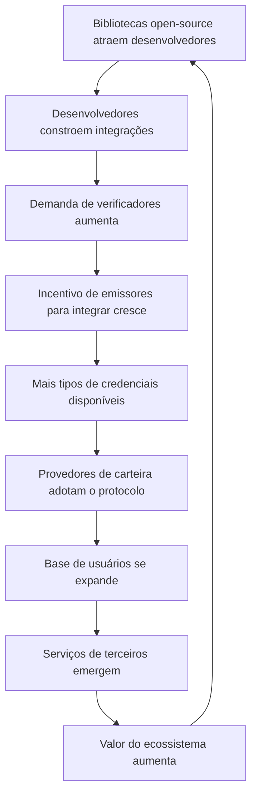

# Estratégia de Ecossistema

## Da Plataforma ao Ecossistema

A Ultima Forma começa como uma plataforma de orquestração conectando emissores e verificadores. A visão de longo prazo é um ecossistema onde terceiros constroem serviços, ferramentas e aplicações sobre o protocolo aberto e a rede proprietária — criando valor que a Ultima Forma não poderia construir sozinha.

A estratégia de ecossistema transforma o cenário competitivo: em vez de se defender de concorrentes, a plataforma os recruta como participantes do ecossistema. Cada carteira de terceiros, cada parceiro de integração, cada ferramenta de desenvolvedor construída sobre o protocolo aumenta o valor da rede.

---

## Participantes do Ecossistema

### Emissores

Entidades que criam credenciais verificáveis — o lado da oferta da rede.

| Tipo de Emissor | Exemplos de Credenciais | Valor Estratégico |
|-----------------|------------------------|-------------------|
| **Bancos** | Verificação de renda, propriedade de conta, score de crédito | Maior nível de confiança; maior incentivo econômico (redução de custo de *KYC*) |
| **Telecomunicações** | Verificação de endereço, propriedade de número de telefone | Base instalada grande; alta demanda de verificação |
| **Governos** | Identidade civil, CPF, licenças profissionais | Maior nível de confiança; alinhamento regulatório; integração GOV.BR |
| **Universidades** | Credenciais acadêmicas, certificações profissionais | Alto valor para casos de uso de verificação em RH/emprego |
| **Empregadores** | Verificação de emprego, atestado de renda | Alta demanda de serviços financeiros para decisões de crédito |
| **Saúde** | Status de seguro, registros de vacinação, credenciais profissionais | Setor regulado com fortes requisitos de conformidade |

### Verificadores

Empresas que consomem credenciais verificadas — o lado da demanda da rede.

| Tipo de Verificador | Casos de Uso | Perfil de Volume |
|---------------------|--------------|------------------|
| **Fintechs** | Onboarding de clientes, conformidade *KYC*, decisões de crédito | Alto volume; sensível a custos; digital-first |
| **Seguros** | Verificação de segurado, validação de sinistros | Volume médio; transações de alto valor |
| **Saúde** | Identidade do paciente, verificação de seguro, credenciais de provedores | Crescente adoção digital; fortes requisitos regulatórios |
| **Imobiliário** | Verificação de inquilino, comprovação de renda, identidade para contratos | Volume médio; alto valor por transação |
| **RH / Emprego** | Verificações de antecedentes, verificação de credenciais, autorização de trabalho | Volume estável; requisitos crescentes de conformidade |

### Desenvolvedores

Construindo sobre o protocolo aberto — o motor de adoção.

- **Desenvolvedores de integração**: incorporando verificação de credenciais em aplicações existentes
- **Desenvolvedores de carteiras**: criando carteiras especializadas para indústrias ou casos de uso específicos
- **Desenvolvedores de ferramentas**: construindo analytics, conformidade e ferramentas de monitoramento sobre o protocolo
- **Desenvolvedores de plataforma**: construindo aplicações verticais que usam verificação de credenciais como recurso central

### Provedores de Carteira

Carteiras de terceiros usando o *SDK* aberto criam escolha para usuários e expandem a rede.

- Bancos incorporando gestão de credenciais via *SDK* de emissor
- Desenvolvedores de carteiras independentes construindo experiências especializadas
- Carteiras governamentais (GOV.BR) integrando via protocolo aberto
- Carteiras específicas por indústria (saúde, educação, profissional)

### Serviços de Terceiros

Serviços construídos sobre a plataforma que criam valor adicional para os participantes:

- **Analytics de conformidade**: ferramentas de monitoramento e relatórios para indústrias reguladas
- **Detecção de fraude**: serviços antifraude especializados usando dados de verificação de credenciais
- **Middleware de integração**: conectores para *ERP*, *CRM* e sistemas específicos por indústria
- **Serviços de auditoria**: serviços independentes de auditoria e certificação para emissores de credenciais

---

## Modelo de Receita do Ecossistema

O ecossistema cria múltiplas fontes de receita além das taxas diretas de verificação:

| Fonte de Receita | Modelo | Cronograma |
|------------------|--------|------------|
| **Taxas de verificação** | Por verificação e assinatura (negócio central) | Fase 0+ |
| **Taxas de plataforma empresarial** | Contratos anuais para acesso de alto volume e alto *SLA* | Fase 1+ |
| **Taxas de plataforma para desenvolvedores** | Acesso à *API* de produção além da faixa gratuita | Fase 1+ |
| **Taxas de parceiros do ecossistema** | Participação na receita com serviços de terceiros construídos na plataforma | Fase 2+ |
| **Taxas de certificação** | Programas de certificação e auditoria de emissores | Fase 2+ |
| **Comissões de marketplace** | Comissões sobre serviços de terceiros transacionados pela plataforma | Fase 3+ |

À medida que o ecossistema amadurece, a mistura de receita se desloca das taxas diretas de verificação para taxas de plataforma e ecossistema — um modelo de receita de maior margem e mais defensável.

---

## Flywheel do Ecossistema

Cada ciclo do flywheel aumenta o valor para todos os participantes e eleva o custo de migração para um ecossistema alternativo.

---

## Potencial de Marketplace (Longo Prazo)

À medida que o ecossistema amadurece (Fase 3+), um marketplace para serviços relacionados a credenciais se torna viável:

- **Marketplace de emissores**: verificadores descobrem e conectam com emissores em tipos de credenciais e níveis de confiança
- **Marketplace de serviços**: serviços de conformidade, analytics e integração de terceiros disponíveis para todos os participantes da plataforma
- **Marketplace para desenvolvedores**: integrações pré-construídas, templates e ferramentas que aceleram a implementação

O modelo de marketplace transforma a Ultima Forma de provedora de infraestrutura em negócio de plataforma — com a correspondente melhoria na economia unitária e defensibilidade.

---

## Métricas de Crescimento do Ecossistema

| Métrica | Meta Fase 1 | Meta Fase 2 | Meta Fase 3 |
|---------|-------------|-------------|-------------|
| **Integrações de emissores** | 3–5 | 10–15 | 25+ |
| **Clientes verificadores ativos** | 5–10 | 20–30 | 50+ |
| **Tipos de credenciais disponíveis** | 5–8 | 15–20 | 30+ |
| **Implementações de carteiras de terceiros** | 1–2 | 5–8 | 15+ |
| **Serviços de terceiros na plataforma** | 0 | 3–5 | 10+ |
| **Tamanho da comunidade de desenvolvedores** | 200+ | 1.000+ | 5.000+ |

---

## Glossário (siglas e termos)

- **API**: Application Programming Interface; interface para integração entre sistemas.
- **CRM**: Customer Relationship Management; sistema de gestão de relacionamento com clientes.
- **ERP**: Enterprise Resource Planning; sistema integrado de gestão empresarial.
- **KYC**: Know Your Customer; processo de verificação de identidade do cliente.
- **SDK**: Software Development Kit; conjunto de ferramentas para construir em uma plataforma.
- **SLA**: Service Level Agreement; acordo de nível de serviço.
