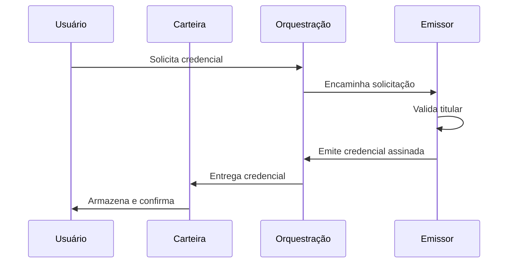
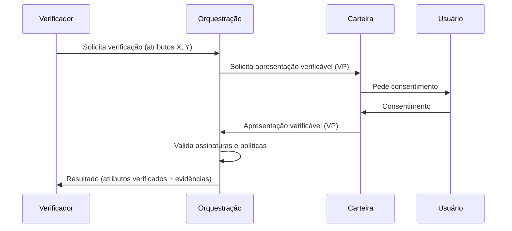

# Apêndice

Este apêndice consolida, em formato de referência, os fluxos técnicos e as principais premissas numéricas utilizadas ao longo do plano.

---

## A. Diagramas Técnicos (referência)

### A.1 Fluxo de emissão de credencial

### A.2 Fluxo de verificação (apresentação verificável com consentimento)

---

## B. Fluxos de exemplo (casos de uso)

### B.1 Onboarding em FinTech (vertical inicial)

1. O usuário possui uma credencial de identidade emitida por um emissor qualificado/registrado (ex.: Gov.br, instituição financeira ou telecom), armazenada na carteira.
2. A FinTech solicita verificação de atributos mínimos (ex.: CPF e nome) via API.
3. A plataforma de orquestração encaminha a solicitação para a carteira, com política e escopo.
4. O usuário consente o compartilhamento do conjunto mínimo de atributos.
5. A carteira envia uma **apresentação verificável (VP)** com os atributos solicitados e evidências criptográficas (assinaturas do emissor e, quando aplicável, status/revogação).
6. A orquestração valida assinatura, status quando aplicável, e registra metadados do evento (auditoria).
7. A FinTech recebe o resultado verificável e continua o fluxo de onboarding e KYC sob sua responsabilidade.

### B.2 Verificação de qualificação profissional

1. O usuário possui uma credencial de diploma/certificação emitida por uma universidade/entidade emissora integrada.
2. A empresa contratante solicita verificação do atributo necessário (ex.: “titulação”, “curso”, “ano”).
3. O fluxo segue o mesmo padrão do onboarding: consentimento, **apresentação verificável (VP)** com divulgação seletiva (quando aplicável) e validação criptográfica.

---

## C. Premissas consolidadas (valores do plano)

| Premissa | Valor/Descrição | Onde está definida no plano |
|---------|------------------|-----------------------------|
| **Vertical inicial** | **FinTech** | sessão “Go-To-Market” |
| **Geografia inicial** | **Brasil** (expansão para LATAM selecionado) | sessão “Go-To-Market” |
| **Tipo de MVP (escopo)** | **Híbrido**: orquestração + API enterprise + carteira mínima (Android/iOS) | sessões “Arquitetura da Solução” e “Roadmap 36 Meses” |
| **Custo de KYC tradicional (referência de dor)** | **PF**: R$ **40–100** por verificação; **PJ**: ~R$ **10–12,5 mil** por revisão | sessão “Declaração do Problema” |
| **TAM (mercado global de verificação/KYC)** | **US$ 15–25 bi até 2030**, CAGR ~**12–15%** | sessão “Tese de Mercado” |
| **SAM / SOM (referência)** | **SAM**: **15–25%** do TAM (vertical+geografia); **SOM (36m)**: **0,5–2%** do SAM | sessão “Tese de Mercado” |
| **Ciclo de venda (referência)** | **Growth**: **3–6 meses**; **Enterprise**: **6–9 meses** | sessões “Go-To-Market” e “Unit Economics” |
| **Retenção (proxy via vida útil média)** | **Starter**: 24–36m; **Growth**: 30–42m; **Enterprise**: 36–60m | sessão “Unit Economics” |

---

## D. Pricing e economia unitária (resumo)

### D.1 Pricing por verificação (tabela)

| Item | Preço (tabela) | Definição |
|------|----------------:|----------|
| **Verificação básica** | **R$ 3,90** | Validação criptográfica, resolução de issuer/DID, checagens de formato/schema e auditoria (metadados) |
| **Verificação qualificada** | **R$ 12,90** | Básica + políticas (ex.: exigir emissor qualificado/registrado), status/revogação quando disponível e pacote de evidências auditáveis |

Referência de descontos por volume, assinatura e SLA enterprise: sessão “Business Model”.

### D.2 COGS por verificação (faixas de referência)

| Tipo | Até 10k/mês | 10k–100k/mês | >100k/mês |
|------|------------:|-------------:|----------:|
| **COGS básica** | **R$ 0,40** | **R$ 0,24** | **R$ 0,15** |
| **COGS qualificada** | **R$ 0,90** | **R$ 0,60** | **R$ 0,40** |

Referência: sessão “Unit Economics”.

### D.3 Assinaturas e pacote enterprise (referência)

| Oferta | Preço | Inclui | Excedente (referência) |
|--------|------:|--------|-------------------------|
| **Starter (assinatura)** | **R$ 7.500/mês** | 2.000 básicas + 200 qualificadas / mês | R$ 2,50 (básica) / R$ 8,50 (qualificada) |
| **Growth (assinatura)** | **R$ 29.000/mês** | 10.000 básicas + 1.000 qualificadas / mês | R$ 1,90 (básica) / R$ 6,90 (qualificada) |
| **Enterprise (SLA)** | **a partir de R$ 450.000/ano** | 200.000 básicas + 20.000 qualificadas / ano; uptime 99,9% | R$ 1,20 (básica) / R$ 4,50 (qualificada) |

Referência: sessão “Business Model”.

### D.4 Base de custos fixos (0–12 meses, referência)

| Categoria | Faixa (R$/mês) | Observação |
|----------|----------------:|------------|
| **Cloud + observabilidade + segurança** | **R$ 18.000–35.000** | Ambientes, banco gerenciado, filas/eventos, storage de logs/auditoria, monitoramento/alertas, WAF/rate limiting e backups |
| **Operação (SRE parcial) e suporte técnico** | **R$ 25.000–55.000** | Alocação parcial do time, variando conforme clientes ativos e complexidade das integrações |

Referência: sessão “Unit Economics”.

---

## E. Roadmap (36 meses, síntese)

| Fase | Período | Marcos-chave |
|------|---------|-------------|
| **0 — Fundação** | 0–6m | MVP de orquestração, API enterprise, 1 emissor integrado (mínimo), carteira mínima (Android/iOS) |
| **1 — Piloto** | 6–12m | 1 emissor em produção, fluxo end-to-end validado, 1 parceiro âncora e ~10 mil verificações no período |
| **2 — Escala inicial** | 12–24m | 2–3 emissores, 5–10 clientes enterprise, 200–500 mil verificações/ano |
| **3 — Expansão** | 24–36m | Multi-região e/ou 2ª vertical, 1–2 milhões verificações/ano, preparação para Series A |

Referência: sessão “Roadmap 36 Meses”.

---

## F. Captação (referência)

| Rodada | Meta | Objetivo | Runway alvo |
|--------|-----:|----------|------------|
| **Pre-seed** | **R$ 3,5M** | MVP em produção, pilotos pagos e base comercial de recorrência | **16–18 meses** |
| **Seed** | **R$ 12M** | Escala de aquisição/retenção, contratos anuais e preparo para Series A | **18–24 meses** |

Referência: sessão “Estratégia de Captação”.

---

## G. Riscos (matriz resumo)

| Risco | Prob. | Impacto | Mitigação principal |
|-------|-------|---------|---------------------|
| Regulatório | Média | Alto | Parecer jurídico, design conservador (não armazenar credenciais; não decidir sobre crédito) |
| Adoção | Média | Alto | Piloto com parceiro âncora, ROI claro, flexibilidade para fluxos híbridos |
| Big Tech | Média | Médio–Alto | Foco em regulado, neutralidade/interoperabilidade, construção de rede |
| Tecnológico | Baixa–Média | Médio–Alto | Padrões abertos, auditorias de segurança, arquitetura com menor superfície |
| Execução | Média | Alto | Roadmap incremental, runway adequado, métricas e governança de entrega |

Referência: sessão “Análise de Risco”.

---

## H. Referências (normas e fontes)

- **W3C**: Verifiable Credentials Data Model; DID Core.
- **Regulação**: LGPD (Brasil), GDPR (Europa), eIDAS 2.0 (UE).
- **Mercado**: estimativas de consultorias citadas no plano (ex.: McKinsey, Grand View Research).
- **Contexto Brasil**: Gov.br (referências e iniciativas de identidade digital).

---

## Glossário (termos e siglas usados no plano)

| Termo | Definição |
|-------|-----------|
| **AML** | Anti-Money Laundering; regras e controles de combate à lavagem de dinheiro |
| **API** | Application Programming Interface; interface para integração entre sistemas |
| **B2B / B2B2C** | Modelos de negócio voltados a empresas (e empresa→empresa→consumidor) |
| **CAC** | Custo de Aquisição de Cliente |
| **CAGR** | Compound Annual Growth Rate; taxa de crescimento anual composta |
| **COGS** | Cost of Goods Sold; custo direto para entregar o serviço |
| **Credencial verificável (VC)** | Atestado digital assinado criptograficamente por um emissor, contendo atributos sobre o titular |
| **DID** | Decentralized Identifier; identificador descentralizado |
| **eIDAS** | Regulamento europeu de identificação eletrônica e serviços de confiança |
| **Emissor** | Entidade que emite credenciais (governo, banco, telecom, universidade etc.) |
| **KYC** | Know Your Customer; processo de verificação de identidade de clientes |
| **LGPD** | Lei Geral de Proteção de Dados (Brasil) |
| **LTV** | Lifetime Value; valor do cliente ao longo do relacionamento (normalmente em margem bruta) |
| **NRR** | Net Revenue Retention; retenção líquida de receita na base de clientes (inclui expansão e perdas) |
| **SLA** | Service Level Agreement; acordo de nível de serviço |
| **SAM / SOM / TAM** | Recortes de mercado: atendível, capturável e endereçável |
| **Verificador** | Entidade que solicita e recebe atestados sobre atributos do titular |
| **Carteira (wallet)** | Aplicação onde o titular armazena credenciais e controla compartilhamento |
| **Orquestração** | Coordenação do fluxo entre emissores, carteiras e verificadores |
| **Apresentação verificável (VP)** | Conjunto de credenciais e/ou atributos apresentado pelo titular em resposta a uma solicitação, com evidências criptográficas verificáveis (ex.: assinaturas; e, quando aplicável, status/revogação) |
