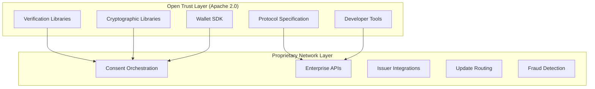
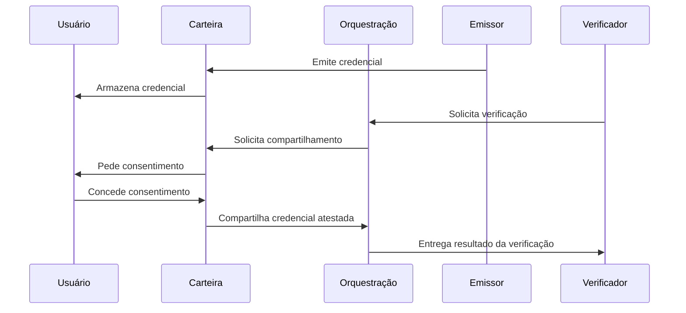
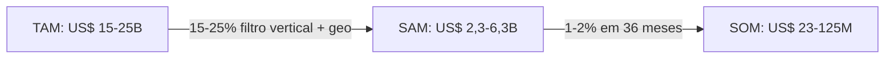
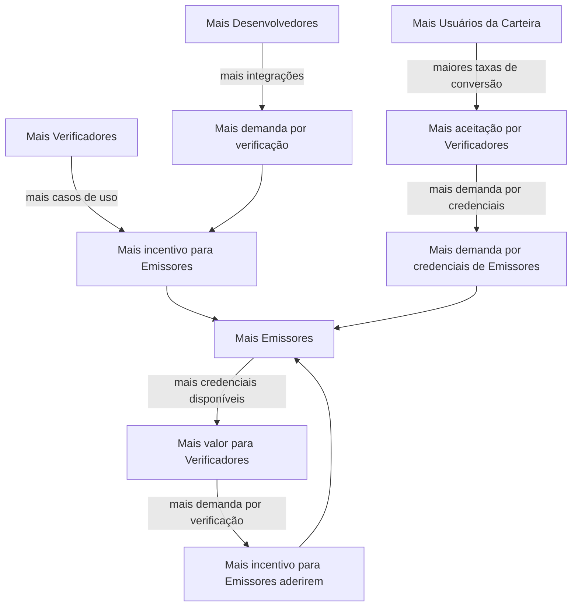
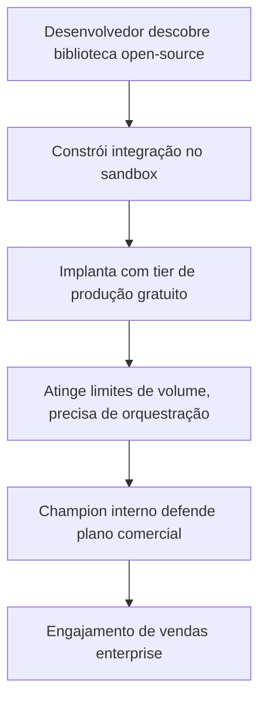
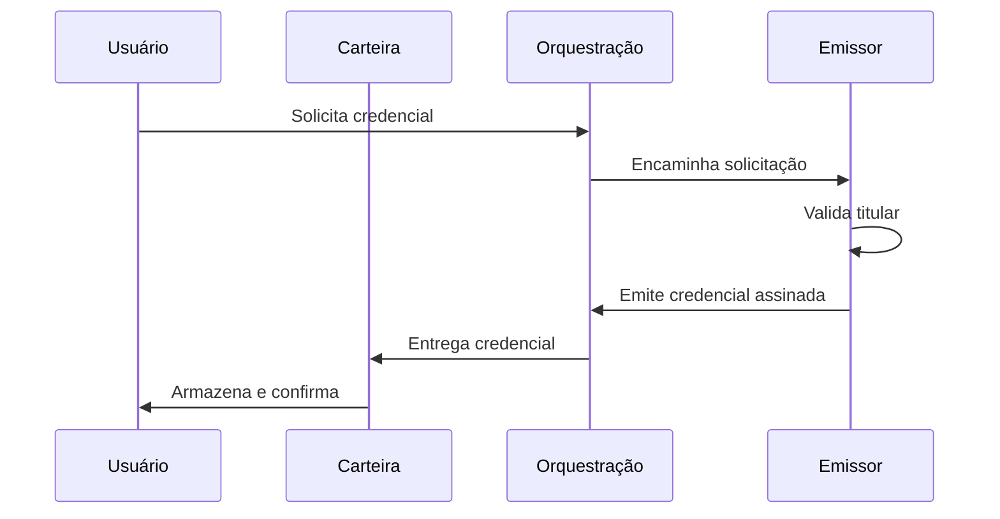
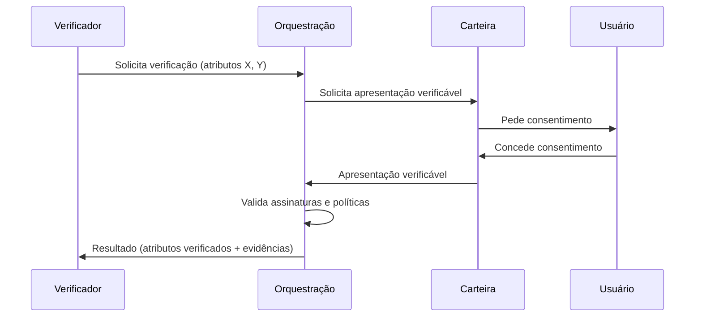

# Ultima Forma

## Open Protocol. Trusted Network.

### O Protocolo de Confiança Aberto para Identidade Portátil

---

# 1. Sumário Executivo

Todos os anos, empresas gastam bilhões reconstruindo o mesmo processo: coletar documentos, validar identidades, verificar fraudes e cumprir regulamentações de KYC e AML. Usuários repetem esses passos dezenas de vezes em bancos, fintechs, seguradoras e serviços governamentais. Os dados coletados ficam isolados em silos, inconsistentes e estáticos. Eles deterioram. São violados. Nunca chegam à próxima instituição que precisa deles.

O problema não é de software, e sim de infraestrutura. A identidade digital hoje não possui uma camada de interoperabilidade.

A Ultima Forma está construindo essa camada. A empresa opera um protocolo de confiança aberto para identidade portátil, alimentado por uma rede de infraestrutura proprietária. O protocolo de verificação é open-source e auditável. A rede de orquestração é proprietária. Isso segue o modelo da Stripe (Elements aberto / rede de pagamentos proprietária), Cloudflare (Workers aberto / rede de edge proprietária) e Kubernetes (orquestrador aberto / infraestrutura de nuvem proprietária).

A plataforma conecta três atores: **emissores** (bancos, telecoms, governos) que criam credenciais verificáveis, **usuários** que as armazenam em carteiras soberanas, e **empresas** que precisam de dados verificados para cadastrar clientes, prevenir fraudes e cumprir regulamentações.

A plataforma não centraliza dados. Não emite identidades. Não toma decisões de crédito. Ela orquestra o fluxo de credenciais assinadas criptograficamente entre as partes, com consentimento explícito do usuário em cada etapa. A camada de verificação é open-source. Qualquer parte pode inspecionar, auditar e construir sobre ela.

*Nosso protocolo é aberto e auditável, e nossa rede é proprietária.*

O modelo de negócio gera receita a partir de transações de verificação, assinaturas e contratos enterprise, com uma camada de incentivo ao ecossistema que compartilha receita com emissores e devolve cashback aos usuários durante o crescimento inicial da rede. As margens brutas em steady-state superam 85%. A rede trilateral produz valor composto à medida que cada novo participante aumenta a utilidade para os demais.

A Ultima Forma está captando **R$ 3,5 milhões em rodada pre-seed** para entregar o MVP em produção, publicar as bibliotecas de verificação open-source e o wallet SDK, fechar pilotos pagos com parceiros fintech e estabelecer a base comercial para receita recorrente em um ciclo de execução de 16--18 meses.

**Em uma frase:** Ultima Forma é o protocolo de confiança aberto para identidade portátil, alimentado por uma rede de infraestrutura proprietária que reduz custos de coleta de dados e verificação de identidade em 70--90% para checagens básicas e 30--50% do custo total do fluxo de trabalho de KYC quando combinado com ferramentas de compliance existentes, enquanto usuários mantêm soberania sobre seus dados.

---

# 2. A Tese de Infraestrutura

A identidade está seguindo o mesmo caminho de pagamentos, dados financeiros e comunicações: de soluções pontuais fragmentadas para APIs de infraestrutura unificadas.

| Domínio | Antes | Camada de Infraestrutura | Resultado |
|---------|-------|--------------------------|-----------|
| **Pagamentos** | Integrações bancárias sob medida | Stripe | Avaliação US$ 65B+ |
| **Dados financeiros** | Screen scraping, acordos bilaterais | Plaid | Avaliação US$ 13B+ |
| **Comunicações** | Acordos operadora por operadora | Twilio | US$ 15B+ no pico |
| **Infraestrutura web** | Servidores e CDNs auto-gerenciados | Cloudflare | Market cap US$ 30B+ |
| **Identidade** | KYC fragmentado, dados em silos | **Ultima Forma** | Em construção |

Em cada caso, a empresa vencedora construiu a camada neutra que conectou um ecossistema fragmentado. Em cada caso, a empresa que controlou a interface aberta para desenvolvedores e a rede de infraestrutura proprietária capturou a posição de infraestrutura.

Protocolos abertos criam os maiores mercados endereçáveis. TCP/IP, HTTP e SMTP demonstram que quando a camada de protocolo é aberta, o ecossistema cresce mais rápido e o operador de infraestrutura captura valor na camada de rede. A Ultima Forma aplica essa lógica à identidade: o protocolo de verificação é aberto, e a rede de orquestração é proprietária.

### Por Que a Infraestrutura de Identidade É Inevitável

Verificação de identidade não é opcional. É uma exigência regulatória em serviços financeiros, seguros, saúde e governo. Toda empresa que cadastra um cliente, concede crédito ou processa um pagamento precisa responder à mesma pergunta: *essa pessoa é quem diz ser?*

Hoje, cada empresa responde a essa pergunta de forma independente, do zero, toda vez. O resultado é um sistema fragmentado onde o mesmo indivíduo é verificado dezenas de vezes ao longo da vida, cada verificação custando R$ 40--100 para pessoas físicas e até R$ 12.500 para análises de pessoas jurídicas. O mercado global de verificação de identidade e KYC supera US$ 15 bilhões e cresce a um CAGR de 12--15%.

Três forças estão convergindo para tornar a infraestrutura neutra de identidade inevitável:

**A regulação está forçando.** O eIDAS 2.0 da Europa exige carteiras de identidade digital para cidadãos da UE. A LGPD do Brasil e o GDPR da Europa impõem consentimento, minimização de dados e portabilidade. Requisitos de AML/KYC sustentam a demanda por verificação enquanto tornam o acúmulo centralizado de dados cada vez mais custoso e arriscado. Em paralelo, leis de verificação de idade obrigatória em múltiplas jurisdições (Online Safety Act no Reino Unido, Marco Legal Digital no Brasil, Social Media Minimum Age Act na Austrália, DSA na UE e leis estaduais nos EUA) expandem o mercado endereçável para setores antes fora do escopo de verificação de identidade: gaming, redes sociais e plataformas de conteúdo.

**A economia está exigindo.** O KYC tradicional é caro, redundante e não escala. Empresas mantêm equipes inteiras para análise manual de documentos, reconciliação de dados e gestão de compliance. Cada etapa adicional no cadastro reduz a conversão. O custo de fraude em serviços financeiros varia de 0,3% a 10% da receita.

**A tecnologia está viabilizando.** W3C Verifiable Credentials e Decentralized Identifiers (DIDs) fornecem padrões abertos para emitir, armazenar e verificar credenciais sem registros centralizados. Provas de conhecimento zero permitem verificação sem expor dados desnecessários. Infraestrutura em nuvem e APIs padronizadas reduzem o custo de integração para semanas em vez de meses.

A tese de mercado é simples: identidade se tornará infraestrutura portátil e reutilizável. A empresa que construir a camada neutra de orquestração, com um protocolo de confiança aberto e uma rede proprietária, captura a posição que a Plaid construiu para dados financeiros. No Brasil, o PIX demonstrou que infraestrutura compartilhada em um ecossistema regulado pode alcançar adoção quase universal quando a proposta de valor é inquestionável. A orquestração de credenciais segue a mesma lógica.

---

# 3. O Problema

### O custo do status quo

A identidade digital não funciona como infraestrutura. Funciona como silos desconectados. Cada empresa reconstrói o mesmo pipeline: coleta de dados, validação de identidade, verificações antifraude, compliance regulatório e atualizações cadastrais contínuas.

As consequências são mensuráveis:

| Dimensão | Custo | Contexto |
|----------|-------|----------|
| Verificação KYC individual | R$ 40--100 | Ferramentas + operação por verificação |
| Análise KYC corporativa | R$ 10.000--12.500 | Análise de estrutura societária e beneficiário final |
| Tempo médio de cadastro | 15--45 minutos | Por evento de verificação |
| Perdas com fraude (setor financeiro) | 0,3--10% da receita | Varia por segmento e geografia |
| Retrabalho por inconsistência de dados | 15--30% das operações | Baseado em estudos de mercado |

### Para usuários: fricção e perda de controle

Usuários acumulam identidades em dezenas de sistemas. Uma credencial emitida por uma instituição não pode ser reutilizada em outra. A mesma pessoa envia documentos, selfies e provas de vida repetidamente. Uma pesquisa da Unico e Instituto Locomotiva revelou que 77% dos brasileiros citam perda de tempo e burocracia como principal frustração com processos de identidade.

Após enviar dados, os usuários perdem visibilidade e controle. Não sabem quem acessa suas informações, por quanto tempo ou como revogar o acesso. Bancos de dados centralizados atraem ataques. Violações afetam milhões. A estrutura de incentivos recompensa o acúmulo de dados, não a minimização.

### Para empresas: custo, fraude e dados desatualizados

**Verificação redundante.** Mesmo que um banco tenha realizado KYC completo de um cliente, a próxima instituição repete todo o processo: captura de documentos, prova de vida, verificações antifraude, verificação regulatória. A identidade é recriada, não reutilizada.

**Exposição a fraudes.** Sistemas fragmentados dificultam a verificação cruzada. Fraude de identidade sintética (CPF válido combinado com dados fabricados), reuso de identidade roubada, falsificação de documentos e manipulação cadastral prosperam em ambientes onde não existe uma fonte única de verdade.

**Deterioração de dados.** Após o cadastro, os dados do cliente, como endereço, telefone, e-mail, renda e estado civil, nunca são automaticamente sincronizados entre instituições.

**Perda de conversão.** Cada etapa adicional no cadastro reduz a conversão. Empresas investem pesadamente em aquisição de clientes e perdem usuários na etapa de validação de identidade.

### O déficit de confiança

Além do custo e da fricção, o sistema atual tem um problema fundamental de confiança. Usuários são solicitados a enviar seus dados mais sensíveis a sistemas que não podem inspecionar. Empresas dependem de fornecedores de KYC que não podem auditar. Reguladores precisam confiar na auto-certificação de fornecedores. O mercado de infraestrutura de identidade é construído sobre confiança opaca — contratos e certificações em vez de transparência por design.

A infraestrutura de protocolo aberto endereça esse déficit diretamente: a camada de verificação é auditável, a criptografia é pública, e qualquer parte pode verificar independentemente o que o sistema faz.

### A causa raiz

A identidade digital atual é:

- Não portátil (credenciais não se transferem entre instituições)
- Não reutilizável (cada verificação começa do zero)
- Não sincronizada (dados deterioram após a coleta)
- Não interoperável (sistemas operam em silos)
- Não transparente (sistemas de verificação são caixas pretas)

---

# 4. A Mudança Tecnológica

Um conjunto de padrões e primitivas criptográficas existe hoje que torna a identidade verificável, portátil e controlada pelo usuário tecnicamente viável em escala. Não é teórico: os blocos fundamentais estão em produção.

### Verifiable Credentials (Padrão W3C)

Uma credencial verificável é uma atestação digital assinada criptograficamente por um emissor, contendo atributos sobre um titular. A assinatura é matematicamente verificável por qualquer parte sem contatar o emissor. O titular controla quais credenciais compartilhar, com quem e quando.

### Decentralized Identifiers (DIDs)

DIDs são identificadores globalmente únicos que resolvem para endpoints sem depender de um registro central. Eles permitem que emissores, titulares e verificadores descubram uns aos outros e estabeleçam confiança sem uma autoridade única controlando o namespace.

### Provas de Conhecimento Zero e Divulgação Seletiva

Essas técnicas criptográficas permitem que um titular prove atributos específicos sem revelar os dados subjacentes. Um usuário pode provar que tem mais de 18 anos sem revelar sua data de nascimento.

### Regulação de Privacidade como Catalisador

GDPR e LGPD impõem consentimento, minimização de dados e direito ao esquecimento. O eIDAS 2.0 exige carteiras de identidade digital para cidadãos da UE e estabelece um framework para credenciais qualificadas e serviços de confiança.

### Convergência

Essas quatro forças convergem simultaneamente: padrões abertos de credenciais, identificadores descentralizados, criptografia que preserva privacidade e mandatos regulatórios. Elas tornam possível construir infraestrutura de identidade onde credenciais são emitidas uma vez e reutilizadas muitas vezes, o titular controla o compartilhamento, a verificação é instantânea e criptográfica, e nenhuma parte central armazena ou controla os dados. O protocolo aberto torna essa infraestrutura confiável por padrão.

---

# 5. Por Que Agora

### A janela regulatória

O eIDAS 2.0 exigirá que os estados-membros da UE ofereçam carteiras de identidade digital aos cidadãos. Isso cria demanda imediata por infraestrutura de orquestração de credenciais. No Brasil, a aplicação da LGPD está amadurecendo. A plataforma GOV.BR registrou mais de 95 milhões de assinaturas digitais apenas no primeiro semestre de 2025. O CPQD e a Secretaria de Governo Digital do Brasil assinaram acordo de cooperação de dois anos para pilotar identidade descentralizada usando credenciais verificáveis para acesso ao GOV.BR. A FEBRABAN, Zetta e ABRID assinaram acordo complementar para avançar a infraestrutura de identidade digital pública. O Brasil assumiu o papel coordenador na Global Digital Collaboration em dezembro de 2025, liderando esforços internacionais em carteiras de identidade digital e padrões de interoperabilidade.

### A onda de verificação de idade

Uma segunda força regulatória opera em paralelo ao KYC financeiro. O Online Safety Act (Reino Unido), o Marco Legal para Proteção de Crianças e Adolescentes em Ambientes Digitais (Brasil, 2025), o Social Media Minimum Age Act (Austrália) e o Digital Services Act (UE) exigem que plataformas digitais verifiquem a idade dos usuários. Nos EUA, diversos estados aprovaram leis semelhantes. O dilema central dessas regulamentações é como proteger menores sem criar bases de dados de vigilância. Verificação de atributo via credenciais verificáveis e ZKP resolve esse dilema: o usuário prova que tem mais de 16 ou 18 anos sem revelar data de nascimento, nome ou qualquer outro dado pessoal. Diferente do KYC financeiro (evento único por relacionamento), a verificação de idade pode ser recorrente por sessão ou por plataforma, o que multiplica o volume de transações na rede de orquestração.

### Os padrões estão prontos para produção

As especificações W3C Verifiable Credentials e DID Core passaram de rascunho para estáveis. Múltiplas implementações open-source existem. A lacuna não é mais a viabilidade técnica - é a infraestrutura de mercado.

### A janela de primeiro movimento

Infraestrutura neutra de identidade é um negócio de efeitos de rede. A primeira plataforma a reunir uma massa crítica de emissores e verificadores em um dado mercado se torna o padrão. A janela para estabelecer uma camada de orquestração de protocolo aberto, antes que plataformas proprietárias travem o ecossistema, está aberta agora. No Brasil e LATAM, não há incumbente nessa posição.

---

# 6. A Solução

A Ultima Forma fornece um protocolo de confiança aberto para identidade portátil, implementado através de três componentes:

### 1. Camada de Consentimento de Credenciais (Multi-Canal)

A camada de consentimento opera por três canais:

- **Fluxos de consentimento baseados em web (Dia 1).** Usuários aprovam o compartilhamento de credenciais via links no navegador, sem necessidade de app.
- **SDK embarcado em emissores.** Bancos e telecoms embarcam gestão de credenciais em seus apps existentes via SDK.
- **Carteira de Identidade standalone (camada de conveniência).** Um aplicativo mobile dedicado para usuários que possuem credenciais de múltiplos emissores e desejam gestão unificada.

### 2. Plataforma de Orquestração

O backend que conecta emissores, verificadores e titulares de credenciais sem centralizar dados de identidade. Registra eventos de consentimento e metadados de verificação, nunca o conteúdo das credenciais.

### 3. API Enterprise

A interface de integração para empresas que precisam validar atributos de identidade. Complementa ferramentas de compliance existentes.

### Arquitetura Aberta vs. Proprietária

| Camada | Componentes | Status |
|--------|-------------|--------|
| **Open Trust Layer** | Bibliotecas de verificação de credenciais, bibliotecas criptográficas, wallet SDK, especificação do protocolo, ferramentas de desenvolvedor | Open-source (Apache 2.0) |
| **Proprietary Network Layer** | Orquestração de consentimento, APIs enterprise, integrações com emissores, roteamento de atualizações, detecção de fraude, infraestrutura operacional | Proprietária |

A camada aberta constrói confiança e adoção. A camada proprietária captura valor. Um competidor pode fazer fork do código. Não pode fazer fork da rede.

### Como Funciona

### Níveis de Confiança

| Nível | Descrição |
|-------|-----------|
| **Emissor qualificado** | Credenciais de entidades reguladas com assinaturas criptográficas verificáveis |
| **Emissor registrado** | Emissores registrados na plataforma com processos auditados |
| **Autodeclarado** | Declarações do titular; confiança limitada, apropriado para cenários de baixo risco |

### O Que a Ultima Forma Não É

| Fronteira | Fundamento |
|-----------|------------|
| **Não é um banco** | Sem depósitos, sem produtos financeiros. Evita regulação bancária |
| **Não é um provedor de crédito** | Sem decisões de crédito, sem scoring. Foco em verificação |
| **Não é um repositório de dados** | Sem armazenamento centralizado de credenciais. Minimiza responsabilidade por violações |
| **Não é uma autoridade de identidade** | Sem emissão de identidades. Posicionada como facilitadora |
| **Não é um sistema fechado** | Protocolo de verificação aberto; confiança através de auditabilidade |

---

# 7. O Time

### Resolução de Identidade em Escala

O time fundador traz expertise rara em **identificação digital e resolução de identidade usando Big Data**, aplicada em ambientes governamentais e de alta criticidade. Isso inclui experiência direta com a Polícia Federal, ABIN (Agência Brasileira de Inteligência), Banco Central do Brasil e Procuradoria-Geral da República.

**[Pedro Drummond](https://www.linkedin.com/in/drummondpedro/)** -- Enterprise Data Architect com mais de 20 anos de experiência em arquitetura de dados, integração de sistemas e resolução de identidade em larga escala. Atualmente Principal Enterprise Architect na AdvancedMD, onde lidera a arquitetura de uma plataforma que processa dados PII e PHI de milhares de pacientes nos EUA sob regulação HIPAA. Baseado no norte da Espanha.

### Engenharia AI-First

**[Yuri Lima](https://www.linkedin.com/in/yuri-matos-de-lima/)** -- AI Platform Lead na CTD KG, empresa alemã de ERP, onde lidera a plataforma de inteligência artificial. Especialista referência de mercado em construção de sistemas AI-first com foco em confiabilidade, custo e segurança. Baseado no norte da Espanha.

IA é embarcada na plataforma desde a concepção. No produto, automatiza e assiste jornadas de verificação. Na engenharia, combina evals, observabilidade, governança de prompt/modelo e automação de qualidade para acelerar ciclos de entrega. Na operação, cobre monitoramento inteligente, classificação de incidentes e análise de risco.

### Profundo Conhecimento Regulatório

O time combina profundo conhecimento de **governança corporativa**, principais regulamentações globais relacionadas a identidade, dados e privacidade, e o funcionamento do **ambiente governamental**.

---

# 8. Tamanho de Mercado

### TAM: Mercado Total Endereçável

O mercado global de verificação de identidade e KYC é projetado em **US$ 15--25 bilhões até 2030**, crescendo a um CAGR de 12--15%. Leis de verificação de idade obrigatória em múltiplas jurisdições expandem o mercado endereçável para setores antes fora do escopo tradicional de KYC: gaming, redes sociais, plataformas de conteúdo e e-commerce restrito. O volume de verificações nessas verticais é expressivamente maior que o KYC financeiro, dado o caráter recorrente das checagens (por sessão ou por plataforma, em vez de evento único por relacionamento).

### SAM: Mercado Endereçável Acessível

Médias e grandes empresas em fintech, saúde e setor público, em regiões com frameworks regulatórios favoráveis (Brasil, LATAM selecionada, UE). Aproximadamente **15--25% do TAM**, ou **US$ 2,3--6,3 bilhões**.

### SOM: Mercado Obtível Acessível

Estimativa conservadora: **1--2% do SAM em um horizonte de 36 meses**, representando **US$ 23--125 milhões** em oportunidade anual de mercado.

---

# 9. Modelo de Negócio

A Ultima Forma monetiza a troca de dados verificados através de quatro faixas de receita, sobrepostas com incentivos ao ecossistema que aceleram o crescimento da rede.

### Fontes de Receita

#### 1. Pay-per-Verification

| Tipo de Verificação | Preço Padrão | Early Adopter | 10k--100k/mês | >100k/mês |
|---------------------|-------------|---------------|---------------|-----------|
| **Básica** | R$ 3,90 | R$ 2,50 | R$ 1,90 | ~R$ 1,20 |
| **Qualificada** | R$ 12,90 | R$ 8,50 | R$ 6,90 | ~R$ 4,50 |
| **Corporativa / Alto Risco** | R$ 25--50 | Sob proposta | Sob proposta | Sob proposta |

#### 2. Assinaturas

| Plano | Preço | Volume Incluído | Taxa de Excedente |
|-------|-------|-----------------|-------------------|
| **Starter** | R$ 7.500/mês | 2.000 básicas + 200 qualificadas | R$ 2,50 / R$ 8,50 |
| **Growth** | R$ 29.000/mês | 10.000 básicas + 1.000 qualificadas | R$ 1,90 / R$ 6,90 |
| **Scale** | Sob proposta | Negociado | Taxa decrescente |

#### 3. Enterprise SLA

- A partir de **R$ 450.000/ano**
- SLA de 99,9% de uptime
- Suporte prioritário, governança de integração, relatórios de auditoria e compliance

#### Meta de Mix de Receita (horizonte de 24--36 meses)

| Tipo | Meta | Fundamento |
|------|------|------------|
| **Recorrente** (assinaturas + SLA) | 65% | Base previsível; retenção e LTV |
| **Baseada em evento** (por verificação) | 35% | Porta de entrada para assinatura |

### Camada de Incentivo ao Ecossistema

| Fase | Período | Participação Emissor | Cashback Usuário | Líquido Plataforma (básica) |
|------|---------|---------------------|------------------|----------------------------|
| **Fase 1** | 0--18 meses | R$ 1,00 | R$ 1,00 (primeiros 10 usos) | R$ 1,90 |
| **Fase 2** | 18--36 meses | R$ 0,50 | -- | R$ 3,40 |
| **Fase 3** | 36+ meses | -- | -- | R$ 3,90 |

### Unit Economics

| Métrica | Starter | Growth | Enterprise |
|---------|---------|--------|------------|
| Receita mensal | R$ 7.500 | R$ 29.000 | R$ 37.500 |
| Margem bruta de infraestrutura (steady-state) | 80% | 82% | 85% |
| CAC | R$ 20k--35k | R$ 60k--110k | R$ 180k--320k |
| Payback | 3--6 meses | 3--5 meses | 6--10 meses |
| LTV (margem bruta) | R$ 144k--216k | R$ 713k--998k | R$ 1,15M--1,91M |

Meta: LTV:CAC >= 3:1, payback <= 12 meses.

### Escalabilidade

- Custo de infraestrutura dominado pela base fixa que se amortiza com o volume crescente
- Sem proporcionalidade linear de custos
- Efeitos de rede se compõem com cada novo participante

---

# 10. Efeitos de Rede

### O Flywheel Trilateral

O protocolo aberto adiciona um quarto lado ao flywheel: **desenvolvedores**. SDKs open-source e bibliotecas de verificação atraem desenvolvedores que constroem integrações. Integrações criam demanda pela plataforma proprietária. O ecossistema de desenvolvedores cresce independentemente das vendas enterprise.

### Sequenciamento de Cold-Start

Toda empresa de infraestrutura que redefiniu uma categoria enfrentou a mesma objeção: "mas quem vai primeiro?" A Twilio convenceu operadoras de telecom. A Stripe convenceu bancos. A Plaid fez scraping de dados bancários antes que acordos formais existissem. O PIX enfrentou resistência das próprias instituições que deveria servir. Em dois anos processou mais transações que cartões de crédito e débito somados.

#### Estratégia de Sequenciamento

A Ultima Forma começa com as instituições mais valiosas e reputadas, grandes bancos e telecoms, porque suas credenciais carregam a maior confiança, sua participação sinaliza legitimidade e elas têm o incentivo econômico mais forte. As primeiras 1--2 integrações com emissores desbloqueiam os primeiros pilotos com verificadores. Os primeiros pilotos com verificadores geram dados que aceleram a próxima conversa com emissor. Em paralelo, as bibliotecas open-source atraem desenvolvedores que criam demanda bottom-up.

#### Resiliência à Adoção Mais Lenta

Se a integração com emissores levar o dobro do tempo projetado, a reserva de capital de 20% estende o runway em aproximadamente 3 meses. Os primeiros 1--2 clientes verificadores podem operar como design partners sob termos de custo reduzido. O modelo de negócio não depende de escala multi-emissor rápida. Depende de um emissor e um verificador provando a economia unitária em produção.

---

# 11. Arquitetura de Confiança Aberta

### Por Que a Transparência É Não-Negociável

Identidade é a categoria de dados de maior confiança. Quando um usuário roteia sua identidade através de um sistema, ele deve poder verificar o que esse sistema faz. Provedores tradicionais de identidade operam como caixas pretas. A Ultima Forma rejeita esse modelo.

O protocolo de verificação é open-source e publicamente auditável. Qualquer parte pode inspecionar o que o sistema faz com seus dados, como a verificação funciona e se as garantias criptográficas se mantêm.

### Estratégia Open-Source

| Fase | Componentes Liberados |
|------|----------------------|
| **Fase 0** (0--6m) | Biblioteca de verificação, Wallet SDK, rascunho especificação protocolo v0.1 |
| **Fase 1** (6--12m) | Especificação protocolo v1.0, ferramentas CLI, diretrizes de contribuição |
| **Fase 2** (12--24m) | Bibliotecas criptográficas estendidas, carteira de referência, sandbox de desenvolvedor |
| **Fase 3** (24--36m) | Formalização de governança, programa de certificação |

### Modelo de Governança

Mudanças no protocolo seguem processo de proposta-revisão-aprovação. Contribuições são gerenciadas via CLA e padrões de code review. Conforme o ecossistema amadurece, a governança pode transicionar para modelo de fundação (similar à Linux Foundation, CNCF ou OpenID Foundation).

### Empresas Comparáveis de Protocolo Aberto

| Empresa | Camada Aberta | Camada Proprietária | Resultado |
|---------|---------------|---------------------|-----------|
| **Red Hat** | Kernel Linux | Suporte enterprise | Aquisição US$ 34B |
| **Confluent** | Apache Kafka | Plataforma cloud | Market cap US$ 9B+ |
| **HashiCorp** | Terraform, Vault | HCP Cloud | Aquisição US$ 5B+ |
| **Stripe** | Elements, Stripe.js | Rede de pagamentos | Avaliação US$ 65B+ |

---

# 12. Estratégia de Adoção por Desenvolvedores

### Crescimento Liderado por Desenvolvedores

A Stripe não venceu pagamentos contratando a maior equipe de vendas. Venceu tornando pagamentos fáceis para desenvolvedores. A Ultima Forma segue o mesmo modelo.

Os SDKs e bibliotecas de verificação permitem instalação em minutos (`npm install @ultima-forma/verify`), com interface padrão para todos os tipos de credencial e sem vendor lock-in na camada de verificação.

O sandbox de desenvolvedor é totalmente funcional, com credenciais de teste, fluxos de verificação end-to-end e acesso gratuito.

O funil de adoção segue a lógica desenvolvedor-para-enterprise:

Metas de métricas para o programa de desenvolvedores:

| Métrica | Fase 0--1 | Fase 2--3 |
|---------|-----------|-----------|
| GitHub stars | 500+ | 2.000+ |
| Downloads mensais do SDK | 1.000+ | 10.000+ |
| Desenvolvedores ativos no sandbox | 100+ | 500+ |
| Deals originados por desenvolvedores | 1--2 | 5--10 |

---

# 13. Estratégia de Ecossistema

A plataforma cresce em um ecossistema amplo de participantes construindo sobre o protocolo aberto:

- **Emissores**: bancos, telecoms, governos, universidades, empregadores
- **Verificadores**: fintechs, seguradoras, saúde, imobiliário, RH
- **Desenvolvedores**: construindo integrações sobre o protocolo aberto
- **Provedores de carteira**: carteiras de terceiros usando o SDK aberto
- **Serviços de terceiros**: analytics, compliance, detecção de fraude

Cada participante aumenta o valor para todos os demais. O ecossistema é o moat.

---

# 14. Panorama Competitivo

### Competidores Nomeados por Categoria

| Categoria | Players | Modelo |
|----------|---------|--------|
| **Orquestração de credenciais** | Trinsic, Walt.id, Mattr | Infraestrutura VC; foco EUA/Europa |
| **KYC tradicional (Brasil)** | idwall, Unico | Coleta centralizada de dados; barreira de pivot |
| **KYC baseado em bureaus** | Serasa, Boa Vista, TransUnion | Mais prováveis de se tornarem emissores do que competidores |
| **Carteiras governamentais** | Gov.br, eID | Complementares; emissão vs. orquestração |
| **Big Tech** | Apple, Google, Meta | Autenticação, não verificação de atributos |

Nenhum competidor direto de orquestração de credenciais opera atualmente no Brasil ou LATAM.

### Como o Protocolo Aberto Muda a Dinâmica Competitiva

Competidores fechados não conseguem igualar as garantias de confiança da criptografia auditável e verificação open-source. Consórcios open-source são parcialmente endereçados pelo fato de a Ultima Forma já ter aberto o protocolo e construído a comunidade. Jogadores internacionais adotando o protocolo expandem o ecossistema, não o ameaçam. A adoção por desenvolvedores cria demanda bottom-up que competidores apenas enterprise não conseguem replicar.

---

# 15. Moat de Infraestrutura

### O Que Defende Este Negócio

#### Moat de Protocolo

Quando o protocolo aberto se torna um padrão, trocar do padrão é mais difícil que trocar de fornecedor. Um competidor pode replicar o código em meses. Replicar a adoção do protocolo leva anos. Podem fazer fork do protocolo, mas não podem fazer fork da rede. Esse moat cresce conforme o ecossistema de desenvolvedores e implementações de carteiras se expande.

#### Efeitos de Rede

Cada novo emissor, verificador, desenvolvedor e usuário de carteira aumenta o valor para os demais. Esse efeito se compõe com a escala e cria vantagem competitiva crescente.

#### Infraestrutura de Confiança

Relacionamentos com emissores qualificados requerem tempo, credibilidade, auditorias de segurança e alinhamento regulatório. Confiança é um ativo cumulativo que não se replica com capital ou velocidade.

#### Profundidade de Integração

Integrações de API enterprise criam custos de implementação e de troca. Quanto mais profunda a integração, menor a probabilidade de churn.

#### Ecossistema de Desenvolvedores

SDKs abertos atraem desenvolvedores que criam demanda. A comunidade não pode ser replicada lançando um produto concorrente. Começa pequeno e cresce com o uso.

#### Posicionamento Regulatório

O protocolo aberto permite inspeção regulatória direta e reduz fricção de compliance. Reguladores preferem sistemas que podem auditar.

### Mitigação de Risco de Oferta

- Diversificação de emissores (nenhum emissor único > 30% do volume)
- Compromissos de integração com aviso prévio
- Portabilidade de padrões (credenciais W3C VC/DID são portáteis em formato)

---

# 16. Framework de Confiança

A Ultima Forma publica um framework de confiança público. A especificação do protocolo é publicada, versionada e tem governança pública. Todas as operações criptográficas são auditáveis, sem caixa preta proprietária. As bibliotecas de verificação são open-source e submetidas a auditorias de segurança contínuas. A certificação de emissores usa critérios públicos com scoring transparente.

O framework de confiança permite aceitação regulatória entre jurisdições e permite que terceiros construam produtos de confiança sobre o framework.

---

# 17. Estratégia Go-To-Market

### Cabeça de Ponte: Fintech Brasil

Instituições financeiras e fintechs têm os requisitos de KYC mais intensos, maiores volumes de verificação e maior sensibilidade a custos.

### Canais de Distribuição

A força comercial atende contas enterprise com ciclos de 3--6 meses. Integradores e consultorias ampliam o alcance como parceiros. Conteúdo técnico, eventos e webinars geram demanda qualificada. O canal mais diferenciado é o crescimento liderado por desenvolvedores: SDKs open-source impulsionam adoção bottom-up, com desenvolvedores que descobrem, constroem e defendem a plataforma internamente.

### Perfis de Cliente Ideal

| ICP | Dor Principal | Gatilho |
|-----|---------------|---------|
| **Fintech de médio porte** | Alto custo de KYC; longa conversão | Redução de custos |
| **Banco digital / neobank** | Múltiplos provedores de KYC; inconsistência | Simplificação de stack |
| **Empresa de pagamentos / PSP** | Fraude, retrabalho, custo por transação | Automação |

### Roadmap de 36 Meses

| Fase | Período | Marcos Principais |
|------|---------|-------------------|
| **0. Fundação** | 0--6m | MVP, 1 integração de emissor, liberação biblioteca open-source, wallet SDK |
| **1. Piloto** | 6--12m | 1 parceiro-âncora, especificação protocolo v1.0, sandbox de desenvolvedor |
| **2. Escala** | 12--24m | 5--10 clientes, comunidade de desenvolvedores, carteiras de terceiros |
| **3. Expansão** | 24--36m | Multi-região, Series A, governança do protocolo, certificação do ecossistema |

### Marcos de Captação

| Rodada | Meta | Entregas-Chave |
|--------|------|----------------|
| **Pre-seed** | R$ 3,5M | MVP, 3--6 clientes pagantes, MRR R$ 40--80k, bibliotecas open-source publicadas |
| **Seed** | R$ 12M | 20--30 clientes, ARR R$ 2--6M, 2.000+ GitHub stars, LTV:CAC >= 3:1 |

### Projeção de Receita Pre-Seed

**Cenário conservador:**

| Mês | Clientes Acumulados | MRR |
|-----|---------------------|-----|
| M6 | 1 | R$ 7.500 |
| M12 | 4 | R$ 51.500 |
| M18 | 6 | R$ 66.500 |

**Cenário moderado:**

| Mês | Clientes Acumulados | MRR |
|-----|---------------------|-----|
| M6 | 1 | R$ 7.500 |
| M12 | 5 | R$ 80.500 |
| M18 | 8 | R$ 120.000 |

**Cenário de downside:**

| Mês | Clientes Acumulados | MRR |
|-----|---------------------|-----|
| M12 | 2 | R$ 7.500 |
| M18 | 3 | R$ 44.000 |

### Alocação de Capital Pre-Seed

| Categoria | Participação | Valor |
|-----------|-------------|-------|
| Produto / Engenharia | 45% | R$ 1,58M |
| Comercial | 25% | R$ 875k |
| Operações / Jurídico | 10% | R$ 350k |
| Reserva | 20% | R$ 700k |

### Investidores-Alvo

- Fundos focados em infraestrutura, investindo em empresas de nível de protocolo, infraestrutura de API e plataformas de desenvolvedores
- Fundos de deep tech focados em empresas open-source com efeitos de rede
- Fundos early-stage focados em fintech, identidade ou infraestrutura
- Angels com experiência em setores regulados ou identidade digital
- Family offices com apetite para tese de infraestrutura B2B de longo prazo
- Corporate venture em setores intensivos em KYC/compliance

---

# 18. Visão de Longo Prazo

Em dez anos, a identidade digital será infraestrutura portátil. Credenciais emitidas uma vez serão reutilizáveis entre contextos, países e setores. O protocolo de confiança aberto será o padrão em torno do qual o mercado constrói -- assim como HTTP se tornou o padrão para a web e TCP/IP se tornou o padrão para redes.

### A trajetória

**Anos 1--3: Estabelecer a cabeça de ponte.** Tornar-se a plataforma de referência em orquestração de credenciais na fintech brasileira. Publicar o protocolo aberto. Construir a comunidade de desenvolvedores. Provar o modelo com redução mensurável de custos de KYC.

**Anos 3--5: Expandir a rede.** Entrar em saúde, seguros e setor público. Expandir para LATAM e UE. O efeito de rede e o ecossistema de desenvolvedores se tornam os principais motores de crescimento. O protocolo aberto ganha referências regulatórias.

**Anos 5--10: Tornar-se infraestrutura.** A verificação de credenciais via protocolo da Ultima Forma se torna o padrão para onboarding regulado. O protocolo é governado por uma fundação multi-stakeholder. Novos tipos de credencial emergem: qualificações profissionais, registros de saúde, certificações corporativas. A plataforma evolui de uma ferramenta de verificação para a camada de interoperabilidade de identidade.

A Ultima Forma está construindo o protocolo de confiança aberto para identidade portátil. O protocolo é aberto, a rede é proprietária, e a infraestrutura é inevitável.

---

# Apêndice

## A. Análise de Riscos

| Risco | Probabilidade | Impacto | Mitigação Principal |
|-------|--------------|---------|---------------------|
| **Regulatório** | Média | Alto | Parecer jurídico; arquitetura minimiza superfície; protocolo aberto permite inspeção regulatória |
| **Adoção** | Média | Alto | ROI claro; parceiro piloto; canal de crescimento liderado por desenvolvedores |
| **Big Tech** | Média | Médio--Alto | Verticais reguladas; neutralidade; garantias de confiança aberta |
| **Tecnológico** | Baixa--Média | Médio--Alto | Padrões maduros; auditorias; comunidade open-source |
| **Execução** | Média | Alto | Roadmap incremental; runway adequado; métricas |
| **Open-Source** | Média | Médio | Moat de rede proprietária; modelo de governança; investimento na comunidade |
| **Moeda/Macro** | Média | Médio | Modelo denominado em BRL; reserva de capital |
| **Expansão de plataforma gov.** | Média | Alto | Foco no setor privado; posicionamento complementar |

## B. Diagramas de Fluxos Técnicos

### Emissão de Credencial

### Verificação com Consentimento

## C. Posicionamento Regulatório

### Modelo de Responsabilidade de Dados

| Ator | Responsabilidade |
|------|-----------------|
| **Emissores** | Qualidade e validade das credenciais emitidas |
| **Verificadores** | Decisões baseadas em credenciais |
| **Ultima Forma** | Disponibilidade da orquestração, compliance do processamento, logs de consentimento. Protocolo aberto permite verificação independente |

### Modelo de Armazenamento

| Tipo de Dado | Localização | Retenção |
|-------------|-------------|----------|
| **Credenciais** | Carteira do usuário (dispositivo) | Sob controle do titular |
| **Logs de consentimento** | Plataforma | Por exigência legal (ex.: 5 anos) |
| **Metadados de verificação** | Plataforma | Política operacional + compliance |

## D. Considerações Futuras

### Orquestração White-Label para Bancos Tier 1

Para os maiores emissores, oferecer capacidades de carteira co-branded ou verificação de credenciais white-label usando o protocolo aberto da Ultima Forma e infraestrutura de orquestração proprietária.

### Prêmio de Qualidade de Dados

Conforme a rede amadurece, pagamentos a emissores vinculados à qualidade e atualidade das credenciais criam um flywheel de qualidade.

### Marketplace do Ecossistema

Conforme o ecossistema amadurece, um marketplace para serviços relacionados a credenciais -- ferramentas de compliance, analytics, serviços de auditoria -- se torna viável, transformando a Ultima Forma de provedor de infraestrutura em negócio de plataforma.

## E. Glossário

| Termo | Definição |
|-------|-----------|
| **AML** | Anti-Money Laundering; regras e controles para prevenir lavagem de dinheiro |
| **API** | Application Programming Interface; interface de integração entre sistemas |
| **ARR** | Annual Recurring Revenue |
| **BACEN** | Banco Central do Brasil |
| **B2B / B2B2C** | Modelos de negócio: empresa-para-empresa e empresa-para-empresa-para-consumidor |
| **CAC** | Custo de Aquisição de Cliente |
| **CAGR** | Compound Annual Growth Rate |
| **CLA** | Contributor License Agreement |
| **CLI** | Command-Line Interface |
| **COGS** | Cost of Goods Sold; custo direto para entregar o serviço |
| **DID** | Decentralized Identifier; identificador globalmente único resolvido sem registro central |
| **DX** | Developer Experience |
| **eIDAS** | Regulamentação europeia sobre identificação eletrônica e serviços de confiança |
| **GDPR** | General Data Protection Regulation (Europa) |
| **KYC** | Know Your Customer; processo de verificação de identidade |
| **LGPD** | Lei Geral de Proteção de Dados (Brasil) |
| **LTV** | Lifetime Value; valor do cliente ao longo do relacionamento |
| **MDM** | Master Data Management |
| **MRR** | Monthly Recurring Revenue |
| **NRR** | Net Revenue Retention |
| **PSP** | Payment Service Provider |
| **SDK** | Software Development Kit |
| **SLA** | Service Level Agreement |
| **SSO** | Single Sign-On |
| **TAM / SAM / SOM** | Total Addressable / Serviceable Addressable / Serviceable Obtainable Market |
| **Verifiable Credential (VC)** | Atestação digital assinada criptograficamente por um emissor |
| **Verifiable Presentation (VP)** | Conjunto de credenciais apresentadas por um titular com evidência criptográfica |
| **W3C** | World Wide Web Consortium; organismo de padronização para Verifiable Credentials e DIDs |

---

*Ultima Forma -- Open Protocol. Trusted Network. Construindo a camada de infraestrutura de identidade.*
